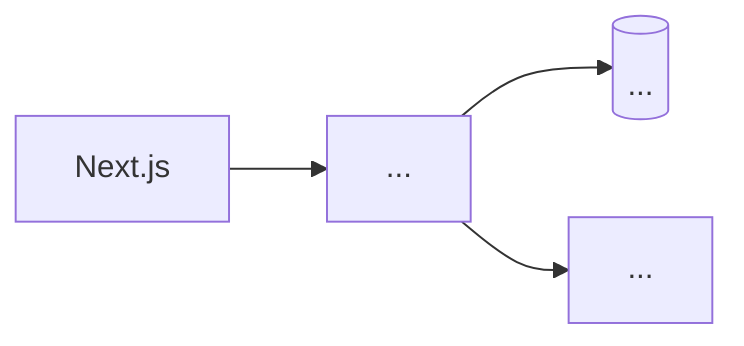

# Architecture — <PROJECT NAME>

## 1 · Stack decision record (one line + why + rejected alternative)

| Layer | Choice | Why | Rejected (and why it lost) |
|---|---|---|---|
| Frontend | | | |
| Backend | <or "none — server actions" (Volt's existence check)> | | |
| Store | <Mongo XOR Convex — Atlas's call, DECISIONS #> | | |
| AI | <provider + fallback model> | | |
| Deploy | <FE / BE / data targets> | | |

## 2 · The Walking Skeleton (P0 of every plan)

The one thread that proves the core loop:
`<screen> → <call> → <store op> → <response rendered>`
Wow-moment machinery inside/adjacent: <how> · Skeleton deadline: <clock time>

## 3 · System sketch

**Tracks derived:** fe · be · data · ai · ship <only the ones that exist>

## 4 · Cross-cutting decisions

Auth: <none/anonymous-session/provider — justify against the demo> · Env vars: named in
`.env.example` from day one · Flags: `lib/flags.*` list · Realtime: <mechanism or none>

## 5 · What we are explicitly not building

<microservices, queues, admin panels, migrations… — the Direction Checks pre-answered>
