# 🏛️ Q-Trace System Architecture Diagrams

> **Project:** Q-Trace — Quantum Flight Recorder & Learning Platform  
> **Problem Statement:** SIH26140 — AI-Based Interactive Quantum Algorithm Learning Platform  
> **Format:** Mermaid Markdown Specification

---

## 1. High-Level End-to-End System Architecture

```mermaid
flowchart TD
  subgraph CLIENT["Client Tier (Next.js 15 + React 19 App Router)"]
    direction TB
    SHELL["Learner Shell & Nav"]
    PATH["Gamified Learning Path (ChamberNodes)"]
    WORKSPACE["Circuit Workspace (dnd-kit + CodeMirror 6)"]
    LINTER["Live Quantum Invariant Linter (QI-1, QI-2, QI-3)"]
    PRED_UI["Prediction Checkpoint Modal"]
    VIS_EVID["Visual Evidence (State Trace, Bloch, Q-Sphere)"]
    RECORDER_UI["Quantum Flight Recorder UI"]
    TUTOR_UI["Socratic Tutor UI & Counterexample Panel"]
    INSTRUCTOR_UI["Instructor Failure Topology Dashboard"]
  end

  subgraph API_GATEWAY["API Gateway & Security Boundary (FastAPI Monolith)"]
    direction TB
    REQ_MID["RequestID & Observability Middleware"]
    AST_SEC["AST Code Security Sandbox (Closed Grammar Allowlist)"]
    CIRCUIT_ROUTER["Circuit Router (OpenQASM 3.0 Exporter)"]
    SIM_ROUTER["Simulation Router (POST /v1/simulation-runs)"]
    FLIGHT_ROUTER["Flight Recorder Router (/v1/flight-recorder)"]
    TUTOR_ROUTER["Tutor Router (/v1/tutor/chat)"]
    PROG_ROUTER["Progress & Assessment Router (/v1/challenge-attempts)"]
    INSIGHT_ROUTER["Instructor Analytics Router (/v1/instructor-insights)"]
  end

  subgraph QUANTUM_RUNTIME["Quantum Simulation Runtime Engine"]
    direction TB
    MODEL_VAL["Circuit Model Pydantic Validator"]
    ROSETTA["Endianness Rosetta Stone & Normalizer"]
    QISKIT_AER["Qiskit Aer Simulator (Statevector + Density Matrix)"]
    PENNYLANE["PennyLane Conformance Adapter (default.qubit)"]
    CIRQ["Google Cirq Multi-Backend Conformance Adapter"]
    NOISE["NISQ Noise Emulator (T1/T2 Relaxation + Readout Error)"]
    STATE_TRACE["Step-by-Step State Trace Engine"]
  end

  subgraph AI_PEDAGOGY["Evidence-Bound AI Pedagogy & Grading"]
    direction TB
    MISCON_MATRIX["40+ Misconception Decision Matrix"]
    CLAIM_VAL["Deterministic Claim Validator (Zero-Hallucination Guard)"]
    SOCRATIC_GEN["Socratic Counterexample Generator"]
    LLM_ADAPTER["LLM Provider Gateway (Gemini / Claude / GPT-4o)"]
    FALLBACK_RES["Curated Pedagogical Reserve (Offline Fallback)"]
  end

  subgraph PERSISTENCE["Data & Persistence Layer"]
    direction TB
    REPO_IF["Typed Repository Interface"]
    MONGO_DB[("MongoDB Atlas M30 (26 Collection Indexes)")]
    IN_MEM_STORE[("Deterministic In-Memory Seed Store (DEMO_LOCAL=1)")]
  end

  subgraph DPI_INTEGRATION["National DPI & Sovereign Cloud Tier"]
    direction TB
    NKN["National Knowledge Network (NKN Edge Caching)"]
    MEGHRAJ["NIC MeghRaj GovCloud"]
    SWAYAM["SWAYAM & DIKSHA Syndication"]
    NAD["National Academic Depository (NAD / DigiLocker)"]
    INDIGENOUS_QPU["Indigenous QPU Hardware Adapters (NQM Labs)"]
  end

  %% Client to Gateway
  WORKSPACE --> AST_SEC
  PRED_UI --> SIM_ROUTER
  WORKSPACE --> CIRCUIT_ROUTER
  WORKSPACE --> SIM_ROUTER
  RECORDER_UI --> FLIGHT_ROUTER
  TUTOR_UI --> TUTOR_ROUTER
  PATH --> PROG_ROUTER
  INSTRUCTOR_UI --> INSIGHT_ROUTER

  %% Gateway to Quantum Runtime
  AST_SEC --> MODEL_VAL
  CIRCUIT_ROUTER --> MODEL_VAL
  SIM_ROUTER --> MODEL_VAL
  MODEL_VAL --> ROSETTA
  ROSETTA --> QISKIT_AER
  ROSETTA --> PENNYLANE
  ROSETTA --> CIRQ
  QISKIT_AER --> NOISE
  NOISE --> STATE_TRACE
  STATE_TRACE --> SIM_ROUTER
  SIM_ROUTER --> VIS_EVID

  %% Gateway to AI Pedagogy
  FLIGHT_ROUTER --> MISCON_MATRIX
  STATE_TRACE -. Numeric Evidence .-> MISCON_MATRIX
  MISCON_MATRIX --> SOCRATIC_GEN
  TUTOR_ROUTER --> CLAIM_VAL
  CLAIM_VAL --> LLM_ADAPTER
  LLM_ADAPTER -. Intercept Hallucination .-> CLAIM_VAL
  CLAIM_VAL -. If Offline / Error .-> FALLBACK_RES
  CLAIM_VAL --> TUTOR_UI

  %% Persistence connections
  PROG_ROUTER --> REPO_IF
  INSIGHT_ROUTER --> REPO_IF
  SIM_ROUTER --> REPO_IF
  REPO_IF --> MONGO_DB
  REPO_IF -. Local Mode .-> IN_MEM_STORE

  %% DPI Integrations
  API_GATEWAY -. Hosted On .-> MEGHRAJ
  CLIENT -. Low Latency Peering .-> NKN
  CLIENT -. Course Embeds .-> SWAYAM
  PROG_ROUTER -. Issue Micro-Credentials .-> NAD
  ROSETTA -. Hardware Horizon .-> INDIGENOUS_QPU
```

---

## 2. Safety & Trust Boundary Architecture

```mermaid
flowchart LR
  subgraph UNTRUSTED_CLIENT["Untrusted Client Surface"]
    CODE_INPUT["User Submitted Python Code (CodeMirror)"]
    CIRCUIT_INPUT["Unsaved Visual Circuit Grid"]
  end

  subgraph SECURITY_GATEWAY["AST Security Sandbox Gateway"]
    direction TB
    AST_PARSE["Python AST Parser (ast.parse)"]
    GRAMMAR_CHECK{"Allowlist Grammar Validation"}
    REJECT_EXCEPT["24-Vector AST Security Rejection (exec, eval, os, sys)"]
    SAFE_MODEL["Versioned Pydantic Circuit Model JSON"]
  end

  subgraph PHYSICS_GATEWAY["Local Quantum Simulation Sandbox"]
    Q_SIM["Qiskit Aer / PennyLane In-Process Engine"]
    NUM_EVIDENCE["Immutable Numeric Evidence Tensor (Probabilities, Trace)"]
  end

  subgraph AI_GATEWAY["Evidence-Bound AI Claim Validator"]
    direction TB
    PROMPT_CHAIN["Structured Prompt with Numeric Evidence"]
    LLM_RESP["Raw LLM Output Stream"]
    CLAIM_AUDIT{"FabricatedClaimError Validator"}
    REPLACE_FALLBACK["Curated Physics-Verified Fallback"]
    VERIFIED_TUTOR["Verified Socratic Guidance to Learner"]
  end

  CODE_INPUT --> AST_PARSE
  AST_PARSE --> GRAMMAR_CHECK
  GRAMMAR_CHECK -- Malicious or Disallowed Syntax --> REJECT_EXCEPT
  GRAMMAR_CHECK -- Safe Constructor & Gates --> SAFE_MODEL
  CIRCUIT_INPUT --> SAFE_MODEL

  SAFE_MODEL --> Q_SIM
  Q_SIM --> NUM_EVIDENCE

  NUM_EVIDENCE --> PROMPT_CHAIN
  PROMPT_CHAIN --> LLM_RESP
  LLM_RESP --> CLAIM_AUDIT
  CLAIM_AUDIT -- Physical Hallucination Detected --> REPLACE_FALLBACK
  CLAIM_AUDIT -- Numerically Grounded --> VERIFIED_TUTOR
  REPLACE_FALLBACK --> VERIFIED_TUTOR
```

