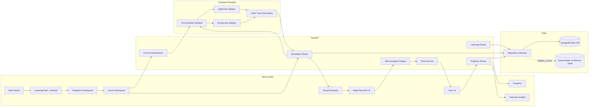

# Architecture — Q-Trace

> Status: draft for blueprint review · PRD vocabulary is authoritative · internal prototype date 29 Aug 2026

## 1 · Stack decision record

| Layer | Choice | Why | Rejected alternative |
|---|---|---|---|
| Repository | Monorepo: `apps/web`, `apps/api`, `scripts`, `board/contracts` | One clone, one smoke command, explicit FE/BE boundaries, and simple local-demo startup | Multiple repositories — contracts and fallback assets would drift under time pressure |
| Frontend | Next.js 15+ App Router, React 19, TypeScript strict, Tailwind v4, shadcn/ui | Matches the team’s strongest frontend stack and the shipped WarRoom pack | Vite SPA — fast, but loses the team’s established Next.js patterns and deployment path |
| Circuit Workspace | Custom qubit-wire grid + `@dnd-kit/core`; CodeMirror 6 for the supported code view | The circuit is a bounded ordered grid, not an arbitrary node graph; custom cells make gate ordering deterministic | React Flow — excellent for free graphs, unnecessary complexity for ordered qubit wires; Monaco — heavier and more fragile in Next.js |
| Frontend state/data | TanStack Query for server results; Zustand only for the unsaved Circuit Model, selected gate and replay cursor; local React state for panel UI | Keeps Simulation Runs and progress cacheable without turning the whole app into a global client store | Redux — unnecessary ceremony; Zustand for all data — makes server truth and unsaved circuit state easy to conflate |
| Visualization | Plotly.js loaded client-only for Bloch sphere/histogram; custom SVG/HTML for amplitude and State Trace views | Delivers the requested Bloch sphere and charts without a custom WebGL engine | Three.js/R3F — visually strong but adds a separate rendering stack for one demo beat |
| Backend | Python 3.12 + FastAPI + Pydantic v2 + `uv`, organized as a modular monolith by learning, circuits, simulation, diagnosis/tutor, progress and analytics domains | Qiskit Aer and PennyLane are Python-native; one process avoids a second backend runtime while retaining explicit module boundaries | Separate Node service — fails Volt’s existence test because it adds a third runtime without owning unique capability |
| Quantum execution | Qiskit SDK 2.3 line + Qiskit Aer 0.17 line for primary runs; PennyLane 0.45 line `default.qubit` for conformance | Official docs support statevector/save instructions and PennyLane snapshots; two genuine backends satisfy the prototype claim | Cirq/qBraid live adapters — valuable roadmap items, but a third/fourth backend does not improve the 90-second proof enough to justify integration risk |
| Circuit interoperability | Versioned `Circuit Model` JSON is canonical; OpenQASM 3 export from the supported subset | Keeps the builder, code generator, simulators and sharing on one safe model; OpenQASM provides a credible ecosystem boundary | OpenQASM as the internal editing model — broader than the safe prototype subset and Qiskit import support is feature-dependent |
| Store | MongoDB Atlas M0 via PyMongo Async API, behind a repository interface; deterministic in-memory seed fallback for local demo | Flexible attempt/trace documents, aggregate Instructor Insight, known team stack, and venue-resilient fallback | Convex — excellent realtime DX, but realtime is not a core requirement and Python quantum execution still requires a service boundary; PostgreSQL — stronger relational guarantees than this prototype needs |
| Tutor | Provider-adapter interface in FastAPI; preferred cloud model selected from the team’s configured key, temperature 0–0.2, structured output; curated `DEMO_FALLBACK` always available | Provider choice is not mandated and credentials are not yet known; the evidence contract matters more than a logo | Model-specific calls in routes — locks architecture before credentials are known and makes venue failure demo-fatal; local LLM — deployment weight is unjustified for the internal prototype |
| Deploy | Vercel (`apps/web`) + Railway (`apps/api`) + Atlas M0; `DEMO_LOCAL=1` starts web, API, in-memory data and Tutor fallback on one laptop | Early live URLs plus a full offline venue path | Single Vercel deployment — Python quantum packages and Aer runtime are a poor fit for frontend serverless functions |

### Direction-check resolutions

1. **Editable code:** keep one safely parsed Qiskit subset using Python AST inspection; never execute submitted Python. Cut to generated read-only code if it threatens the skeleton.
2. **PennyLane:** genuine adapter for the supported Bell journey and conformance output, not a second general-purpose execution platform.
3. **Tutor provider:** provider-neutral until an existing team credential is confirmed; deterministic fallback is P0 and numerical truth always comes from simulation.
4. **Store:** MongoDB wins because realtime is not core, the team already knows it, and attempt/trace data is document-shaped.
5. **Visualization:** mathematical 2D/2.5D views plus a labeled Bloch sphere; no cinematic 3D metaphors that imply physically false splitting.

## 2 · Walking Skeleton

The one thread that proves the core loop:

`/learn/bell-state → POST /v1/simulation-runs → Simulation Run + State Trace → POST /v1/flight-recorder/diagnose → Misconception Signal + Repair Challenge → POST /v1/challenge-attempts → Progress Record → GET /v1/instructor-insights/demo-cohort → rendered learner success + instructor proof`

### P0 scenario

1. Role switch selects seeded **Aarav**.
2. Aarav opens the seeded Bell-state **Module** and records the wrong **Prediction Checkpoint**: two independent random outputs.
3. The **Circuit Workspace** loads a two-qubit H → CNOT → Measure **Circuit Model** and generated Qiskit code.
4. FastAPI executes the model on Qiskit Aer, persists the **Simulation Run**, and returns counts, probabilities and a two-step **State Trace**.
5. The **Quantum Flight Recorder** identifies the first conceptual divergence and returns `SUPERPOSITION_VS_ENTANGLEMENT` as the **Misconception Signal**.
6. The evidence-bound **Tutor** renders a trace-grounded fallback explanation and one **Repair Challenge**.
7. Aarav passes the deterministic challenge; his **Progress Record** updates and the same event changes Dr. Rao’s **Instructor Insight**.

**Skeleton deadline:** 25 Aug 2026, 09:00 IST.

**Wow machinery inside P0:** Prediction Checkpoint + State Trace + deterministic misconception rules + Flight Recorder replay. PennyLane conformance, free-form Tutor inference, full builder drag/drop, code parsing and richer analytics are adjacent P1 work; P0 mocks their contract shapes where needed.

### P0 acceptance command

`scripts/smoke.sh` starts the local stack, resets seeds, executes the Bell journey through real HTTP calls, verifies the expected Misconception Signal and Progress Record, then exits non-zero on any contract drift.

## 3 · System sketch

## 4 · Tracks and file ownership

| Track | Owns | Must not edit |
|---|---|---|
| **learning-ux** | `apps/web/app`, `apps/web/components`, `apps/web/features/*`, frontend contract mirrors, `apps/web/tests/unit/*` | Python services, DB repositories, QA-owned acceptance/e2e/fixtures, deployment workflows |
| **simulation-api** | `apps/api/app/routers/circuits.py`, `simulation_runs.py`, `services/quantum/*`, Pydantic quantum models, `apps/api/tests/unit/simulation/*` | Web UI, Tutor prompts, progress repositories, QA acceptance/security fixtures |
| **ai-pedagogy** | `apps/api/app/routers/flight_recorder.py`, `tutor.py`, `services/diagnosis/*`, `services/tutor/*`, `prompts/*`, `apps/api/tests/unit/ai/*` | Quantum numeric kernels, web components, DB infrastructure, QA acceptance fixtures |
| **data-analytics** | `apps/api/app/repositories/*`, `routers/learning.py`, `progress.py`, `instructor.py`, seed script, `apps/api/tests/unit/data/*` | Quantum adapters, Tutor prompts, web UI, QA acceptance fixtures |
| **fixtures-qa** | `apps/api/tests/{contract,fixtures/golden,acceptance,security}`, `apps/web/{e2e,tests/fixtures,tests/acceptance}`, cross-track release scripts | Production implementation and every implementation track’s unit-test folders except approved fixture hooks |
| **story-ship** | `docs`, `scripts`, deployment configs, smoke runner, PPT/demo/fallback assets | Product implementation; only Patch merges integration fixes |

**Shared surfaces:** only `board/contracts/*`, PRD vocabulary, environment variable names, and versioned fixture IDs. No track silently edits another track’s files.

## 5 · Cross-cutting decisions

### Identity and privacy

- No production authentication in the internal prototype; seeded role switching creates disclosed demo sessions.
- Requests carry `X-Demo-Profile-Id`; backend validates it against seeded profiles.
- Free-form Tutor text is not persisted. Store only structured Tutor outcome metadata if needed for the scripted analytics.
- Instructor Insight is aggregate by default; the demo may show named seeded learners only because they are synthetic.

### Safety and trust boundary

- Submitted Qiskit text is parsed with Python `ast`; only an allowlisted constructor and gate-call grammar can create a Circuit Model. Code is never executed.
- Qubit count: 2–5. Operation count: ≤20. Allowed gates: H, X, Y, Z, CNOT, Measure.
- Qiskit Aer owns numerical truth. The Tutor receives immutable evidence fields and may not modify probabilities, amplitudes, counts, State Trace or grading.
- Cross-backend conformance compares canonical probabilities using a declared epsilon, not raw shot counts.

### Visualization correctness

- State Trace before measurement uses statevector-derived probabilities and phases.
- A Bloch view for an entangled subsystem is computed from a reduced density matrix and labeled `mixed single-qubit view`; the UI never claims it represents the whole entangled state.
- Measurement histograms are shown separately from state amplitudes.
- Visual metaphors include an explicit “representation, not physical trajectory” note.

### Reliability flags

`DEMO_LOCAL` · `DEMO_FALLBACK` · `ENABLE_PENNYLANE` · `ENABLE_CODE_PARSE` · `ENABLE_TUTOR_CLOUD` · `ENABLE_NOISE_LAB`.

The scripted demo must pass with `DEMO_LOCAL=1`, `DEMO_FALLBACK=1`, `ENABLE_PENNYLANE=0`, and `ENABLE_TUTOR_CLOUD=0`; disabled optional features render disclosed fallback states, never broken controls.

### Observability

- One request ID crosses web → API → simulation/tutor logs.
- Log fields: service, operation, durationMs, adapter/model, fallbackUsed, errorCode; never log provider keys or Tutor free text.
- `GET /health` verifies process health; `GET /ready` verifies seed repository plus primary Qiskit adapter.

### Environment variables

`NEXT_PUBLIC_API_BASE_URL` · `WEB_ORIGIN` · `MONGODB_URI` · `MONGODB_DB` · `TUTOR_PROVIDER` · `TUTOR_MODEL` · `TUTOR_API_KEY` · feature flags above.

## 6 · What we are explicitly not building

Real QPU execution · arbitrary Python execution · full Cirq/qBraid adapters · real-time collaboration · large-circuit simulation · production auth/billing/proctoring · open-ended autonomous agents · a complete curriculum · claims of measured learning efficacy · additional Node service · queues/microservices · unverified AI grading.
