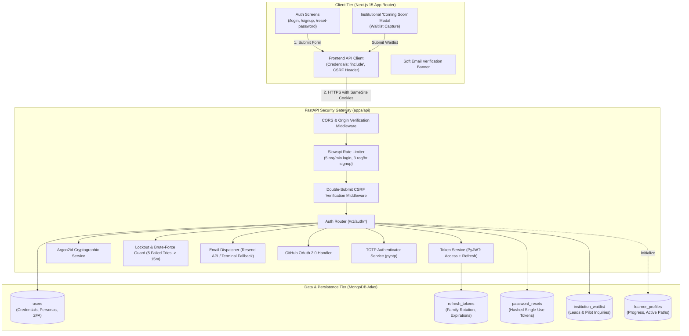
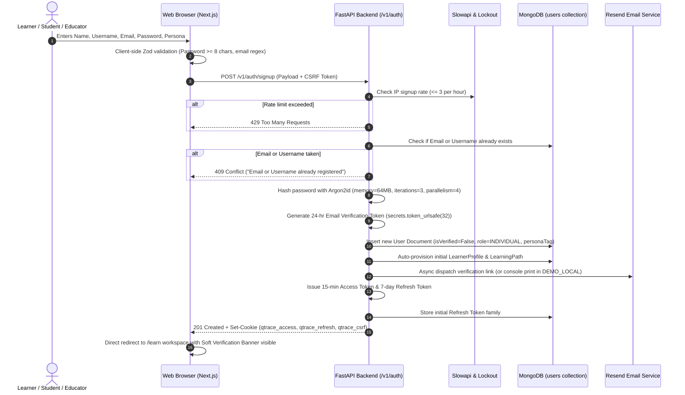
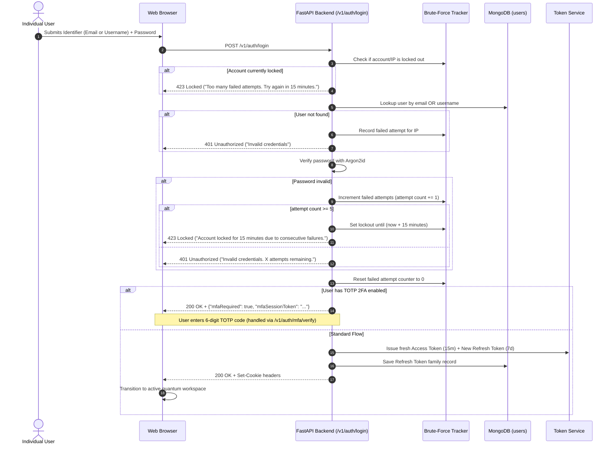
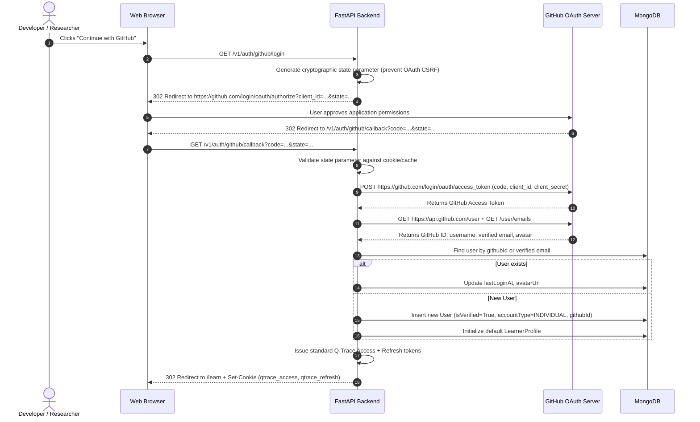
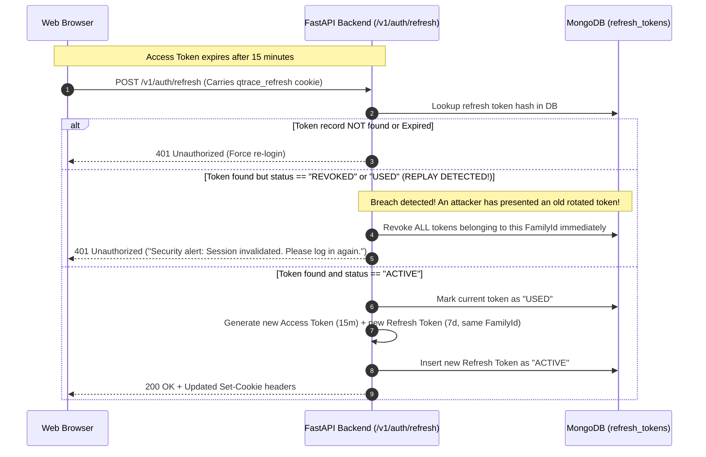
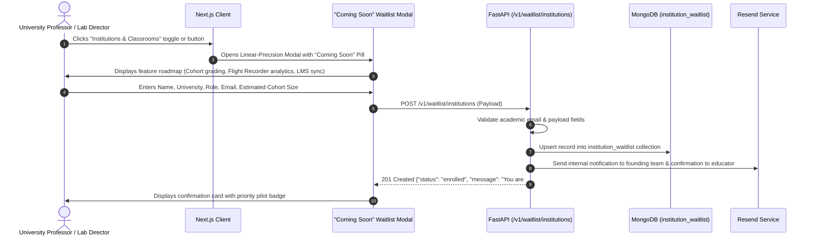
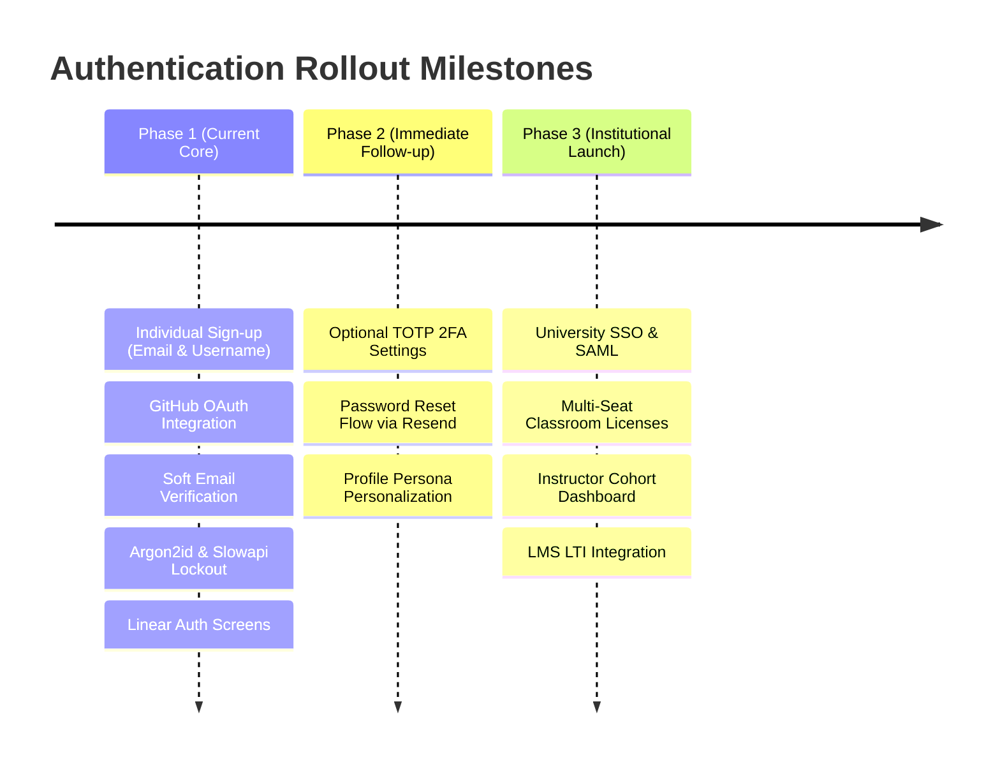

# Q-Trace Authentication & Identity System Design
## High-Level Architecture, Low-Level Design (LLD), Security Specifications & Workflow Flows

> **Target Audience:** Engineering, Architecture Reviewers, Security Auditors, and Product Team  
> **Status:** Approved Architectural Specification (Post /grill-me Alignment)  
> **Scope:** Primary implementation focused on **Individual Learners, Students, and Independent Educators**, with an interactive **"Coming Soon" Early-Access Gateway for Institutions**.  
> **Design Language:** Linear Precision Quantum Instrument (`docs/DESIGN-SYSTEM.md`)  
> **Tech Stack Alignment:** FastAPI (Python 3.12) + PyMongo (MongoDB Atlas) + PyJWT + Argon2id + Next.js 15 App Router + Tailwind v4 + Resend API  

---

## 1. Executive Summary & Design Principles

Q-Trace is an advanced quantum learning platform and state-vector circuit workspace. This document specifies the complete, production-grade identity, signup, and login architecture.

### Key Architectural Tenets
1. **Unified Backend Security Boundary:** Authentication logic, token issuance, credential hashing, and authorization guards live natively in the **FastAPI (`apps/api`)** service. This ensures that sensitive quantum simulation endpoints and student progress repositories share a single, zero-trust security perimeter without reliance on third-party auth subscriptions.
2. **Defensive In-Depth Token Architecture:** Session persistence utilizes **HttpOnly, Secure, SameSite=Lax cookies** carrying short-lived JWT access tokens (15 minutes) and rotating refresh tokens (7 days). Tokens are never exposed to browser JavaScript, neutralizing Cross-Site Scripting (XSS) token theft.
3. **OWASP/NIST Cryptographic Rigor:** Passwords are protected using **Argon2id** (`argon2-cffi`), the state of the art in memory-hard hashing resistant to GPU/ASIC brute-force cracking.
4. **Resilient Developer Experience:** Transactional emails (verification and password resets) run via **Resend** with an automatic **local console fallback** when running offline or in demo environments (`DEMO_LOCAL=1`), guaranteeing zero blocked development loops.
5. **Progressive Persona Modeling:** A unified data schema represents all individuals (General Learners, Self-Study Students, Independent Educators) with persona tags, while Institutional Multi-Seat Organizations (Universities, Schools, Cohorts) are cleanly decoupled and surfaced through an interactive **"Coming Soon" Waitlist** interface.

---

## 2. System Architecture & Component Topology

The authentication subsystem spans three tiers: the Next.js Client Layer, the FastAPI Security & Auth Core, and the MongoDB Atlas Data Store.



---

## 3. User Personas & Account Modeling

To balance immediate individual focus with institutional roadmapping, the system utilizes a **Unified Account Model**.

| Dimension | Individual: General Learner | Individual: Self-Study Student | Individual: Independent Educator | Institutional Organization |
|---|---|---|---|---|
| **Account Type** | `INDIVIDUAL` | `INDIVIDUAL` | `INDIVIDUAL` | `INSTITUTION` *(Coming Soon)* |
| **Persona Tag** | `LEARNER` | `STUDENT` | `EDUCATOR` | `ORGANIZATION` |
| **Primary Goal** | Intuitive quantum exploration, Bell state intuition | University coursework, syllabus alignment, exam review | Class demo prep, curriculum authoring, circuit prototyping | Departmental seat management, cohort telemetry, LMS integration |
| **Auth Method** | Email/Username + Password, GitHub OAuth | Email/Username + Password, GitHub OAuth | Email/Username + Password, GitHub OAuth | SAML / SSO / Google Workspace *(Roadmap)* |
| **Access State** | **Live & Active Now** | **Live & Active Now** | **Live & Active Now** | **Coming Soon (Waitlist Active)** |
| **Linked Profile** | Seeded/Created `LearnerProfile` | Seeded/Created `LearnerProfile` | Seeded/Created `LearnerProfile` + Instructor Views | `Cohort` & `Organization` records |

---

## 4. End-to-End User Journeys & Flow Diagrams

### 4.1 Individual Sign-Up Flow (Start to Finish)

Users can sign up using Email, Display Name, Username, and Password, or 1-click GitHub OAuth.



### 4.2 Individual Login & Brute-Force Lockout Flow

Login supports either Email or Username as the login identifier.



### 4.3 GitHub OAuth 2.0 Flow (2-Step Fast Sign-In)



### 4.4 Refresh Token Family Rotation & Anti-Replay Flow



### 4.5 Password Reset & Account Recovery Flow

```mermaid
sequenceDiagram
    autonumber
    actor User as User
    participant Browser as Next.js Web App
    participant API as FastAPI Backend
    participant DB as MongoDB
    participant Mailer as Resend Email Service

    User->>Browser: Enters email on /forgot-password
    Browser->>API: POST /v1/auth/forgot-password {"email": "..."}
    API->>DB: Lookup user by email
    alt User exists
        API->>API: Generate 15-min token = secrets.token_urlsafe(32)
        API->>API: Compute SHA-256 hash of token
        API->>DB: Store reset record {tokenHash, userId, expiresAt: now + 15m, used: false}
        API->>Mailer: Send email with link https://qtrace.app/reset-password?token=...
    end
    API-->>Browser: 200 OK ("If that email exists, reset instructions have been dispatched.")
    Note over API-->>Browser: Prevents user enumeration by returning identical 200 response

    User->>Browser: Clicks reset link in email
    Browser->>User: Displays /reset-password screen with new password input
    User->>Browser: Submits New Password
    Browser->>API: POST /v1/auth/reset-password {"token": "...", "newPassword": "..."}
    API->>API: Compute SHA-256 hash of incoming token
    API->>DB: Find active, non-expired, non-used reset record
    alt Token invalid or expired
        API-->>Browser: 400 Bad Request ("Reset link expired or already used.")
    end
    API->>API: Hash new password with Argon2id
    API->>DB: Update user passwordHash
    API->>DB: Mark reset token as used=True
    API->>DB: Revoke ALL active refresh token families for this user (Kill all sessions)
    API-->>Browser: 200 OK ("Password updated successfully. Please log in.")
```

### 4.6 Institutional "Coming Soon" & Waitlist Flow



---

## 5. Low-Level Database Schema (MongoDB Atlas)

All schemas conform to `docs/SCHEMA.md` conventions: stable string IDs, `schemaVersion: 1`, and strict ISO-8601 timestamps.

### 5.1 `users` Collection
Represents individual accounts across all learner personas.

```json
{
  "_id": "usr_7f8a9b2c3d4e",
  "email": "aarav.sharma@domain.edu",
  "username": "aarav_quantum",
  "displayName": "Aarav Sharma",
  "passwordHash": "$argon2id$v=19$m=65536,t=3,p=4$...",
  "accountType": "INDIVIDUAL",
  "personaTag": "STUDENT",
  "isVerified": true,
  "verificationTokenHash": null,
  "verificationExpiresAt": null,
  "githubId": "12345678",
  "githubUsername": "aarav-sh",
  "avatarUrl": "https://avatars.githubusercontent.com/u/12345678",
  "mfa": {
    "enabled": false,
    "totpSecret": null,
    "backupCodes": []
  },
  "lockout": {
    "failedAttempts": 0,
    "lockedUntil": null
  },
  "learnerProfileId": "lp_aarav",
  "schemaVersion": 1,
  "createdAt": "2026-09-26T06:30:00Z",
  "updatedAt": "2026-09-26T06:30:00Z"
}
```

**Indexes:**
- `unique_email`: `{ "email": 1 }` (unique)
- `unique_username`: `{ "username": 1 }` (unique)
- `sparse_github_id`: `{ "githubId": 1 }` (unique, sparse)
- `learner_profile_ref`: `{ "learnerProfileId": 1 }`

---

### 5.2 `refresh_tokens` Collection
Stores active and historic refresh tokens for family rotation and replay detection.

```json
{
  "_id": "rtk_91a2b3c4d5e6",
  "tokenHash": "e3b0c44298fc1c149afbf4c8996fb92427ae41e4649b934ca495991b7852b855",
  "userId": "usr_7f8a9b2c3d4e",
  "familyId": "fam_3a4b5c6d7e8f",
  "status": "ACTIVE",
  "userAgent": "Mozilla/5.0 (Windows NT 10.0; Win64; x64)...",
  "ipAddress": "192.0.2.45",
  "expiresAt": "2026-10-03T06:30:00Z",
  "createdAt": "2026-09-26T06:30:00Z"
}
```

**Indexes:**
- `token_hash_lookup`: `{ "tokenHash": 1 }` (unique)
- `user_family_lookup`: `{ "userId": 1, "familyId": 1 }`
- `ttl_expiry`: `{ "expiresAt": 1 }` (expireAfterSeconds: 0 — MongoDB auto-eviction)

---

### 5.3 `password_resets` Collection
Single-use time-limited recovery records.

```json
{
  "_id": "rst_4e5f6a7b8c9d",
  "tokenHash": "8f434346648f6b96df89dda901c5176b10e6d83961dd3c1ac88b59b2dc327aa4",
  "userId": "usr_7f8a9b2c3d4e",
  "used": false,
  "expiresAt": "2026-09-26T06:45:00Z",
  "createdAt": "2026-09-26T06:30:00Z"
}
```

**Indexes:**
- `reset_token_lookup`: `{ "tokenHash": 1 }` (unique)
- `ttl_reset_expiry`: `{ "expiresAt": 1 }` (expireAfterSeconds: 0)

---

### 5.4 `institution_waitlist` Collection
Captures prospective institutional leads and classroom pilot requests.

```json
{
  "_id": "wtl_5a6b7c8d9e0f",
  "fullName": "Dr. Elena Vance",
  "workEmail": "evance@mit.edu",
  "institutionName": "Massachusetts Institute of Technology",
  "role": "PROFESSOR",
  "expectedStudents": 120,
  "notes": "Interested in Bell-state Flight Recorder for Fall Quantum Mechanics lab.",
  "status": "PENDING_REVIEW",
  "schemaVersion": 1,
  "createdAt": "2026-09-26T06:30:00Z"
}
```

**Indexes:**
- `waitlist_email`: `{ "workEmail": 1 }` (unique)
- `waitlist_created`: `{ "createdAt": -1 }`

---

## 6. Low-Level API Contract Specifications

All endpoints prefix: `/v1/auth` and `/v1/waitlist`.  
Security headers: `Content-Type: application/json`, `X-CSRF-Token: <token>`.

### 6.1 Authentication Endpoints Matrix

| HTTP Method | Route | Description | Rate Limit | Auth Required |
|---|---|---|---|---|
| `POST` | `/v1/auth/signup` | Register new individual user | 3 / hour / IP | No |
| `POST` | `/v1/auth/login` | Authenticate with Email/Username + Password | 5 / min / IP | No |
| `POST` | `/v1/auth/refresh` | Rotate refresh token & issue new access token | 20 / min | Cookie |
| `POST` | `/v1/auth/logout` | Revoke current session & clear cookies | None | Cookie |
| `POST` | `/v1/auth/logout-all` | Revoke all active sessions on all devices | 5 / min | User JWT |
| `GET` | `/v1/auth/me` | Fetch authenticated user profile & persona | None | User JWT |
| `POST` | `/v1/auth/forgot-password` | Request password reset email | 3 / 15m / IP | No |
| `POST` | `/v1/auth/reset-password` | Execute password reset with email token | 5 / 15m / IP | No |
| `GET` | `/v1/auth/verify-email` | Confirm email address with token | None | No |
| `POST` | `/v1/auth/resend-verification` | Resend verification email | 2 / 10m / User | User JWT |
| `GET` | `/v1/auth/github/login` | Initiate GitHub OAuth authorization | 10 / min | No |
| `GET` | `/v1/auth/github/callback` | Exchange code for tokens & redirect | 10 / min | No |
| `POST` | `/v1/auth/mfa/setup` | Generate TOTP secret & QR code | 3 / 10m | User JWT |
| `POST` | `/v1/auth/mfa/verify` | Confirm TOTP setup or submit 2FA login code | 5 / min | User/MFA Token |
| `POST` | `/v1/waitlist/institutions` | Submit institutional pilot request | 5 / hour / IP | No |

---

### 6.2 Endpoint Contract Details

#### 1. `POST /v1/auth/signup`
**Request Body:**
```json
{
  "email": "student@university.edu",
  "username": "quantum_alex",
  "displayName": "Alex Chen",
  "password": "CorrectHorseBattery99!",
  "personaTag": "STUDENT"
}
```

**Response (201 Created):**
```json
{
  "user": {
    "id": "usr_9a8b7c6d5e",
    "email": "student@university.edu",
    "username": "quantum_alex",
    "displayName": "Alex Chen",
    "accountType": "INDIVIDUAL",
    "personaTag": "STUDENT",
    "isVerified": false,
    "learnerProfileId": "lp_usr_9a8b7c6d5e"
  },
  "message": "Account created. Soft access granted. Verification email dispatched."
}
```
**Response Headers:**
```http
Set-Cookie: qtrace_access=<jwt>; Path=/; Max-Age=900; HttpOnly; Secure; SameSite=Lax
Set-Cookie: qtrace_refresh=<token>; Path=/v1/auth; Max-Age=604800; HttpOnly; Secure; SameSite=Lax
Set-Cookie: qtrace_csrf=<csrf_token>; Path=/; Max-Age=604800; Secure; SameSite=Lax
```

---

#### 2. `POST /v1/auth/login`
**Request Body:**
```json
{
  "identifier": "quantum_alex",
  "password": "CorrectHorseBattery99!"
}
```
*Note: `identifier` accepts either the registered email or the username.*

**Response (200 OK):**
```json
{
  "user": {
    "id": "usr_9a8b7c6d5e",
    "email": "student@university.edu",
    "username": "quantum_alex",
    "displayName": "Alex Chen",
    "accountType": "INDIVIDUAL",
    "personaTag": "STUDENT",
    "isVerified": false
  },
  "mfaRequired": false
}
```

---

#### 3. `POST /v1/waitlist/institutions`
**Request Body:**
```json
{
  "fullName": "Prof. Marcus Thorne",
  "workEmail": "mthorne@ethz.ch",
  "institutionName": "ETH Zürich - Department of Physics",
  "role": "DEPARTMENT_CHAIR",
  "expectedStudents": 85,
  "notes": "Looking for interactive state-vector tracing for introductory physics."
}
```

**Response (201 Created):**
```json
{
  "status": "WAITLISTED",
  "waitlistPosition": 37,
  "message": "Thank you, Prof. Thorne. Your institutional request has been priority-queued."
}
```

---

## 7. Backend Implementation Architecture (FastAPI)

The backend implementation resides in `apps/api/app/` adhering to the existing modular monolith pattern.

```
apps/api/app/
├── core/
│   ├── auth.py              # PyJWT access/refresh token encoding & decoding
│   ├── password.py          # Argon2id hasher & verifier (argon2-cffi)
│   ├── security.py          # Double-submit CSRF & Origin validation middleware
│   └── rate_limit.py        # Slowapi instance & custom lockout key extractors
├── repositories/
│   ├── user_repo.py         # MongoDB interface for users collection
│   ├── session_repo.py      # Refresh token family management & invalidations
│   └── waitlist_repo.py     # Institutional waitlist persistence
├── services/
│   ├── email_service.py     # Resend client + local terminal print fallback
│   ├── oauth_github.py      # GitHub OAuth 2.0 exchange and user synchronization
│   └── totp_service.py      # PyOTP 2FA generator and backup code validator
└── routers/
    ├── auth.py              # Route handlers for signup, login, refresh, logout
    └── waitlist.py          # Route handler for institutional waitlist submissions
```

### 7.1 Argon2id Password Hashing Engine
The cryptographic hasher is configured according to OWASP recommendations:
- **Algorithm:** Argon2id (Version 19)
- **Time Cost (Iterations):** 3
- **Memory Cost:** 65,536 KiB (64 MiB)
- **Parallelism:** 4 threads
- **Hash Output Length:** 32 bytes
- **Salt Length:** 16 bytes cryptographically random (`os.urandom(16)`)

### 7.2 JWT Token Payload Specification
Access tokens carry strictly non-sensitive identity claims:
```json
{
  "sub": "usr_9a8b7c6d5e",
  "email": "student@university.edu",
  "username": "quantum_alex",
  "role": "INDIVIDUAL",
  "persona": "STUDENT",
  "iss": "qtrace-api",
  "iat": 1790404200,
  "exp": 1790405100
}
```

---

## 8. Frontend UI/UX Design System Specification

The UI matches `docs/DESIGN-SYSTEM.md` (**"Linear Precision Quantum Instrument"**).

### 8.1 Visual Components & Token Mapping
- **Canvas Background:** `--bg-canvas` (`#ffffff` light / `#08090a` dark)
- **Card Containers:** `--bg-surface` (`#f9fafb` light / `#121316` dark) with hairline `--border-default` (`rgba(255,255,255,0.08)` in dark mode).
- **Primary Action Buttons:** High-precision Sky accent (`--accent`: `#0284c7` light / `#38bdf8` dark).
- **Input Fields:** Crisp, monochromatic with focus ring `--border-strong` and subtle background `--bg-surface-raised`.

### 8.2 Form Design & Micro-Interactions
1. **Streamlined Individual Signup:** Form is 100% focused on effortless individual registration (Display Name, Username, Email with standard `alex@gmail.com` placeholder, and Password). Automatically assigns `LEARNER` persona tag in the background, eliminating extraneous questions.
2. **Institutional Coming-Soon Gateway:** A discreet, elevated badge on the auth card header:
   ```
   Create your Q-Trace Account  |  [ For Institutions (Coming Soon) ↗ ]
   ```
   Clicking triggers the Glassmorphism Waitlist Modal (`InstitutionWaitlistModal`) without page navigation.
3. **Soft Verification Banner:**
   - Position: Top-fixed hairline strip below navigation.
   - Tone: Subtle Amber (`--warning-subtle`).
   - Content: *"Verify your email address (alex@gmail.com) to unlock permanent circuit sharing."*
   - CTA: `[ Resend Verification Link ]` with inline confirmation.
4. **Header Navigation Clean-up:**
   - Synthetic demo persona switcher (`RoleSwitcher`) removed from the main header navigation to eliminate confusion with production session state. Authenticated sessions display active user profile with persona badge and sign-out controls.

---

## 9. Security Hardening & Threat Mitigation Matrix

| Threat / Attack Vector | Severity | Mitigation Architecture |
|---|---|---|
| **Credential Stuffing / Password Brute-Force** | **High** | `slowapi` limits login to 5 attempts/minute. 5 consecutive failures trigger an automatic 15-minute account lockout. |
| **XSS Token Theft** | **Critical** | Tokens reside in `HttpOnly` cookies, preventing any client-side JavaScript (`document.cookie`) access. |
| **Cross-Site Request Forgery (CSRF)** | **High** | Dual defense: `SameSite=Lax` browser cookie enforcement + Double-Submit `X-CSRF-Token` header verification on all mutating requests (`POST`, `PUT`, `DELETE`). |
| **Stolen Refresh Token Replay** | **Critical** | Refresh Token Family Rotation. If a previously consumed refresh token is presented, all sessions in that token family are instantly invalidated. |
| **Password Database Breach** | **Critical** | Argon2id memory-hard hashing prevents offline cracking via high-end consumer or cloud GPUs. |
| **User Enumeration / Timing Attacks** | **Medium** | Constant-time password comparison (`hmac.compare_digest`); generic error messages ("Invalid credentials") on login; identical 200 response on forgot-password requests regardless of user existence. |
| **Denial of Service (DoS) via Email Flooding** | **Medium** | Rate limit of 3 forgot-password and 2 verification resends per 15 minutes per IP/User. |

---

## 10. Verification & Smoke Test Plan

To guarantee system stability, the following automated test cases are defined:

1. **Test `test_signup_success`:** Validates creation of individual user, Argon2 password hashing, and issuance of `qtrace_access` and `qtrace_refresh` cookies.
2. **Test `test_login_dual_identifier`:** Confirms login succeeds with both registered email and username.
3. **Test `test_brute_force_lockout`:** Simulates 5 failed login attempts; asserts HTTP 423 Locked on the 6th attempt.
4. **Test `test_refresh_token_rotation`:** Executes token refresh; asserts old refresh token is marked "USED" and cannot be reused.
5. **Test `test_replay_attack_revocation`:** Attempts to reuse a previously rotated refresh token; asserts entire family is revoked and HTTP 401 returned.
6. **Test `test_institutional_waitlist_capture`:** Submits valid institutional lead; verifies document insertion in MongoDB `institution_waitlist`.
7. **Test `test_resend_console_fallback`:** Executes email dispatch with `RESEND_API_KEY=""`; verifies verification URL is formatted and printed to stdout without raising an exception.

---

## 11. Rollout Phases & Roadmap



*(End of Specification)*
