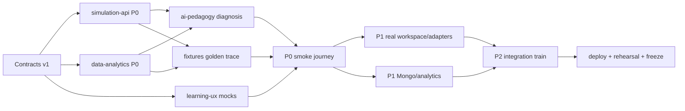

# Build Plan — Q-Trace

> FULL blueprint spine · internal hackathon 29 Aug 2026, exact time TBD · all times IST · phase plans expand this grid into cold-startable cards.

## Milestone spine

| Milestone | Deadline | Acceptance |
|---|---|---|
| Blueprint freeze | 23 Aug 14:00 | Architecture, schema, contracts, fit-audit and this plan approved |
| Phase plans + missions | 23 Aug 18:00 | Every track has P0–P3 cards, DAG, owner/mock paths and ≤70% load |
| **P0 walking skeleton** | **25 Aug 09:00** | Real HTTP Bell journey: Prediction → Qiskit Simulation Run/State Trace → Misconception Signal → Repair Challenge → Progress/Instructor proof; `scripts/smoke.sh` green |
| P1 core complete | 26 Aug 18:00 | visual grid, supported code view, PennyLane conformance, three-Module catalogue, Flight Recorder, fallback Tutor and core persistence work together |
| P2 integration train | 27 Aug 18:00 | Atlas/live deploy, cloud Tutor when configured, contract tests, E2E and local fallback pass |
| Risky-feature freeze | 27 Aug 18:00 | no new dependencies, adapters, parsers, AI providers or visualization systems |
| Feature + demo-script freeze | 28 Aug 09:00 | learner-led 90-second path rehearsed; Cut List executed; PPT content frozen |
| Final merge/deploy/PPT readiness | 28 Aug 18:00 | live URLs and one-laptop mode pre-warmed; backup recording and final PPT ready |

## Phase × Track grid

| Track | P0 Skeleton — due 25 Aug 09:00 | P1 Core — due 26 Aug 18:00 | P2 Integration — due 27 Aug 18:00 | P3 Polish — due 28 Aug 09:00 |
|---|---|---|---|---|
| **learning-ux** | Next shell; seeded Aarav role; Bell Module and Prediction UI; contract-shaped Circuit Workspace/Visual Evidence/Flight Recorder/Repair/Progress screens using mocks | three-Module catalogue; Aarav/Meera path variants; ordered dnd-kit grid; generated Qiskit + one supported edit; Plotly evidence; live Progress view | swap all P0 mocks to typed API calls; fallback/loading/error states; Dr. Rao closing insight; share/export UI if green | keyboard/click gate placement; projector pass; copy and transition polish; no new panels |
| **simulation-api** | FastAPI health/ready; Pydantic mirrors; Circuit Model validator; real Qiskit Bell Simulation Run; normalized pre-measurement State Trace; in-memory persistence | safe AST parser; OpenQASM export; PennyLane Bell conformance; reduced-state Bloch/purity; circuit-health metrics | Atlas repository; adapter flags/timeouts/logging; deployed API; conformance and asymmetric-order fixtures | performance budget; explicit unsupported-path UX; dependency freeze |
| **ai-pedagogy** | deterministic Bell diagnosis; `SUPERPOSITION_VS_ENTANGLEMENT`; curated trace-bound Tutor fallback; Repair Challenge generator contract | misconception taxonomy; replay copy; evidence-key validator; provider adapter with structured output if credentials exist | cloud/fallback parity; privacy logging check; failure/rate-limit drills; recommendation rules if green | judge Q&A, explanation clarity and anti-copy guard; no new model/provider |
| **data-analytics** | seeded profiles, Bell content/challenge, Prediction, Progress and Instructor response shapes in one in-memory repository; atomic demo attempt update | Mongo collections/indexes; 30-profile synthetic cohort; three Modules; Learning Paths; attempt/signal aggregates | Atlas seed and pre-warm; idempotency; same repository tests for memory/Atlas; analytics cache | synthetic-data disclosure and empty/edge states; schema freeze |
| **fixtures-qa** | Bell golden fixture; asymmetric bit-order fixture; contract schema checks; `scripts/smoke.sh` drives real P0 HTTP thread | adapter tolerance tests; unsafe-code rejection; diagnosis/grading fixtures; frontend component tests | Playwright learner journey; offline/fallback drill; live CORS/deploy smoke; Warden contract review | projector/rehearsal bug sweep; backup-video verification; release checklist |
| **story-ship** | monorepo/environment conventions; local-demo launcher; live deploy shells; deck spine, problem evidence and demo script v0 | Vercel/Railway/Atlas configuration; seeded demo reset; PPT architecture/novelty/impact slides; local fallback packaging | merge trains; live URLs; pre-warm script; rehearsal 1–2; backup recording | final PPT/demo/viva pack; freeze enforcement; submission readiness |

## Cross-track dependency DAG

### Waiting is not a plan

- learning-ux starts against contract fixtures before backend readiness.
- ai-pedagogy uses the checked-in Bell State Trace fixture until Simulation Run P0 is live.
- data-analytics uses seeded attempt/signal objects before diagnosis is live.
- fixtures-qa owns golden payloads consumed by all tracks; implementation tracks do not hand-edit expected outputs.
- story-ship deploys health/shell services before product integration and rehearses against DEMO_FALLBACK.

## Provisional load ledger

Declared member hours were not available in prior conversations. The following are **card-hour ceilings**, not invented availability. Before `/phase-plan`, each owner must declare enough usable time that assigned cards remain ≤70%; otherwise the plan cuts scope before assignments.

| Seat / likely owner | Provisional track | Card-hour ceiling | Minimum declared availability needed | Status |
|---|---|---:|---:|---|
| Vinod Krishna | story-ship + architecture/integration | 16h | 23h | PASS — 48h declared; 33.6h card cap |
| Venu Gopal | learning-ux | 20h | 29h | PASS — 48h declared; 33.6h card cap |
| Uday Rohit | simulation-api | 20h | 29h | PASS — 48h declared; 33.6h card cap |
| Rani | data-analytics | 18h | 26h | PASS — 48h declared; 33.6h card cap |
| Rajeswari | ai-pedagogy | 18h | 26h | PASS — 48h declared; 33.6h card cap |
| Akshaya | fixtures-qa + story support | 16h | 23h | PASS — 48h declared; 33.6h card cap |

**Five-member survival rule:** Akshaya owns fixtures-qa with 48h declared, while P0 retains a contingency: if unavailable at a critical gate, QA P0 splits between Vinod, Uday and Rani; P1/P2 breadth cuts before any member exceeds the 33.6h card cap.

## Contract ownership

| Contract | Owner | Consumers |
|---|---|---|
| `circuit-simulation.md` | simulation-api | learning-ux, ai-pedagogy, fixtures-qa, story-ship |
| `learning-content.md` | data-analytics | learning-ux, ai-pedagogy, fixtures-qa, story-ship |
| `flight-recorder-tutor.md` | ai-pedagogy | learning-ux, data-analytics, fixtures-qa, story-ship |
| `progress-analytics.md` | data-analytics | learning-ux, ai-pedagogy, fixtures-qa, story-ship |

## Deploy targets

- **Frontend:** Vercel project `qtrace-web`; URL to be created during story-ship P0.
- **Backend:** Railway service `qtrace-api`; Python 3.12, one worker; `/health` and `/ready` required before integration.
- **Data:** MongoDB Atlas M0 database `qtrace_demo`; credentials server-side; deterministic in-memory repository when `DEMO_LOCAL=1`.
- **Local venue mode:** `scripts/demo-local.sh` starts production web + FastAPI, resets deterministic seeds and forces Tutor fallback; no Atlas or internet required.
- **Observability:** request ID visible in frontend debug drawer and API logs; no keys or Tutor free text logged.

## Integration train departures

1. **Skeleton assembly — 25 Aug 07:00:** contract fixture freeze, API/data/diagnosis merge, frontend live swap, smoke by 09:00.
2. **P1 train — 26 Aug 16:00:** workspace, parser, PennyLane, Atlas and three-Module catalogue; smoke by 18:00.
3. **P2 train — 27 Aug 15:00:** deployed endpoints, cloud/fallback parity, analytics and E2E; risky-feature freeze at 18:00.
4. **Final train — 28 Aug 09:00:** only review-approved defect fixes after this point; final readiness by 18:00.

## Cut triggers

- Skeleton smoke red at 24 Aug 18:00 → code editor becomes generated read-only; PennyLane moves to post-skeleton.
- Skeleton smoke red at 25 Aug 06:00 → Atlas, cloud Tutor and instructor chart all stay on disclosed local/seed paths.
- Any SDK/dependency fight over 20 minutes → pin tested compatible version or disable the optional adapter.
- Any confirmed member below the minimum availability in the ledger → execute PRD Cut List before phase cards are assigned.
- Sixth member unfilled at `/missions` → no mission is silently assigned; reduce P1/P2 QA breadth and preserve P0 golden fixtures + smoke.

## Blueprint-to-phase-plan gates

- Every P0 card must reference the exact contracts and either a real dependency or a checked-in mock fixture.
- quantum-ui pack loads on learning-ux and fixtures-qa cards.
- quantum-runtime pack loads on simulation-api, ai-pedagogy and fixtures-qa cards.
- No card may claim arbitrary Qiskit, all SDKs, real hardware or unrestricted Python.
- `scripts/smoke.sh` is owned by fixtures-qa; story-ship owns local/deploy launchers.
