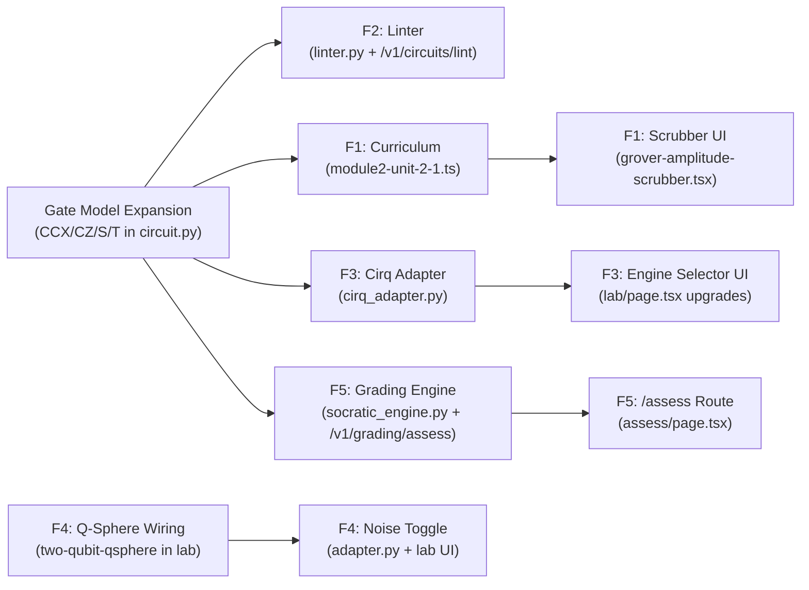

# Q-Trace · Features Implementation Spec

**Version**: 1.0  
**Date**: 29 September 2026  
**Authors**: Vinod + Antigravity  
**Event**: SIH 2026 — Problem Statement SIH26140  
**Source of Truth for**: F1 · F2 · F3 · F4 · F5

> [!IMPORTANT]
> This document is the **single authoritative spec** for the 5 differentiating features.
> Every build task must trace back to a section here. Do not implement beyond this spec
> without a logged decision in `board/DECISIONS.md`.

---

## Document Map

| Feature | Name | SIH Deliverable | Section |
|---|---|---|---|
| **F1** | Grover's Algorithm Unit (Module 2 Launch) | Deliverable 1 — Curriculum | [§1](#f1-grovers-algorithm-unit--module-2-launch) |
| **F2** | Quantum Invariant Linter | Deliverable 2 — Circuit Designer | [§2](#f2-quantum-invariant-linter) |
| **F3** | Tri-Engine Conformance Arena | Deliverable 3 — Multi-Framework Sim | [§3](#f3-tri-engine-conformance-arena--endianness-rosetta-stone) |
| **F4** | Q-Sphere + NISQ Noise Emulation | Deliverable 4 — Visualization | [§4](#f4-q-sphere--nisq-noise-emulation) |
| **F5** | Socratic Counterexample Engine | Deliverable 5 — Assessment | [§5](#f5-socratic-counterexample-engine--mutation-challenges) |

---

## F1: Grover's Algorithm Unit — Module 2 Launch

### 1.1 What This Feature Is

Module 1 ends at `mod1_algorithm_bridge` in `units-8-to-10.ts` with a preview list of Module 2
units (2.1–2.7). F1 launches **Module 2** by building the first complete algorithm unit:
**Grover's Search Algorithm**.

The unit follows the same pedagogical pattern as Module 1 (e.g., Hadamard had concept stages
before the gate lab): we introduce the new vocabulary and gates Grover requires **before**
asking the student to build and run the circuit. The unit also wires into the existing
**Flight Recorder** in `/lab` to show a step-by-step scrubber of amplitude amplification.

### 1.2 New Gates Required

The current `GateName` enum in `apps/api/app/models/circuit.py` only supports:
`H, X, Y, Z, CNOT, MEASURE`.

Grover's diffusion operator requires:

| Gate | Qiskit API | Qubit Arity | Notes |
|---|---|---|---|
| **CCX** (Toffoli) | `qc.ccx(ctrl1, ctrl2, target)` | 2 controls + 1 target | Core of the multi-controlled-Z diffusion operator |
| **CZ** | `qc.cz(ctrl, target)` | 1 control + 1 target | Used in phase-kickback oracle encoding |
| **S** | `qc.s(qubit)` | 1 | Phase gate (√Z); already in curriculum but not GateName |
| **T** | `qc.t(qubit)` | 1 | π/8 gate; needed for Toffoli decompositions |

> [!NOTE]
> CZ and S/T gates were already mentioned in the Module 1 curriculum content (units-4-to-5.ts)
> but never added to the backend GateName enum. Adding them here satisfies both Module 1
> Gate Lab descriptions AND Grover.

**Backend change scope:**
- `apps/api/app/models/circuit.py` — extend `GateName` enum, add per-gate validation rules
- `apps/api/app/services/quantum/adapter.py` — map new gates to Qiskit circuit calls
- `apps/api/app/services/quantum/parser.py` — add AST patterns for `qc.ccx()`, `qc.cz()`,
  `qc.s()`, `qc.t()` to the allowlist
- `apps/web/features/circuit/circuit-types.ts` — mirror new GateNames on the frontend
- `apps/web/features/circuit/gate-palette.tsx` — add glyph + drag target for CCX, CZ, S, T

### 1.3 Curriculum Stage Plan — Unit 2.1 (Grover's Algorithm)

File to create: **`apps/web/lib/curriculum/module2-unit-2-1.ts`**

Export: `module2Unit21Stages: CurriculumStage[]`

The unit has **9 stages** across 5 categories:

```
CONCEPT PREP (4 stages) → GATE INTRO (2 stages) → PREDICTION (1) → GATE LAB (1) → BOSS (1)
```

#### Stage 2.1.1 — NODE_CONCEPT: "The Oracle: Marking the Answer Without Reading It"
- **unitId**: `unit_2_1` | **stageNumber**: 1
- **estimatedMinutes**: 5 | **coherenceReward**: 60
- **analogyHook**: *"A metal detector doesn't tell you what's buried — it just beeps louder over
  the right spot. Grover's oracle does the same: it marks the answer qubit with a phase flip
  without revealing which item it is."*
- **conceptSummary**: The Grover oracle $U_\omega$ applies a phase flip to exactly one
  computational basis state $|\omega\rangle$ (the "marked" state):
  $$U_\omega|x\rangle = \begin{cases} -|x\rangle & \text{if } x = \omega \\ |x\rangle & \text{otherwise} \end{cases}$$
  It does NOT measure or collapse the state — the query register remains in superposition.
  The oracle's phase flip is invisible until the Diffusion operator interferes the amplitudes.
- **metadata**: `{ oracleType: "phase_flip", classicalEquivalent: "f(x) = 1 if x == ω else 0" }`

#### Stage 2.1.2 — NODE_CONCEPT: "Amplitude Amplification: Reflecting About the Mean"
- **unitId**: `unit_2_1` | **stageNumber**: 2
- **estimatedMinutes**: 6 | **coherenceReward**: 70
- **analogyHook**: *"Imagine all arrow heights on a target represent probability amplitudes.
  Grover flips the marked arrow negative, then reflects every arrow about their average height.
  The positive arrows shrink; the once-negative marked arrow shoots up above the average."*
- **conceptSummary**: The Grover Diffusion operator $U_s = 2|s\rangle\langle s| - I$
  (where $|s\rangle = H^{\otimes n}|0\rangle^n$) performs an **inversion about the mean**:
  each amplitude $\alpha_i$ is transformed to $2\bar{\alpha} - \alpha_i$ where
  $\bar{\alpha} = \frac{1}{N}\sum_j \alpha_j$. After the oracle negates $\alpha_\omega$, the
  reflection amplifies $\alpha_\omega$ while suppressing all other amplitudes. After
  $\lfloor \pi\sqrt{N}/4 \rfloor$ iterations, $P(|\omega\rangle) \approx 1$.
- **groverMath**:
  ```typescript
  {
    diffusionOperator: "2|s⟩⟨s| - I",
    meanAmplitude: "ᾱ = (1/N) Σ αᵢ",
    reflectionRule: "αᵢ → 2ᾱ - αᵢ",
    optimalIterations: "⌊(π/4)√N⌋",
    finalProbability: "P(|ω⟩) ≈ sin²((2k+1)θ) where θ = arcsin(1/√N)"
  }
  ```

#### Stage 2.1.3 — NODE_CONCEPT: "The Toffoli Gate (CCX): Quantum AND"
- **unitId**: `unit_2_1` | **stageNumber**: 3
- **estimatedMinutes**: 5 | **coherenceReward**: 65
- **analogyHook**: *"A traffic light changes to green ONLY IF both the pedestrian button is
  pressed AND the timer has elapsed. CCX (Toffoli) flips its target qubit ONLY IF both
  control qubits are |1⟩ — it is a quantum AND gate."*
- **conceptSummary**: The Toffoli gate (CCX) is a 3-qubit gate with 2 control qubits and
  1 target. It applies an X (NOT) gate to the target **only** when both controls are $|1\rangle$:
  $\text{CCX}|c_1 c_0 t\rangle = |c_1 c_0\rangle \otimes X^{c_1 \cdot c_0}|t\rangle$.
  It is the universal building block for the multi-controlled phase-flip oracle in Grover.
  CCX is also classically reversible — the Fredkin/Toffoli gate is universal for
  reversible classical computation.
- **gateTruthTable**:
  ```typescript
  {
    gate: "CCX (Toffoli)",
    qiskitAPI: "qc.ccx(ctrl1, ctrl2, target)",
    controls: 2,
    targets: 1,
    truthTable: [
      { input: "|000⟩", output: "|000⟩" },
      { input: "|001⟩", output: "|001⟩" },
      { input: "|010⟩", output: "|010⟩" },
      { input: "|011⟩", output: "|011⟩" },
      { input: "|100⟩", output: "|100⟩" },
      { input: "|101⟩", output: "|101⟩" },
      { input: "|110⟩", output: "|111⟩" },
      { input: "|111⟩", output: "|110⟩" }
    ],
    universality: "Universal for reversible classical computation"
  }
  ```

#### Stage 2.1.4 — NODE_CONCEPT: "Grover Speedup: O(√N) vs O(N)"
- **unitId**: `unit_2_1` | **stageNumber**: 4
- **estimatedMinutes**: 4 | **coherenceReward**: 55
- **analogyHook**: *"Finding a name in an unsorted phone book requires reading, on average, half
  the pages — N/2 lookups. Grover finds the name by opening the book roughly √N times, using
  quantum wave interference to cancel out every wrong page."*
- **conceptSummary**: Classical unstructured search requires $O(N)$ oracle queries on average
  (and at least $N/2$ in the worst case). Grover's algorithm provably solves the same problem
  with $O(\sqrt{N})$ oracle queries — a **quadratic speedup**. For $N = 2^n$ items encoded in
  $n$ qubits, the optimal number of Grover iterations is
  $k_{\text{opt}} = \lfloor \frac{\pi}{4}\sqrt{N} \rfloor$.
  For $n = 3$ qubits ($N = 8$), $k_{\text{opt}} = 2$ iterations reach $P(|\omega\rangle) \approx 0.945$.
- **speedupTable**:
  ```typescript
  {
    items: [4, 8, 16, 64, 1024],
    classicalAvg: [2, 4, 8, 32, 512],
    groverIterations: [1, 2, 3, 6, 25],
    successProbability: [1.0, 0.945, 0.961, 0.987, 0.999]
  }
  ```

#### Stage 2.1.5 — NODE_GATE_LAB: "CCX Gate Lab: Build a Quantum AND"
- **unitId**: `unit_2_1` | **stageNumber**: 5
- **estimatedMinutes**: 6 | **coherenceReward**: 80
- **conceptSummary**: Interactive gate lab using the upgraded Circuit Workspace with CCX.
  Students build a 3-qubit circuit: initialize q0=|1⟩, q1=|1⟩ via X gates, then apply CCX.
  The Flight Recorder shows the statevector confirm |111⟩ → |110⟩ (target flipped).
  Students then try with q1=|0⟩ and observe the CCX does NOT fire (no flip).
- **labCircuit**:
  ```typescript
  {
    qubitCount: 3,
    steps: [
      "Apply X to q0 (prepare |1⟩)",
      "Apply X to q1 (prepare |1⟩)",
      "Apply CCX(ctrl=q0, ctrl=q1, target=q2)",
      "Measure all qubits"
    ],
    expectedOutput: "|110⟩ with P=1.0",
    learnerTask: "Verify CCX fires only when both controls are |1⟩"
  }
  ```

#### Stage 2.1.6 — NODE_GATE_LAB: "Phase Oracle Lab: Mark |101⟩ with a Phase Flip"
- **unitId**: `unit_2_1` | **stageNumber**: 6
- **estimatedMinutes**: 7 | **coherenceReward**: 85
- **conceptSummary**: Students build a 3-qubit phase oracle that marks the state $|101\rangle$
  (q0=1, q1=0, q2=1) with a phase flip. Technique: flip q1 (X gate), apply CCX with controls
  q0 and q2 targeting an ancilla-free approach using CZ, then un-flip q1. The Flight Recorder
  captures the statevector to show the phase of $|101\rangle$ is now $-1/\sqrt{8}$ while all
  other states remain $+1/\sqrt{8}$.
- **labCircuit**:
  ```typescript
  {
    qubitCount: 3,
    targetState: "|101⟩",
    oracleSteps: [
      "H on all qubits (equal superposition)",
      "X on q1 (so q1 is |1⟩ when input is |101⟩)",
      "CCX(ctrl=q0, ctrl=q1, target=q2) — marks |111⟩ after X-flip trick",
      "X on q1 (undo flip)",
      "Capture statevector: |101⟩ amplitude is now negative"
    ]
  }
  ```

#### Stage 2.1.7 — NODE_PREDICTION: "How Many Iterations? Predict the Grover Count"
- **unitId**: `unit_2_1` | **stageNumber**: 7
- **estimatedMinutes**: 3 | **coherenceReward**: 50
- **predictionCheckpoint**:
  ```typescript
  {
    id: "pc_grover_iterations",
    prompt: "For a 3-qubit Grover search (N = 8 states, 1 marked state), how many Grover iterations are needed to maximize P(|ω⟩)?",
    options: [
      {
        id: "GROVER_2_ITER",
        label: "2 iterations — ⌊(π/4)√8⌋ = ⌊2.22⌋ = 2",
        correct: true,
        explanation: "Correct! After exactly 2 Grover iterations on 3 qubits, P(|ω⟩) ≈ 94.5%. A 3rd iteration would OVER-rotate and reduce probability back down."
      },
      {
        id: "GROVER_1_ITER",
        label: "1 iteration",
        correct: false,
        explanation: "One iteration brings P(|ω⟩) to ~78.1% for N=8 — the state is not yet maximally amplified."
      },
      {
        id: "GROVER_4_ITER",
        label: "4 iterations — we need to check every state",
        correct: false,
        explanation: "This reveals a classical intuition fallacy. Grover does NOT check every state. 4 iterations over-rotates the amplitude past the peak."
      }
    ],
    correctOptionId: "GROVER_2_ITER",
    misconceptionHandled: "Over-iteration and classical search analogy confusion"
  }
  ```

#### Stage 2.1.8 — NODE_GATE_LAB: "Full 3-Qubit Grover Circuit"
- **unitId**: `unit_2_1` | **stageNumber**: 8
- **estimatedMinutes**: 10 | **coherenceReward**: 100
- **conceptSummary**: Students build and run the complete 3-qubit Grover circuit targeting
  $|\omega\rangle = |101\rangle$. The Flight Recorder scrubber (see §1.4) animates each step:
  initialization, oracle application (step 1), diffusion (step 1), oracle again (step 2),
  diffusion again (step 2), final measurement.
- **starterCircuitDefinition** (provided as default canvas layout):
  ```typescript
  {
    qubitCount: 3,
    classicalBitCount: 3,
    operations: [
      // Step 0: Equal superposition
      { gate: "H", targets: [0], column: 0 },
      { gate: "H", targets: [1], column: 0 },
      { gate: "H", targets: [2], column: 0 },
      // Oracle iteration 1: mark |101⟩
      { gate: "X", targets: [1], column: 1 },
      { gate: "CCX", targets: [2], controls: [0, 1], column: 2 },
      { gate: "X", targets: [1], column: 3 },
      // Diffusion iteration 1
      { gate: "H", targets: [0], column: 4 },
      { gate: "H", targets: [1], column: 4 },
      { gate: "H", targets: [2], column: 4 },
      { gate: "X", targets: [0], column: 5 },
      { gate: "X", targets: [1], column: 5 },
      { gate: "X", targets: [2], column: 5 },
      { gate: "CCX", targets: [2], controls: [0, 1], column: 6 },
      { gate: "X", targets: [0], column: 7 },
      { gate: "X", targets: [1], column: 7 },
      { gate: "X", targets: [2], column: 7 },
      { gate: "H", targets: [0], column: 8 },
      { gate: "H", targets: [1], column: 8 },
      { gate: "H", targets: [2], column: 8 },
      // Measure
      { gate: "MEASURE", targets: [0], classicalTargets: [0], column: 9 },
      { gate: "MEASURE", targets: [1], classicalTargets: [1], column: 9 },
      { gate: "MEASURE", targets: [2], classicalTargets: [2], column: 9 }
    ]
  }
  ```
- **acceptanceCriteria**: `P(|101⟩) >= 0.90` on Qiskit Aer (1024 shots)

#### Stage 2.1.9 — NODE_MILESTONE: "Grover Boss: Find the Hidden State" (Boss)
- **unitId**: `unit_2_1` | **stageNumber**: 9
- **estimatedMinutes**: 10 | **coherenceReward**: 150
- **conceptSummary**: The boss generates a **random marked state** at session start (unknown
  to the student). The student is given only the oracle and must build the complete Grover
  circuit around it to identify the hidden state.
- **acceptanceCriteria**:
  - Circuit must use CCX and all diffusion operator gates
  - $P(|\omega\rangle) \geq 0.90$ on Qiskit Aer
  - Student must name the marked state correctly
- **bossChallenge**: `true`

### 1.4 Flight Recorder Scrubber — Grover Amplitude View

This is the "wow-moment" visualization component for F1.

**New frontend component**: `apps/web/features/evidence/grover-amplitude-scrubber.tsx`

#### What It Renders

A horizontal scrubber timeline synced to the `stateTrace` array returned by the existing
`adapter.py` (which already logs intermediate statevectors at every execution step).

For each scrubber position (step):
- A bar chart of ALL $N = 2^n$ basis state amplitudes (signed, showing negative values)
- The marked state $|\omega\rangle$ is highlighted in **Electric Cyan** (`#00D4FF`)
- Non-marked states are shown in **Cobalt** (`#1E40AF`)
- Step label: `"Oracle Phase Flip"`, `"Diffusion (Inversion About Mean)"`, etc.
- Mean amplitude line $\bar{\alpha}$ drawn as a dashed horizontal rule

#### Integration Point

- Mounted inside `/lab`'s **Stage 3: Flight Recorder** panel, visible when the active circuit
  uses CCX gates (Grover detection heuristic: circuit has CCX + H pattern)
- Data source: existing `stateTrace` array in `SimulationRun` response (no new API needed)
- Scrubber uses `<input type="range">` mapped to `stateTrace[step]`

#### Demo Wow-Moment Script

> Presenter scrubs from step 0 to step 3 on the 3-qubit Grover circuit targeting $|101\rangle$:
> - **Step 0**: All 8 amplitudes flat at $+1/\sqrt{8} \approx 0.354$
> - **Step 1** (Oracle): State $|101\rangle$ flips to $-0.354$; all others remain $+0.354$
> - **Step 2** (Diffusion): $|101\rangle$ shoots to $\approx +0.729$; others drop to $\approx +0.177$
> - **Step 3** (2nd Oracle): $|101\rangle$ flips to $-0.729$
> - **Step 4** (2nd Diffusion): $|101\rangle$ reaches $\approx +0.972$ (94.5% probability)
>
> Judges watch destructive interference eliminate 7 wrong states while $|101\rangle$ dominates.

### 1.5 Backend Changes Required

| File | Change |
|---|---|
| `apps/api/app/models/circuit.py` | Add `CCX = "CCX"`, `CZ = "CZ"`, `S = "S"`, `T = "T"` to `GateName`; add CCX validator (2 controls, 1 target, controls != target); update op-count limit from 20 → 30 (Grover 3-qubit needs ~20 ops) |
| `apps/api/app/services/quantum/adapter.py` | Add `elif gate == GateName.CCX: qc.ccx(op.controls[0], op.controls[1], op.targets[0])` etc. |
| `apps/api/app/services/quantum/parser.py` | Add `qc.ccx`, `qc.cz`, `qc.s`, `qc.t` to the AST allowlist; these are standard `qc.<method>` calls — same safe pattern as `qc.h`, `qc.x` |
| `apps/api/app/services/quantum/openqasm_exporter.py` | Add CCX → `ccx q[c1], q[c0], q[t];` mapping |

### 1.6 Frontend Changes Required

| File | Change |
|---|---|
| `apps/web/features/circuit/circuit-types.ts` | Add `"CCX" \| "CZ" \| "S" \| "T"` to `GateName` union |
| `apps/web/features/circuit/gate-palette.tsx` | Add CCX (3-terminal glyph), CZ, S, T gate tiles |
| `apps/web/features/circuit/gate-glyph.tsx` | Add SVG glyph renderers for CCX (Toffoli symbol: ⊕ with two dots), CZ, S, T |
| `apps/web/features/circuit/interactive-circuit-workspace.tsx` | Handle CCX placement on wire (3-qubit span: 2 control dots + ⊕ target) |
| `apps/web/lib/curriculum/module2-unit-2-1.ts` | **Create new file** — all 9 stages as defined in §1.3 |
| `apps/web/lib/curriculum/all-stages.ts` | Import and spread `module2Unit21Stages` |
| `apps/web/features/evidence/grover-amplitude-scrubber.tsx` | **Create new component** — see §1.4 |

---

## F2: Quantum Invariant Linter

### 2.1 What This Feature Is

The existing AST bidirectional studio (`circuit-parser.ts` ↔ `parser.py`) already syncs
visual ↔ code. F2 adds **real-time quantum physics validation** — not Python syntax errors,
but actual quantum mechanics violations surfaced as **amber warning pills** on the circuit
canvas and the code editor.

### 2.2 Three Invariant Rules to Enforce

#### Rule QI-1: Post-Collapse Unitary Gate

**Trigger**: Any unitary gate (H, X, Y, Z, S, T, CZ, CCX) placed on a qubit wire after a
`MEASURE` operation targeting that same qubit.

**Why it's invalid**: Measurement projects a qubit into the classical basis ($|0\rangle$ or
$|1\rangle$) and records the result in a classical bit. The qubit is no longer in a
quantum state — applying a unitary gate to a classical bit is physically meaningless.

**Message** (shown as amber pill on canvas + red underline squiggle in code editor):
```
⚠ Post-collapse unitary detected: H gate applied to q[0] after MEASURE.
  Qubit q[0] collapsed into classical bit c[0]; subsequent unitary operations
  are physically invalid. Remove the H or move it before the MEASURE.
```

**Severity**: `WARNING` (allow simulation but flag; do not hard-block)

#### Rule QI-2: No-Cloning Violation Attempt

**Trigger**: A CNOT where the control qubit is in a known-superposition state (has
received an H gate) AND the target qubit is also in a known-superposition state (has also
received an H gate) AND the user has explicitly placed a second CNOT with the same
target (attempting to "copy" the superposition to a second register).

**Why it's invalid**: The No-Cloning Theorem prevents duplicating arbitrary unknown quantum
states. Two CNOTs wired this way will produce entanglement, not copying.

**Message**:
```
⚠ Cloning attempt detected: You are trying to duplicate a superposition state
  via two CNOT gates. This does not copy quantum states — it creates entanglement.
  The No-Cloning Theorem (Wootters & Zurek, 1982) proves this is impossible.
```

**Severity**: `INFO` (educational hint, non-blocking)

#### Rule QI-3: Controlled Gate Wire Collision

**Trigger**: A controlled gate (CNOT or CCX) where any control qubit index equals
any target qubit index.

**Why it's invalid**: A qubit cannot control its own transformation — this is undefined
behavior in quantum circuits.

**Message**:
```
⚡ Wire collision: Control qubit q[0] and target qubit q[0] are the same wire.
   A qubit cannot be its own control. Assign control and target to different qubits.
```

**Severity**: `ERROR` (block simulation; must resolve)

### 2.3 Architecture

#### Backend — `apps/api/app/services/quantum/linter.py` (NEW)

```python
"""
Quantum Invariant Linter — pure logic, no SDK imports.

Analyzes a CircuitModel's operation list to detect:
  QI-1: Post-collapse unitary gates
  QI-2: No-cloning violation attempts
  QI-3: Controlled gate wire collisions

Returns a list of LintWarning objects.
"""

from dataclasses import dataclass
from enum import Enum
from typing import List

from app.models.circuit import CircuitModel, GateName

class LintSeverity(str, Enum):
    ERROR   = "ERROR"
    WARNING = "WARNING"
    INFO    = "INFO"

@dataclass
class LintWarning:
    rule: str                  # "QI-1", "QI-2", "QI-3"
    severity: LintSeverity
    qubit: int | None          # affected qubit index (if applicable)
    column: int                # operation column where violation occurs
    opId: str                  # offending operation ID
    message: str               # human-readable message

def lint_circuit(circuit: CircuitModel) -> List[LintWarning]:
    warnings: list[LintWarning] = []
    measured_qubits: set[int] = set()

    for op in circuit.operations:
        gate = op.gate

        # QI-3: Wire collision (check first, fast)
        for ctrl in op.controls:
            if ctrl in op.targets:
                warnings.append(LintWarning(
                    rule="QI-3", severity=LintSeverity.ERROR,
                    qubit=ctrl, column=op.column, opId=op.opId,
                    message=f"Wire collision: control q[{ctrl}] == target q[{ctrl}]."
                ))

        # QI-1: Post-collapse unitary
        if gate != GateName.MEASURE:
            for t in op.targets:
                if t in measured_qubits:
                    warnings.append(LintWarning(
                        rule="QI-1", severity=LintSeverity.WARNING,
                        qubit=t, column=op.column, opId=op.opId,
                        message=(
                            f"Post-collapse unitary: {gate.value} on q[{t}] "
                            f"after MEASURE. Qubit is collapsed."
                        )
                    ))

        # Track measured qubits
        if gate == GateName.MEASURE:
            measured_qubits.update(op.targets)

    return warnings
```

#### Backend — API Endpoint

Lint runs **automatically** as part of the circuit parse endpoint (`POST /v1/circuits/parse-qiskit`).
The existing `ParseQiskitResponse` already has a `warnings: list[str]` field — extend it:

```python
# apps/api/app/models/circuit.py
class ParseQiskitResponse(BaseModel):
    circuitModel: CircuitModel
    warnings: list[str] = Field(default_factory=list)      # existing
    lintWarnings: list[LintWarning] = Field(default_factory=list)  # NEW
```

Also expose as a standalone lint-only endpoint for real-time canvas linting:

```
POST /v1/circuits/lint
Body: { circuitModel: CircuitModel }
Response: { lintWarnings: LintWarning[] }
```

This is called by the frontend on every circuit mutation (debounced 300ms).

#### Frontend — Circuit Canvas Integration

**File**: `apps/web/features/circuit/interactive-circuit-workspace.tsx`

- After each canvas drag-and-drop / gate placement, call `POST /v1/circuits/lint`
- Overlay amber warning pills at the top of the affected qubit wire column
- Warning pill shows rule ID + short message; expand on hover/click for full text

**File**: `apps/web/features/circuit/qiskit-code-editor.tsx`

- Parse `lintWarnings` from the sync response
- Highlight offending lines with amber underline squiggle (CSS `text-decoration: underline wavy #F59E0B`)
- Show inline gutter icon (⚠) at the offending line number

### 2.4 Demo Wow-Moment Script

> Presenter types in the Qiskit code panel:
> ```python
> qc.h(0)
> qc.measure(0, 0)
> qc.h(0)     ← cursor is here
> ```
> Within 300ms, the canvas shows an amber pill on q[0] column 2:
> **"⚠ Post-collapse unitary: H applied to collapsed state q[0]"**
> The code editor shows a wavy amber underline under `qc.h(0)` (line 3).

---

## F3: Tri-Engine Conformance Arena & Endianness Rosetta Stone

### 3.1 What This Feature Is

The `/lab` page currently hardcodes `Qiskit Aer (1024 shots)` as the only execution target.
F3 makes **PennyLane** and **Google Cirq** selectable backends in the Lab UI, runs all three
simultaneously on circuit submission, computes cross-engine delta comparison, and shows
a **green conformance badge** or a **red divergence alert**.

Additionally, an **Endianness Rosetta Stone** inline panel teaches students why `|q₁q₀⟩`
(Qiskit, little-endian) shows different bit ordering than `|q₀q₁⟩` (Cirq/PennyLane, big-endian).

### 3.2 Backend Architecture

#### New File: `apps/api/app/services/quantum/cirq_adapter.py`

```python
"""
Google Cirq adapter for Q-Trace.

Maps CircuitModel → cirq.Circuit → cirq.Simulator → normalized StateTrace.
Reuses normalizer.py for basis endianness alignment (big-endian → little-endian).

Cirq uses big-endian qubit ordering (q₀ = MSB), matching PennyLane.
The existing _pennylane_index_to_contract_label mapping applies directly.
"""

import cirq
import numpy as np
from app.models.circuit import CircuitModel, GateName
from app.services.quantum.normalizer import normalize_statevector

_GATE_MAP = {
    GateName.H: cirq.H,
    GateName.X: cirq.X,
    GateName.Y: cirq.Y,
    GateName.Z: cirq.Z,
    GateName.S: cirq.S,
    GateName.T: cirq.T,
}

def build_cirq_circuit(model: CircuitModel) -> cirq.Circuit:
    qubits = cirq.LineQubit.range(model.qubitCount)
    moments = []
    for op in model.operations:
        if op.gate == GateName.MEASURE:
            moments.append(cirq.measure(*[qubits[t] for t in op.targets]))
        elif op.gate == GateName.CNOT:
            ctrl, tgt = qubits[op.controls[0]], qubits[op.targets[0]]
            moments.append(cirq.CNOT(ctrl, tgt))
        elif op.gate == GateName.CCX:
            c1, c2, tgt = qubits[op.controls[0]], qubits[op.controls[1]], qubits[op.targets[0]]
            moments.append(cirq.CCX(c1, c2, tgt))
        elif op.gate == GateName.CZ:
            ctrl, tgt = qubits[op.controls[0]], qubits[op.targets[0]]
            moments.append(cirq.CZ(ctrl, tgt))
        else:
            gate = _GATE_MAP[op.gate]
            moments.append(gate(qubits[op.targets[0]]))
    return cirq.Circuit(moments)


def run_cirq(model: CircuitModel) -> dict:
    """
    Returns statevector normalized to Qiskit little-endian ordering.
    Uses cirq.Simulator for exact statevector simulation.
    """
    circuit = build_cirq_circuit(model)
    sim = cirq.Simulator()
    result = sim.simulate(circuit)
    sv = result.final_state_vector
    # Cirq is big-endian (q₀ MSB). Reverse bit order to match Qiskit little-endian.
    n = model.qubitCount
    normalized = normalize_statevector(sv, n, source_endian="big")
    return {"backend": "cirq", "statevector": normalized.tolist()}
```

#### Upgraded: `apps/api/app/services/quantum/pennylane_adapter.py`

The existing PennyLane adapter currently runs only for conformance tests (not user-facing).
Expose it to the simulation service as a selectable backend.

#### Upgraded: `apps/api/app/routers/simulation.py`

Add optional `backends` query param to `POST /v1/simulation-runs`:

```
POST /v1/simulation-runs
Body: { circuitModel, backends: ["qiskit", "pennylane", "cirq"] }
```

Response gains:
```json
{
  "conformanceResults": {
    "qiskit":    { "statevector": [...], "durationMs": 12 },
    "pennylane": { "statevector": [...], "durationMs": 18 },
    "cirq":      { "statevector": [...], "durationMs": 9 }
  },
  "conformanceDelta": 0.000000,
  "conformanceBadge": "VERIFIED"   // or "DIVERGED"
}
```

`conformanceDelta` = max pairwise L2 norm across all backend statevectors (epsilon = 1e-6).
The existing `normalizer.py` already handles this comparison.

### 3.3 Frontend Architecture

#### Lab Backend Selector

**File**: `apps/web/app/(app)/lab/page.tsx`

Add a **backend selector row** above the simulation trigger button:

```tsx
<div className="flex gap-2 items-center">
  <span className="text-xs text-muted-foreground">Execution Engine</span>
  {["Qiskit Aer", "PennyLane", "Cirq"].map(engine => (
    <ToggleButton
      key={engine}
      active={selectedEngines.includes(engine)}
      onClick={() => toggleEngine(engine)}
    >
      {engine}
    </ToggleButton>
  ))}
  <ConformanceBadge delta={conformanceDelta} />
</div>
```

#### Conformance Badge Component

**File**: `apps/web/features/circuit/conformance-badge.tsx` (NEW)

- **Green badge** when `conformanceDelta <= 1e-6`: `"✓ Multi-Engine Verified Δ = 0.000000"`
- **Red badge** when `conformanceDelta > 1e-6`: `"✗ Engines Diverged Δ = 0.000031"`
- Tooltip explains the delta and which backends differ

#### Endianness Rosetta Stone Panel

**File**: `apps/web/features/circuit/endianness-rosetta-stone.tsx` (NEW)

- **Visible when**: user switches from Qiskit to Cirq or PennyLane (or has multiple engines selected)
- **Location**: inline side-panel to the right of the Visual Evidence stage in `/lab`
- **Content**:
  ```
  ┌─────────────────────────────────────────────────────┐
  │  🗺 Endianness Rosetta Stone                         │
  ├─────────────────────────────────────────────────────┤
  │  Same Bell circuit, different bit orderings:        │
  │                                                     │
  │  Qiskit Aer (Little-Endian):   |q₁q₀⟩              │
  │    |00⟩ = 50%    |11⟩ = 50%                        │
  │                                                     │
  │  Cirq / PennyLane (Big-Endian): |q₀q₁⟩             │
  │    |00⟩ = 50%    |11⟩ = 50%  ← same probabilities  │
  │                                                     │
  │  Why different string order but same physics?       │
  │  Qiskit writes the rightmost qubit first (q₀),     │
  │  so |01⟩_Qiskit = |q₁=0, q₀=1⟩ = |10⟩_Cirq.      │
  └─────────────────────────────────────────────────────┘
  ```
- Includes an **interactive toggle** to flip between Qiskit and Cirq notation on the
  statevector display. The numbers stay the same; only the label ordering changes.

### 3.4 Demo Wow-Moment Script

> Presenter selects all three engines (Qiskit Aer + PennyLane + Cirq) and runs the Bell circuit.
> Three progress indicators fire simultaneously. All three complete within 50ms.
> The green badge appears: **"✓ Multi-Engine Verified Δ = 0.000000"**.
> The Endianness Rosetta Stone panel slides in, showing the bit-order difference with
> identical probability numbers — judges understand why SDK docs look different.

---

## F4: Q-Sphere + NISQ Noise Emulation

### 4.1 What This Feature Is

F4 has two sub-features that build on **existing components** in the codebase:

1. **Q-Sphere Integration**: The `two-qubit-qsphere.tsx` component exists in
   `apps/web/features/evidence/` but is disconnected from `/lab`. Wire it into the
   Visual Evidence stage as a live multi-qubit state visualizer.

2. **NISQ Noise Emulation Toggle**: Add a "Noise Mode" toggle in `/lab`'s Visual Evidence
   stage that re-runs the simulation with a realistic `qiskit_aer.noise.NoiseModel`
   and shows the Bloch vector contracting inward (mixed state purity < 1).

### 4.2 Q-Sphere Integration

#### Current State

`apps/web/features/evidence/two-qubit-qsphere.tsx` renders a 3D sphere where:
- Point **size** = probability of basis state
- Point **color** = phase angle $\theta$ (hue mapped 0–2π)
- Points placed at latitude $\theta_j = \arccos(1 - 2j/n)$ for Hamming weight $j$

**Problem**: It is not imported or used anywhere in `/lab/page.tsx`.

#### Integration

**File**: `apps/web/app/(app)/lab/page.tsx`

In the Visual Evidence stage (Stage 2 of the 3-stage studio):

```tsx
{/* Existing */}
<BlochSphereView qubitIndex={0} stateTrace={stateTrace} />
<ProbabilityHistogramView counts={simulationRun.counts} />

{/* NEW — conditionally shown when qubitCount >= 2 */}
{circuit.qubitCount >= 2 && (
  <TwoQubitQSphere
    statevector={simulationRun.statevector}
    qubitCount={circuit.qubitCount}
    noiseEnabled={noiseEnabled}
  />
)}
```

The Q-Sphere should be the **primary** visualization for multi-qubit circuits (≥2 qubits);
the Bloch sphere remains as the single-qubit subsystem view.

### 4.3 NISQ Noise Emulation

#### Backend — New Noise Model Endpoint

**File**: `apps/api/app/services/quantum/adapter.py`

Add an optional `noise_model` parameter to the existing `run_circuit` function:

```python
def run_circuit(
    model: CircuitModel,
    noise_preset: str | None = None   # None = ideal, "superconducting" = realistic
) -> SimulationTrace:
    ...
    if noise_preset == "superconducting":
        from qiskit_aer.noise import NoiseModel, thermal_relaxation_error, depolarizing_error
        noise_model = NoiseModel()

        # T1/T2 thermal relaxation (realistic superconducting qubit parameters)
        T1 = 50e-6   # 50 μs — IBM Eagle QPU typical
        T2 = 70e-6   # 70 μs
        gate_time = 50e-9  # 50 ns gate time

        error = thermal_relaxation_error(T1, T2, gate_time)
        noise_model.add_all_qubit_quantum_error(error, ["h", "x", "y", "z", "cx"])

        # Readout error (realistic ~1%)
        noise_model.add_all_qubit_readout_error([[0.99, 0.01], [0.01, 0.99]])
    else:
        noise_model = None

    backend = AerSimulator(noise_model=noise_model)
    ...
```

**API Change**: Add `noisePreset` field to `POST /v1/simulation-runs` body:

```json
{ "circuitModel": {...}, "noisePreset": "superconducting" }
```

#### Frontend — Noise Toggle in Visual Evidence Stage

**File**: `apps/web/app/(app)/lab/page.tsx`

```tsx
<div className="flex items-center gap-2">
  <Switch
    checked={noiseEnabled}
    onCheckedChange={handleNoiseToggle}
    id="noise-toggle"
  />
  <label htmlFor="noise-toggle" className="text-sm">
    NISQ Noise Model (Superconducting T₁/T₂)
  </label>
</div>
```

When toggled, re-submits the circuit to the API with `noisePreset: "superconducting"`.
The UI should show a **brief loading state** (the noisy simulation takes slightly longer).

#### Bloch Vector Contraction Visual

**File**: `apps/web/features/evidence/bloch-3d-sphere.tsx`

The existing component already computes and renders Bloch vector $\vec{r} = (x, y, z)$ from
the density matrix trace outputs in `adapter.py`. The density matrix math already computes
purity $\text{Tr}(\rho^2)$ and Bloch coordinates.

When `noiseEnabled = true`, the API response will return `purity < 1.0` and a Bloch vector
with $|\vec{r}| < 1$ (inside the sphere). The existing rendering logic should already handle
this — verify that the 3D sphere does not clamp $|\vec{r}|$ to 1.0.

Add a **purity readout label** below the sphere:
```
Purity: Tr(ρ²) = 0.847   [mixed state]
```

### 4.4 Demo Wow-Moment Script

> Presenter runs the Bell circuit in **Ideal mode**: sharp 50%/50% histogram, Bloch vectors
> on sphere surface (purity = 1.00). 
> Clicks **"NISQ Noise Model"** toggle. New simulation runs (~200ms).
> The Bloch sphere vectors visibly shrink **inward** — now showing $|\vec{r}| = 0.84$.
> Histogram develops noise artifacts: slight counts on `|01⟩` and `|10⟩`.
> Purity label reads: `"Tr(ρ²) = 0.847 [mixed state]"`.
> Judges understand why real QPUs require quantum error correction.

---

## F5: Socratic Counterexample Engine & Mutation Challenges

### 5.1 What This Feature Is

When a student's circuit fails a grading challenge, instead of showing a raw error traceback
or a "Wrong — try again" message, the **Socratic Counterexample Engine**:

1. Finds the **smallest input state** where the student's circuit diverges from the target
2. Loads both circuits side-by-side in a Flight Recorder diff view
3. States the specific quantum mechanical invariant that was violated (not the syntax error)

This lives on a **dedicated `/assess` route** separate from `/lab` and `/learn`.

### 5.2 Three Quantum Mechanical Invariants for Grading

These invariants are computed **deterministically** via the existing Qiskit Aer simulator —
no LLM calls, no string matching.

#### Invariant G-1: Entanglement Entropy

For a 2-qubit output state $|\psi_{out}\rangle$, compute the von Neumann entropy of
subsystem A: $S(\rho_A) = -\text{Tr}(\rho_A \log_2 \rho_A)$.

- $S = 0$: product state (separable, not entangled)
- $S = 1$: maximally entangled (Bell state)

**Used to assert**: "The target circuit produces entangled output; your circuit produces
a separable product state."

The existing `adapter.py` already computes reduced density matrices and purity
$\text{Tr}(\rho^2)$ at `L146-193`. Entanglement entropy is a direct extension:
$S = 1 - \text{Tr}(\rho^2)$ is a lower-bound approximation; for exact entropy use
eigenvalue decomposition.

#### Invariant G-2: Phase Observability

For a circuit that should produce output in superposition (e.g., $|+\rangle = (|0\rangle + |1\rangle)/\sqrt{2}$),
verify that measuring in the **Hadamard basis** (applying H then measuring) yields a
deterministic result vs random noise.

Algorithm:
1. Run student circuit → get statevector $|\psi_{student}\rangle$
2. Run target circuit → get statevector $|\psi_{target}\rangle$
3. Apply H⊗ⁿ to both → measure in computational basis
4. If $|\psi_{student}\rangle$ shows uniform distribution (entropy ≈ 1) while
   $|\psi_{target}\rangle$ shows a peaked distribution, the student circuit lacks
   the correct relative phases.

**Used to assert**: "Your circuit creates the correct probability magnitudes but wrong
relative phase, causing destructive interference to fail."

#### Invariant G-3: Unitary Reversibility

For any correct quantum circuit $U$, appending $U^\dagger$ should return all qubits to
$|0\cdots0\rangle$ with fidelity $\geq 0.99$.

Algorithm:
1. Run `U_student` on $|0\rangle^n$ → get $|\psi_{out}\rangle$
2. Run `U_student^\dagger` on $|\psi_{out}\rangle$ (reverse all gate operations, conjugate)
3. Measure fidelity against $|0\rangle^n$: $F = |\langle 0^n | U^\dagger U | 0^n\rangle|^2$
4. If $F < 0.99$: student circuit is non-unitary or has gate errors

**Used to assert**: "Your circuit is not a valid unitary transformation. Check for
non-unitary operations or incorrect gate order."

### 5.3 Socratic Counterexample Generation

When grading fails any invariant:

```python
# apps/api/app/services/grading/socratic_engine.py  (NEW)

def generate_counterexample(
    student_circuit: CircuitModel,
    target_circuit: CircuitModel,
    failed_invariant: str  # "G-1" | "G-2" | "G-3"
) -> CounterExample:
    """
    Find the smallest |ψ_in⟩ where student_circuit diverges from target_circuit.
    
    Strategy: test basis states |0⟩, |1⟩, |+⟩, |−⟩, |i+⟩ as inputs.
    Return the first state where fidelity(student_out, target_out) < 0.99.
    """
    test_inputs = [
        {"state": "|0⟩", "prep_ops": []},
        {"state": "|1⟩", "prep_ops": [{"gate": "X", "targets": [0]}]},
        {"state": "|+⟩", "prep_ops": [{"gate": "H", "targets": [0]}]},
    ]
    for inp in test_inputs:
        student_out = run_with_prep(student_circuit, inp["prep_ops"])
        target_out  = run_with_prep(target_circuit,  inp["prep_ops"])
        fidelity    = compute_fidelity(student_out, target_out)
        if fidelity < 0.99:
            return CounterExample(
                inputState=inp["state"],
                studentOutput=student_out,
                targetOutput=target_out,
                fidelity=fidelity,
                invariantViolated=failed_invariant,
                explanation=INVARIANT_MESSAGES[failed_invariant]
            )
    return None  # circuits are equivalent
```

### 5.4 `/assess` Route — UI Specification

**File to create**: `apps/web/app/(app)/assess/page.tsx`

**Layout** (two-column, 50/50):

```
┌──────────────────────┬──────────────────────┐
│   Your Circuit       │   Target Circuit     │
│   (read-only canvas) │   (read-only canvas) │
├──────────────────────┴──────────────────────┤
│   Flight Recorder — Divergence Point         │
│                                              │
│   Input state: |+⟩                          │
│   Step 3: CNOT gate                          │
│   Your output:   |10⟩ with P = 1.0          │
│   Target output: (|00⟩ + |11⟩)/√2  ✗       │
├──────────────────────────────────────────────┤
│   Invariant Violated: G-1 (Entanglement)     │
│                                              │
│   "Your circuit produces a separable product │
│    state |10⟩. The target produces a Bell    │
│    state with S(ρ_A) = 1.0 (max entangled).  │
│    Measuring subsystem A of a Bell state     │
│    yields random {0, 1} — yours gives        │
│    deterministic |1⟩ every time."            │
│                                              │
│   [Try Again]     [View Hint]                │
└──────────────────────────────────────────────┘
```

**Route params**: `/assess?challengeId=<id>&attemptId=<id>`

**Data flow**:
1. Student submits circuit via `/lab` or a dedicated challenge page
2. API grades with `POST /v1/grading/assess`
3. If grading fails, frontend redirects to `/assess?challengeId=X&attemptId=Y`
4. `/assess` page fetches `GET /v1/grading/assess/{attemptId}` to get counterexample data
5. Renders side-by-side read-only circuit canvases + invariant explanation

### 5.5 New API Endpoints

```
POST /v1/grading/assess
Body: { circuitModel: CircuitModel, challengeId: string, learnerId: string }
Response: {
  passed: boolean,
  invariantsChecked: InvariantResult[],
  counterExample: CounterExample | null,
  feedback: string   // deterministic, no LLM
}

GET /v1/grading/assess/{attemptId}
Response: same as above (retrieved from DB)
```

### 5.6 Mutation Challenge Types

Beyond counterexample generation, F5 also defines **automated mutation challenges** — 
pre-seeded challenges that test specific invariants.

| Challenge ID | Target State | Invariant Tested | Common Mistake |
|---|---|---|---|
| `CH_BELL_ENTANGLE` | Bell state $\|\Phi^+\rangle$ | G-1: Entanglement Entropy = 1.0 | Using X instead of H before CNOT |
| `CH_PHASE_SUPER` | $\|+\rangle$ after H | G-2: Phase Observability | Applying Z to destroy phase then H |
| `CH_GROVER_2Q` | $\|11\rangle$ via Grover (N=4) | G-1 + G-3 | Wrong oracle, over-iterating |
| `CH_UNITARY_REV` | $\|0\rangle$ after U†U | G-3: Reversibility | Non-unitary sequence |

These are seeded in `apps/api/app/services/data/seed.py` alongside existing Bell challenges.

### 5.7 Demo Wow-Moment Script

> Student submits a circuit using **X → CNOT** instead of **H → CNOT** for the Bell challenge.
> The assess page loads showing:
> - Left: student circuit with X+CNOT  
> - Right: target circuit with H+CNOT
> - Flight Recorder highlights Step 2 (CNOT) as the divergence point
> - Counterexample input: $|+\rangle$
> - Invariant: **"G-1: Entanglement Entropy violated"**
> - Message: *"Your circuit produces |11⟩ with 100% certainty — a deterministic product state
>   (S(ρ_A) = 0). The target Bell state has S(ρ_A) = 1.0: measuring Alice's qubit gives
>   completely random {0, 1}, not deterministic |1⟩."*

---

## Cross-Feature Contracts

### New API Contracts to Add to `board/contracts/`

| Contract File | New Fields |
|---|---|
| `circuit-simulation.md` | `GateName` extended with CCX, CZ, S, T; `noisePreset` field; `conformanceResults` response |
| `circuit-simulation.md` | New `lintWarnings: LintWarning[]` in `ParseQiskitResponse` |
| New: `grading-assessment.md` | `POST /v1/grading/assess` request/response shape; `InvariantResult`, `CounterExample` types |

### Shared Types (new, frontend + backend mirror)

```typescript
// Frontend: apps/web/lib/types/grading.ts  (new)
interface InvariantResult {
  invariant: "G-1" | "G-2" | "G-3"
  passed: boolean
  measuredValue: number
  expectedValue: number
  message: string
}

interface CounterExample {
  inputState: string
  studentOutput: Statevector
  targetOutput: Statevector
  fidelity: number
  invariantViolated: "G-1" | "G-2" | "G-3"
  explanation: string
}

// LintWarning already defined in parsing contract
interface LintWarning {
  rule: "QI-1" | "QI-2" | "QI-3"
  severity: "ERROR" | "WARNING" | "INFO"
  qubit: number | null
  column: number
  opId: string
  message: string
}
```

---

## Build Priority & Dependency Order



> [!TIP]
> **Start with Gate Model Expansion** — it unblocks F1 curriculum (CCX needed), F2 linter
> (needs to know valid gates), and F5 grading (Grover challenges use CCX).
> F3 and F4 are independent of each other and can be parallelized after gate expansion.

---

## Demo Flow (3-Minute Composite)

| Time | Beat | Feature |
|---|---|---|
| 0:00–0:30 | Serpentine path: enter Unit 2.1, read Oracle concept, pass Toffoli prediction checkpoint | F1 (curriculum) |
| 0:30–1:00 | `/lab`: Load Grover circuit, run it. Drag Grover amplitude scrubber — live amplitude bars animate | F1 (scrubber) |
| 1:00–1:20 | Type `qc.measure(0,0)` then `qc.h(0)` → amber lint pill fires immediately | F2 (linter) |
| 1:20–1:50 | Select Cirq + PennyLane engines, run — green conformance badge appears: Δ = 0.000000 | F3 (tri-engine) |
| 1:50–2:15 | Toggle NISQ noise — Bloch vector contracts inside sphere, purity drops to 0.847 | F4 (noise) |
| 2:15–2:50 | Submit wrong Bell circuit → `/assess` loads with side-by-side counterexample diff | F5 (Socratic) |
| 2:50–3:00 | Return to `/learn` serpentine — all Grover stages completed, boss milestone lit | F1 (path) |
