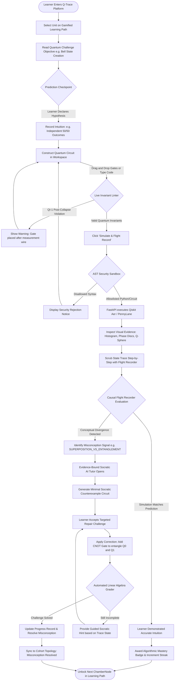
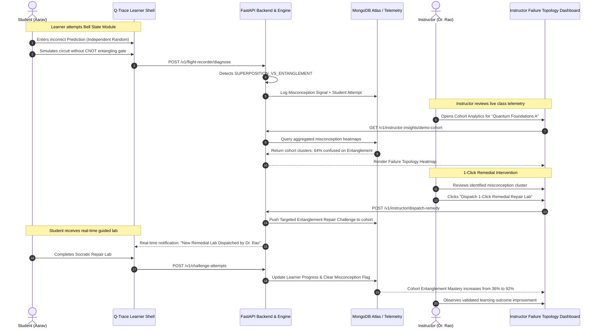
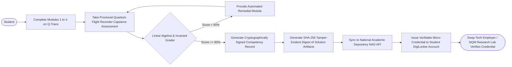

# 🔄 Q-Trace User Flow Diagrams

> **Project:** Q-Trace — Quantum Flight Recorder & Learning Platform  
> **Problem Statement:** SIH26140 — AI-Based Interactive Quantum Algorithm Learning Platform  
> **Format:** Mermaid Markdown Specification

---

## 1. Core Learner Journey: "Predict → Simulate → Inspect → Repair"

---

## 2. Instructor & Institutional Feedback Loop

---

## 3. National Credentialing & DigiLocker Issuance User Flow

