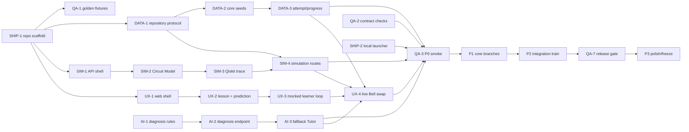

# Q-Trace Phase Plan Index

> Human-approved and frozen. `/missions` load gate passes at 48h declared per member; no implementation starts from this index alone.

## Track ledger

| Track | Cards | Hours | Ceiling | Owner |
|---|---:|---:|---:|---|
| learning-ux | 9 | 20h | 20h | Venu Gopal |
| simulation-api | 9 | 20h | 20h | Uday Rohit |
| ai-pedagogy | 8 | 18h | 18h | Rajeswari |
| data-analytics | 8 | 18h | 18h | Rani |
| fixtures-qa | 8 | 16h | 16h | Akshaya |
| story-ship | 8 | 16h | 16h | Vinod Krishna (lead) |

**Total:** 50 cards · 108 card-hours.
**Load gate:** every member declared 48h; every mission is ≤20h and below the 33.6h cap.

## Global DAG

## Remaining scheduling note

- Exact 29 Aug presentation time is unknown; conservative readiness gates remain active.
- Discord is canonical for mission acceptance/standups/blockers; WhatsApp is urgent-only.
- Venu operates the demo; all six share domain pitch beats; Vinod leads opening, architecture and technical Q&A.
