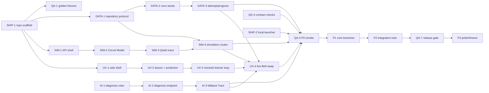

# Phase Plan — ai-pedagogy track

> Generated by /phase-plan from the approved Q-Trace FULL blueprint. Every card is cold-startable, timebox ≤4h.
> Owner: **Rajeswari** · card hours: **18h / 18h ceiling** · declared availability **48h**, 70% cap **33.6h** — PASS.

## File ownership

**Owns:** `apps/api/app/routers/flight_recorder.py`, `tutor.py`, `services/diagnosis/**`, `services/tutor/**`, `prompts/**`, and `apps/api/tests/unit/ai/**`.
**Shared only through:** `board/contracts/*`, PRD vocabulary, env names and QA-owned fixture IDs. Never edit another track’s implementation surface.

## Global dependency map

## Mock path

Use the versioned Bell Simulation Run and State Trace fixture from the contract/QA path until SIM-4 is live. The diagnosis rules must not call a simulator or LLM.

## Load ledger

- Total card hours: **18h**.
- Maximum permitted by blueprint: **18h**.
- Declared usable availability: **48h**; 70% card cap: **33.6h** — PASS.
- Unallocated integration/sleep buffer: **30h** before friction.
- P3 is planned at reduced capacity and remains first to cut.

## P0 · Skeleton — due 25 Aug 2026 09:00 IST (hard)

### AI-1 · Define deterministic misconception rules ⭐ ⭐                        [timebox: 2h]
CONTEXT: The PRD freezes the Bell prediction and misconception vocabulary. Load `flight-recorder-tutor.md`, `circuit-simulation.md` and `quantum-runtime.md`. This logic must not call an LLM.
DELIVERABLE: Create versioned diagnosis rule data and pure functions for `SUPERPOSITION_VS_ENTANGLEMENT`, `MEASUREMENT_DETERMINISM`, `GATE_ORDER` and `NO_SIGNAL`, including first-divergence evidence keys.
TEST: `uv run --project apps/api pytest apps/api/tests/unit/ai/test_diagnosis_rules.py` maps all seeded predictions/traces to expected codes and never emits an unknown evidence key.
DEPENDS: —          UNBLOCKS: AI-2
DEMO: Creates the reliable intellectual engine behind the Flight Recorder.
PERSONA: Sage           STATUS: [ ] todo

### AI-2 · Expose Flight Recorder diagnosis and replay                        [timebox: 2h]
CONTEXT: AI-1 provides pure rules; Simulation Run may still be a contract fixture. Load flight-recorder contract and keep the endpoint deterministic.
DELIVERABLE: Implement diagnosis service/router, persisted Misconception Signal via repository protocol, two-step replay headlines and contract errors for missing prediction/trace.
TEST: `uv run --project apps/api pytest apps/api/tests/unit/ai/test_flight_recorder_route.py` posts the Bell fixture and returns firstDivergenceStep=1 plus the repair challenge ID.
DEPENDS: AI-1          UNBLOCKS: AI-3
DEMO: The UI can reveal exactly where Aarav’s understanding diverged.
PERSONA: Sage           STATUS: [ ] todo

### AI-3 · Ship the evidence-bound Tutor fallback                        [timebox: 2h]
CONTEXT: Diagnosis and seeded Challenge exist. Load AI pack and Tutor contract. P0 must work with no provider key.
DELIVERABLE: Implement curated Bell explanation, evidence-key validator, fallbackUsed/model metadata and deterministic Repair Challenge selection; do not persist free text.
TEST: `uv run --project apps/api pytest apps/api/tests/unit/ai/test_tutor_fallback.py` validates both numerical evidence keys and rejects a fabricated probability claim.
DEPENDS: AI-2,DATA-2          UNBLOCKS: UX-4,AI-4,QA-3
DEMO: Aarav receives an immediate grounded explanation and repair task offline.
PERSONA: Sage           STATUS: [ ] todo

## P1 · Core — due 26 Aug 2026 18:00 IST

### AI-4 · Complete the misconception taxonomy and replay copy                        [timebox: 3h]
CONTEXT: P0 handles one seeded error. Load live State Trace shape and vetted module content; preserve deterministic code selection.
DELIVERABLE: Add rules/tests for measurement determinism and gate order, learner-level replay copy for Aarav/Meera, no-signal behavior and explanation templates that distinguish representation from physical trajectory.
TEST: `uv run --project apps/api pytest apps/api/tests/unit/ai/test_taxonomy_matrix.py` covers every prediction option, code and learner role with no unhandled branch.
DEPENDS: AI-3,SIM-4          UNBLOCKS: AI-5,AI-7,DATA-7,QA-5
DEMO: The Flight Recorder remains useful beyond a single hard-coded sentence.
PERSONA: Sage           STATUS: [ ] todo

### AI-5 · Add the optional structured Tutor provider                        [timebox: 3h]
CONTEXT: AI-4 makes deterministic fallback and taxonomy complete. Load `ai-llm.md`, `flight-recorder-tutor.md`, evidence-key fixtures and environment flag names; provider credentials/model are environment-selected and never assumed.
DELIVERABLE: Implement one provider adapter interface, structured response schema, timeout/retry, prompt files, evidence injection and post-generation numerical-claim validation; fallback on any failure.
TEST: `uv run --project apps/api pytest apps/api/tests/unit/ai/test_tutor_provider_contract.py` uses a fake provider for success, malformed output, timeout and 429; every failure returns the curated fallback.
DEPENDS: AI-4          UNBLOCKS: AI-6
DEMO: When configured, judges see contextual AI without gambling the demo on it.
PERSONA: Sage           STATUS: [ ] todo

## P2 · Integration — due 27 Aug 2026 18:00 IST

### AI-6 · Prove cloud and fallback parity                        [timebox: 2h]
CONTEXT: AI-5 and SHIP-4 provide the provider adapter and deployment shell. Load `ai-llm.md`, `flight-recorder-tutor.md` and cloud/fallback fixture IDs; learner-facing meaning must stay constant across modes.
DELIVERABLE: Add parity fixtures, provider/fallback badges, redacted telemetry and a drill script that forces timeout/rate-limit/fallback transitions.
TEST: `uv run --project apps/api pytest apps/api/tests/unit/ai/test_cloud_fallback_parity.py` proves both modes cite the same trace steps and repair challenge.
DEPENDS: AI-5,SHIP-4          UNBLOCKS: UX-7,AI-8,QA-6
DEMO: The team can deliberately demonstrate resilience if judges question AI reliability.
PERSONA: Sage           STATUS: [ ] todo

### AI-7 · Recommend the next Module from verified outcomes                        [timebox: 2h]
CONTEXT: AI-4 and DATA-5 provide the misconception taxonomy, Learning Paths and seeded Progress Records. Load `learning-content.md` and `progress-analytics.md`; this SHOULD scope is deterministic, not autonomous planning.
DELIVERABLE: Implement a small rules table mapping Challenge outcome + latest Misconception Signal to next Module/reason; expose it through existing progress response or feature-flag it off.
TEST: `uv run --project apps/api pytest apps/api/tests/unit/ai/test_recommendation_rules.py` covers pass/fail/no-signal combinations and returns only known Module IDs.
DEPENDS: AI-4,DATA-5          UNBLOCKS: —
DEMO: The platform demonstrates personalized progression without opaque AI decisions.
PERSONA: Sage           STATUS: [ ] todo

## P3 · Polish — due 28 Aug 2026 09:00 IST (pre-cut-listed)

### AI-8 · Polish anti-copy guidance and judge explanations                        [timebox: 2h]
CONTEXT: AI-6 and QA-7 have release-gated Tutor modes. Load `ai-llm.md`, `flight-recorder-tutor.md`, the approved demo script and Warden findings; change no models, providers, codes or contracts.
DELIVERABLE: Tighten prompts/fallback copy so hints precede answers, add safety notes, prepare eight ≤20-second technical answers and verify no stored free-text logs.
TEST: `uv run --project apps/api pytest apps/api/tests/unit/ai/test_pedagogy_release.py` scans responses/log fixtures for uncited numbers, answer leakage and persisted learner questions.
DEPENDS: AI-6,QA-7          UNBLOCKS: —
DEMO: Judges hear a defensible “AI guides reasoning; it does not do the exercise” answer.
PERSONA: Sage           STATUS: [ ] todo
