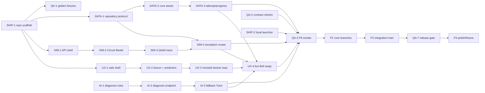

# Phase Plan — data-analytics track

> Generated by /phase-plan from the approved Q-Trace FULL blueprint. Every card is cold-startable, timebox ≤4h.
> Owner: **Rani** · card hours: **18h / 18h ceiling** · declared availability **48h**, 70% cap **33.6h** — PASS.

## File ownership

**Owns:** `apps/api/app/repositories/**`, `routers/learning.py`, `progress.py`, `instructor.py`, `scripts/seed.py`, and `apps/api/tests/unit/data/**`.
**Shared only through:** `board/contracts/*`, PRD vocabulary, env names and QA-owned fixture IDs. Never edit another track’s implementation surface.

## Global dependency map

## Mock path

The repository protocol has an in-memory implementation from P0. Consumers never wait on Atlas; DATA-6 is the explicit backend parity swap.

## Load ledger

- Total card hours: **18h**.
- Maximum permitted by blueprint: **18h**.
- Declared usable availability: **48h**; 70% card cap: **33.6h** — PASS.
- Unallocated integration/sleep buffer: **30h** before friction.
- P3 is planned at reduced capacity and remains first to cut.

## P0 · Skeleton — due 25 Aug 2026 09:00 IST (hard)

### DATA-1 · Define repositories and the in-memory demo store                        [timebox: 1h]
CONTEXT: The API shell path exists after SHIP-1. Load SCHEMA, learning/progress contracts and Mongo pack. P0 consumers need persistence without Atlas.
DELIVERABLE: Create typed repository protocols, dependency selector and deterministic in-memory implementations for profiles, paths, modules, runs/signals, challenges/attempts and progress.
TEST: `uv run --project apps/api pytest apps/api/tests/unit/data/test_memory_repository.py` resets twice to identical IDs and proves create/get plus atomic progress update primitives.
DEPENDS: SHIP-1          UNBLOCKS: SIM-4,DATA-2
DEMO: Plumbing for every P0 endpoint and the venue-safe store.
PERSONA: Atlas           STATUS: [x] done

### DATA-2 · Seed learner, content and challenge truth                        [timebox: 3h]
CONTEXT: Repository protocol exists. Load PRD vocabulary, SCHEMA seed plan and learning/progress contracts. Seed content is vetted and idempotent.
DELIVERABLE: Add Aarav, Meera, Dr. Rao session metadata, three Modules, two Learning Paths, Bell Prediction Checkpoint, starter/broken circuits, quiz, Repair Challenge and initial Progress Records.
TEST: `uv run --project apps/api pytest apps/api/tests/unit/data/test_core_seed.py` seeds twice with no duplicates and retrieves every ID referenced by the contracts.
DEPENDS: DATA-1          UNBLOCKS: AI-3,DATA-3
DEMO: The prototype opens with all three users and a coherent Bell learning journey.
PERSONA: Atlas           STATUS: [x] done

### DATA-3 · Persist Challenge Attempts and progress atomically                        [timebox: 2h]
CONTEXT: Core seeds exist; diagnosis may still use fixtures. Load progress contract and keep grading deterministic outside the repository.
DELIVERABLE: Implement Challenge, Attempt, Progress and Instructor routers/services using the repository protocol, idempotency key and atomic attempt + Progress Record update.
TEST: `uv run --project apps/api pytest apps/api/tests/unit/data/test_progress_flow.py` posts a passing Bell attempt twice and proves one attempt, one 100-point increment and updated Instructor Insight.
DEPENDS: DATA-2          UNBLOCKS: UX-4,DATA-4,QA-3,QA-5
DEMO: Aarav’s repair visibly changes progress and Dr. Rao’s aggregate proof.
PERSONA: Atlas           STATUS: [x] done

## P1 · Core — due 26 Aug 2026 18:00 IST

### DATA-4 · Implement Mongo collections and indexes                        [timebox: 3h]
CONTEXT: DATA-3 proves in-memory behavior and SCHEMA v1 is frozen. Load `mongodb.md`, `SCHEMA.md`, `learning-content.md` and `progress-analytics.md`; do not leak ObjectId across contracts.
DELIVERABLE: Add async Mongo repository, collection getters, schemaVersion guards and idempotent indexes for every documented demo query.
TEST: `uv run --project apps/api pytest apps/api/tests/unit/data/test_mongo_repository.py` runs repository parity against isolated Mongo and verifies required index names.
DEPENDS: DATA-3          UNBLOCKS: DATA-5
DEMO: The live platform persists learner and simulation history credibly.
PERSONA: Atlas           STATUS: [x] done

### DATA-5 · Seed the synthetic cohort and complete Learning Paths                        [timebox: 3h]
CONTEXT: DATA-4 makes Mongo and memory share a repository protocol. Load the SCHEMA seed plan, `learning-content.md`, `progress-analytics.md` and synthetic-data disclosure; preserve stable hero IDs.
DELIVERABLE: Create deterministic 30-profile cohort, 60–90 attempts, 35–50 misconception signals, path variants and edge rows while preserving the same hero records in both stores.
TEST: `uv run --project apps/api pytest apps/api/tests/unit/data/test_demo_seed_story.py` proves exact counts/ranges, idempotency, disclosure text and Aarav live-attempt override.
DEPENDS: DATA-4          UNBLOCKS: UX-6,AI-7,DATA-6
DEMO: Instructor charts look populated while clearly disclosing synthetic data.
PERSONA: Atlas           STATUS: [ ] todo

## P2 · Integration — due 27 Aug 2026 18:00 IST

### DATA-6 · Prove repository parity and deploy Atlas seeds                        [timebox: 2h]
CONTEXT: DATA-5 and QA-3 make P1 repositories and P0 smoke green. Load `mongodb.md`, repository unit tests, `.env.example` names and deploy-runbook; Atlas credentials stay outside git and local mode remains primary fallback.
DELIVERABLE: Run one behavioral contract suite against memory and Atlas, add seed/pre-warm commands and document safe environment selection.
TEST: `uv run --project apps/api pytest apps/api/tests/unit/data/test_repository_contract.py` passes both backends; `uv run --project apps/api python apps/api/scripts/seed.py --check` reports the same hero IDs.
DEPENDS: DATA-5,QA-3          UNBLOCKS: SIM-7,DATA-7,SHIP-6
DEMO: The cloud demo and laptop demo tell the same story.
PERSONA: Atlas           STATUS: [x] done

### DATA-7 · Harden analytics aggregation and idempotency                        [timebox: 2h]
CONTEXT: DATA-6 and AI-4 provide deployed cohort seeds and Misconception Signals. Load `progress-analytics.md`, SCHEMA query/index notes and idempotency fixtures; keep Instructor Insight computed, not a second persisted truth.
DELIVERABLE: Implement indexed aggregation, 10-second cache, empty cohort response, live-demo learner marker and concurrent idempotency test for Challenge Attempts.
TEST: `uv run --project apps/api pytest apps/api/tests/unit/data/test_instructor_analytics.py` verifies rates, top misconception counts, empty cohort and no double score under concurrent duplicate requests.
DEPENDS: DATA-6,AI-4          UNBLOCKS: UX-7,DATA-8,QA-6
DEMO: Dr. Rao sees fast, consistent analytics after Aarav’s live repair.
PERSONA: Atlas           STATUS: [ ] todo

## P3 · Polish — due 28 Aug 2026 09:00 IST (pre-cut-listed)

### DATA-8 · Freeze schema and polish edge states                        [timebox: 2h]
CONTEXT: Release gate is green and schema changes are now expensive. No new collection or field without a contract bump.
DELIVERABLE: Lock schemaVersion/index list, verify long/empty/failed rows, add data reset/pre-warm runbook and mark synthetic records in every instructor response.
TEST: `uv run --project apps/api pytest apps/api/tests/unit/data/test_schema_freeze.py` snapshots field/index names and verifies all edge responses match contracts.
DEPENDS: DATA-7,QA-7          UNBLOCKS: —
DEMO: The demo never reveals empty mystery cards or undisclosed synthetic analytics.
PERSONA: Atlas           STATUS: [ ] todo
