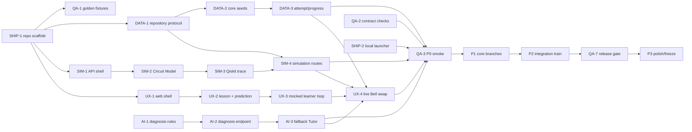

# Phase Plan — fixtures-qa track

> Generated by /phase-plan from the approved Q-Trace FULL blueprint. Every card is cold-startable, timebox ≤4h.
> Owner: **Akshaya** · card hours: **16h / 16h ceiling** · declared availability **48h**, 70% cap **33.6h** — PASS.

## File ownership

**Owns:** `apps/api/tests/{contract,fixtures/golden,acceptance,security}/**`, `apps/web/{e2e,tests/fixtures,tests/acceptance}/**`, cross-track release scripts and checklists.
**Shared only through:** `board/contracts/*`, PRD vocabulary, env names and QA-owned fixture IDs. Never edit another track’s implementation surface.

## Global dependency map

## Mock path

QA owns canonical golden payloads. Other tracks may consume but never rewrite them; contract examples seed the first fixture version.

## Load ledger

- Total card hours: **16h**.
- Maximum permitted by blueprint: **16h**.
- Declared usable availability: **48h**; 70% card cap: **33.6h** — PASS.
- Unallocated integration/sleep buffer: **32h** before friction.
- P3 is planned at reduced capacity and remains first to cut.

## P0 · Skeleton — due 25 Aug 2026 09:00 IST (hard)

### QA-1 · Freeze golden quantum and contract fixtures                        [timebox: 1h]
CONTEXT: Contracts and schema are frozen but implementation may not exist. Load both quantum packs and all contract examples. QA owns this path exclusively.
DELIVERABLE: Create golden Bell, asymmetric bit-order, invalid gate, wrong prediction, diagnosis, Tutor and progress payloads under `apps/api/tests/fixtures/golden` plus frontend mirrors generated from them.
TEST: `python3 scripts/validate_fixtures.py` parses every JSON file, checks IDs/basis order/probability sums and reports zero drift from contract examples.
DEPENDS: SHIP-1          UNBLOCKS: SIM-6,QA-2,QA-4
DEMO: Provides one trusted story every track can build against without waiting.
PERSONA: Warden           STATUS: [ ] todo

### QA-2 · Enforce contract shapes at both boundaries                        [timebox: 2h]
CONTEXT: Golden payloads exist. Load API-contract skill; generate validators from one source per language rather than hand-copying expected shapes.
DELIVERABLE: Add backend Pydantic serialization tests, frontend Zod fixture tests and an error-shape suite for all four contract files.
TEST: `bash scripts/contract-check.sh` passes valid examples and deliberately fails a renamed field, ObjectId leak and missing requestId.
DEPENDS: QA-1          UNBLOCKS: QA-3
DEMO: Prevents integration drift before the live swap.
PERSONA: Warden           STATUS: [ ] todo

### QA-3 · Build the real walking-skeleton smoke runner ⭐                        [timebox: 3h]
CONTEXT: All P0 slices exist and local launcher can start them. Load BUILD-PLAN acceptance and do not bypass HTTP with direct service calls.
DELIVERABLE: Implement `scripts/smoke.sh`: reset seeds, start/check local stack, post Bell Simulation Run, diagnose, obtain fallback Tutor, submit Repair Challenge, assert Progress and Instructor Insight, then cleanly exit.
TEST: `bash scripts/smoke.sh --mode local` exits 0 and prints each real endpoint, expected signal code and final 100-point Progress Record; any contract mismatch exits non-zero.
DEPENDS: QA-2,UX-4,SIM-4,AI-3,DATA-3,SHIP-2          UNBLOCKS: DATA-6,SHIP-4
DEMO: Proves the entire learner loop before the 25 Aug 09:00 skeleton deadline.
PERSONA: Warden           STATUS: [ ] todo

## P1 · Core — due 26 Aug 2026 18:00 IST

### QA-4 · Test adapters, parser safety and evidence math                        [timebox: 2h]
CONTEXT: SIM-5, SIM-6 and QA-1 provide the parser, both adapters and golden fixtures. Load `quantum-runtime.md`, `circuit-simulation.md` and QA-owned basis-order fixtures before writing acceptance tests.
DELIVERABLE: Add cross-track acceptance tests for Qiskit/PennyLane tolerance, asymmetric basis mapping, trace-before-measurement and reduced-state purity under `apps/api/tests/acceptance/quantum`; add the malicious AST corpus under QA-owned `apps/api/tests/security/`.
TEST: `uv run --project apps/api pytest apps/api/tests/acceptance/quantum apps/api/tests/security/test_qiskit_ast.py` passes and catches a deliberately reversed mapper.
DEPENDS: SIM-5,SIM-6,QA-1          UNBLOCKS: SHIP-6
DEMO: Gives judges defensible proof that multiple backends and code editing are real and safe.
PERSONA: Warden           STATUS: [ ] todo

### QA-5 · Test diagnosis, grading and critical UI states                        [timebox: 2h]
CONTEXT: AI-4, DATA-3 and UX-5 provide the taxonomy, progress flow and interactive workspace. Load `flight-recorder-tutor.md`, `progress-analytics.md` and quantum-ui/runtime packs; consume but never modify implementation-owned files.
DELIVERABLE: Add cross-track diagnosis/grading/Tutor evidence acceptance tests under `apps/api/tests/acceptance`, plus Circuit Workspace and fallback-state acceptance fixtures under `apps/web/tests/acceptance`; implementation tracks retain unit tests.
TEST: `bash scripts/test-core.sh` runs all unit and QA-owned acceptance suites and proves no numerical claim lacks evidence.
DEPENDS: AI-4,DATA-3,UX-5          UNBLOCKS: SHIP-6
DEMO: Protects the wow moment and repair outcome from regression.
PERSONA: Warden           STATUS: [ ] todo

## P2 · Integration — due 27 Aug 2026 18:00 IST

### QA-6 · Automate the learner-led Playwright journey                        [timebox: 2h]
CONTEXT: UX-7, SIM-8, AI-6 and DATA-7 provide integrated services and failure states. Load the PRD demo narrative, all four contracts and seed reset command; use synthetic roles and never depend on test order.
DELIVERABLE: Create Playwright test for Aarav prediction → build/run → evidence → Flight Recorder → fallback/cloud Tutor badge → repair → progress → brief instructor proof.
TEST: `pnpm --dir apps/web playwright test bell-journey.spec.ts` passes against local mode and records trace/video only on failure.
DEPENDS: UX-7,SIM-8,AI-6,DATA-7          UNBLOCKS: UX-9,QA-7,SHIP-7
DEMO: Rehearses the exact 90-second path automatically.
PERSONA: Warden           STATUS: [ ] todo

### QA-7 · Run offline, live-deploy and Warden release gates                        [timebox: 2h]
CONTEXT: QA-6 and SHIP-6 provide the automated journey plus merged local/cloud stacks. Load `arenas/sih.md`, `40-endgame.md`, all contracts and the PR-review skill before issuing a release verdict.
DELIVERABLE: Add forced-offline/fallback drill, live CORS/readiness smoke, contract diff scan and fresh-session Warden checklist with BLOCK/MERGE verdict file.
TEST: `bash scripts/release-gate.sh` passes local-offline and live URLs or returns a single ranked blocker list.
DEPENDS: QA-6,SHIP-6          UNBLOCKS: SIM-9,AI-8,DATA-8,QA-8
DEMO: Ensures “show us” works with bad venue Wi-Fi and no last-minute contract drift.
PERSONA: Warden           STATUS: [ ] todo

## P3 · Polish — due 28 Aug 2026 09:00 IST (pre-cut-listed)

### QA-8 · Certify projector demo and backup release                        [timebox: 2h]
CONTEXT: QA-7 and SHIP-7 make feature freeze active after release gating and rehearsal. Load `40-endgame.md`, `docs/DEMO-SCRIPT.md`, the PPT source and release checklist; only review-approved demo defects may change implementation.
DELIVERABLE: Execute keyboard/projector run, 5× smoke, backup recording verification, PPT link check and final release checklist with artifact hashes.
TEST: `bash scripts/final-certify.sh` emits `board/RELEASE-CERT.md` with all gates green and package/video/PPT hashes.
DEPENDS: QA-7,SHIP-7          UNBLOCKS: SHIP-8
DEMO: The team enters the internal round with a rehearsed primary and verified backup.
PERSONA: Warden           STATUS: [ ] todo
