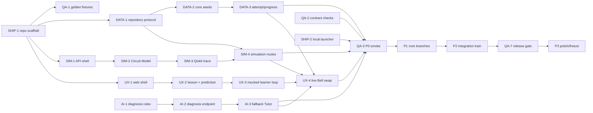

# Phase Plan — learning-ux track

> Generated by /phase-plan from the approved Q-Trace FULL blueprint. Every card is cold-startable, timebox ≤4h.
> Owner: **Venu Gopal** · card hours: **20h / 20h ceiling** · declared availability **48h**, 70% cap **33.6h** — PASS.

## File ownership

**Owns:** `apps/web/app/**`, `apps/web/components/**`, `apps/web/features/**`, `apps/web/lib/contracts/**`, `apps/web/tests/unit/**`.
**Shared only through:** `board/contracts/*`, PRD vocabulary, env names and QA-owned fixture IDs. Never edit another track’s implementation surface.

## Global dependency map

## Mock path

Use checked-in JSON fixtures under `apps/web/tests/fixtures/contracts/` that mirror board contracts. Do not wait for FastAPI; UX-4 is the explicit live swap.

## Load ledger

- Total card hours: **20h**.
- Maximum permitted by blueprint: **20h**.
- Declared usable availability: **48h**; 70% card cap: **33.6h** — PASS.
- Unallocated integration/sleep buffer: **28h** before friction.
- P3 is planned at reduced capacity and remains first to cut.

## P0 · Skeleton — due 25 Aug 2026 09:00 IST (hard)

### UX-1 · Create the learner application shell                        [timebox: 2h]
CONTEXT: The root workspace exists after SHIP-1. Load `nextjs.md`, `quantum-ui.md`, all four contracts, PRD vocabulary and ARCHITECTURE file ownership. This card creates only the web track surface and must support seeded role switching without production auth.
DELIVERABLE: Create `apps/web` with App Router, strict TypeScript, Tailwind, shadcn primitives, route groups for learn/lab/progress/instructor, contract fixture loader, error/loading shells and Aarav/Meera/Dr. Rao role switch.
TEST: `pnpm --dir apps/web test -- role-switch` renders three synthetic roles and opens `/learn/bell-state` as Aarav without network access.
DEPENDS: SHIP-1          UNBLOCKS: UX-2,SHIP-2
DEMO: The judge sees a credible product shell and can enter as Aarav.
PERSONA: Nova           STATUS: [x] done

### UX-2 · Render the Bell Module and capture a prediction                        [timebox: 2h]
CONTEXT: UX-1 provides the shell. Load `learning-content.md`, `circuit-simulation.md` and the Bell module fixture. The learner-led story requires a structured pre-run answer, not free text.
DELIVERABLE: Implement the Bell Module page with concept blocks, prior-knowledge path badge, Prediction Checkpoint options and persisted client draft keyed by learner/module.
TEST: `pnpm --dir apps/web test -- bell-prediction` selects `INDEPENDENT_RANDOM`, reloads the route and shows the saved choice before Run is enabled.
DEPENDS: UX-1          UNBLOCKS: UX-3
DEMO: Aarav makes the wrong prediction judges will watch the Flight Recorder repair.
PERSONA: Nova           STATUS: [x] done

### UX-3 · Build the mocked learner evidence loop                        [timebox: 2h]
CONTEXT: UX-2 captures the Prediction Checkpoint. Load `quantum-ui.md` and fixture responses for Simulation Run, Flight Recorder, Tutor, Repair Challenge and Progress. This is a contract-shaped UI slice, not live integration.
DELIVERABLE: Add a read-only two-wire Circuit Workspace, generated Qiskit panel, probability/histogram evidence, two-step Flight Recorder, fallback Tutor card, repair challenge and progress success state driven entirely by typed fixtures.
TEST: `pnpm --dir apps/web test -- mocked-bell-loop` walks every state and verifies basis labels `00`/`11`, `MIXED_SUBSYSTEM`, evidence keys and repair success.
DEPENDS: UX-2          UNBLOCKS: UX-4
DEMO: The full 90-second learner story can be rehearsed before backend merge.
PERSONA: Nova           STATUS: [x] done

### UX-4 · Swap the Bell journey to live contracts                        [timebox: 2h]
CONTEXT: The mocked loop is green and P0 domain endpoints exist. Load all four contracts and keep fixtures behind `DEMO_LOCAL` fallback. Do not redesign screens or alter response shapes.
DELIVERABLE: Replace P0 fixture calls with TanStack Query mutations/queries for Simulation Run, diagnosis, Tutor fallback, Challenge Attempt, Progress Record and Instructor Insight; retain disclosed fallback states.
TEST: `pnpm --dir apps/web test:e2e -- bell-live` against the local API completes prediction → run → diagnosis → repair → progress and exposes the request ID.
DEPENDS: UX-3,SIM-4,AI-3,DATA-3          UNBLOCKS: UX-5,UX-6,QA-3,SHIP-5
DEMO: Aarav completes the real HTTP walking skeleton; this unblocks the global smoke test.
PERSONA: Nova           STATUS: [x] done

## P1 · Core — due 26 Aug 2026 18:00 IST

### UX-5 · Implement the interactive Circuit Workspace                        [timebox: 3h]
CONTEXT: The live Bell path exists with a read-only workspace. Load `quantum-ui.md` and `circuit-simulation.md`. Circuit Model is the sole editable truth; the grid and code must never diverge.
DELIVERABLE: Implement ordered dnd-kit qubit wires with H/X/Y/Z/CNOT/Measure placement/removal, keyboard/click alternatives, Zustand workspace slice, generated CodeMirror Qiskit and one safe parse-and-replace edit flow.
TEST: `pnpm --dir apps/web test -- circuit-workspace` places H+CNOT, serializes stable columns, round-trips the supported code edit and rejects an unsupported RX without mutating the model.
DEPENDS: UX-4          UNBLOCKS: UX-8,QA-5
DEMO: Judges build the Bell circuit visually and see synchronized Qiskit code.
PERSONA: Nova           STATUS: [x] done

### UX-6 · Complete learning paths and visual evidence                        [timebox: 3h]
CONTEXT: P0 proves one Bell route. Load `learning-content.md`, `circuit-simulation.md` and visualization law. The three-Module catalogue may use concise seeded content, but Bell remains the complete path.
DELIVERABLE: Render the three-Module catalogue, Aarav/Meera entry differences, Plotly histogram/Bloch client components, static table/SVG fallbacks and purity/representation labels from live responses.
TEST: `pnpm --dir apps/web test:e2e -- learning-visuals` shows all three Modules, different entry badges, a mixed reduced-state label and functional static fallback with Plotly disabled.
DEPENDS: UX-4,DATA-5,SIM-6          UNBLOCKS: UX-7
DEMO: The prototype visibly covers structured learning and scientifically honest visualization.
PERSONA: Nova           STATUS: [ ] todo

## P2 · Integration — due 27 Aug 2026 18:00 IST

### UX-7 · Integrate progress, instructor proof and failure states                        [timebox: 2h]
CONTEXT: Core learner screens and live services exist. Load progress/analytics and Tutor contracts. This card must preserve learner emphasis; instructor analytics is a brief closing beat.
DELIVERABLE: Add live Progress Record, three-card/one-chart Instructor Insight, provider/fallback badges, empty/loading/timeout/unsupported states and retry actions without adding new product surfaces.
TEST: `pnpm --dir apps/web test:e2e -- resilient-journey` completes with cloud Tutor off and then renders a simulation-timeout recovery without blank UI.
DEPENDS: UX-6,DATA-7,AI-6          UNBLOCKS: UX-9,QA-6
DEMO: The demo survives failures and closes with Dr. Rao seeing the same learner event.
PERSONA: Nova           STATUS: [ ] todo

### UX-8 · Add supported circuit sharing and export                        [timebox: 2h]
CONTEXT: The Circuit Model and OpenQASM export endpoint are stable. Load `circuit-simulation.md`; collaboration scope is artifact sharing, not realtime editing.
DELIVERABLE: Add OpenQASM download, Circuit Model JSON copy/import for the supported subset and a share panel that clearly labels local artifact sharing.
TEST: `pnpm --dir apps/web test -- circuit-share` exports the Bell model, reimports it and obtains a byte-for-byte equivalent normalized Circuit Model.
DEPENDS: UX-5,SIM-5          UNBLOCKS: —
DEMO: Judges see credible modular/collaborative learning without a fake multiplayer claim.
PERSONA: Nova           STATUS: [ ] todo

## P3 · Polish — due 28 Aug 2026 09:00 IST (pre-cut-listed)

### UX-9 · Polish accessibility and projector readability                        [timebox: 2h]
CONTEXT: All learner flows are integrated and P3 is pre-cut-listed. Load `quantum-ui.md`; change no contracts or page structure.
DELIVERABLE: Fix keyboard order, focus states, color-independent gate labels, 1366×768 overflow, chart text sizing and reduced-motion behavior on the scripted path.
TEST: `pnpm --dir apps/web test:e2e -- accessibility-projector` passes keyboard-only Bell construction and captures all scripted screens at 1366×768 with no clipped primary evidence.
DEPENDS: UX-7,QA-6          UNBLOCKS: —
DEMO: The learner demo remains readable and operable on the judging projector.
PERSONA: Nova           STATUS: [ ] todo
