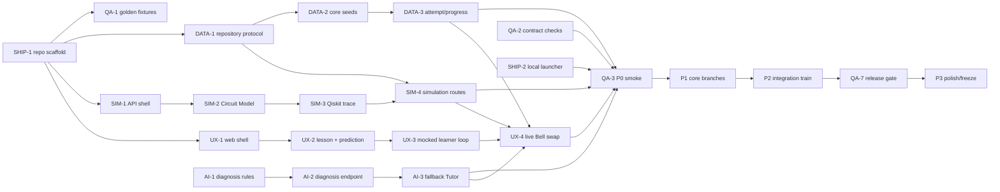

# Phase Plan — simulation-api track

> Generated by /phase-plan from the approved Q-Trace FULL blueprint. Every card is cold-startable, timebox ≤4h.
> Owner: **Uday Rohit** · card hours: **20h / 20h ceiling** · declared availability **48h**, 70% cap **33.6h** — PASS.

## File ownership

**Owns:** `apps/api/app/routers/circuits.py`, `simulation_runs.py`, `apps/api/app/services/quantum/**`, quantum Pydantic models and `apps/api/tests/unit/simulation/**`.
**Shared only through:** `board/contracts/*`, PRD vocabulary, env names and QA-owned fixture IDs. Never edit another track’s implementation surface.

## Global dependency map

## Mock path

Compile against contract examples and the QA-owned Bell payload if present. If QA fixtures are not merged, use an internal test object only; never edit `tests/fixtures/golden/**`.

## Load ledger

- Total card hours: **20h**.
- Maximum permitted by blueprint: **20h**.
- Declared usable availability: **48h**; 70% card cap: **33.6h** — PASS.
- Unallocated integration/sleep buffer: **28h** before friction.
- P3 is planned at reduced capacity and remains first to cut.

## P0 · Skeleton — due 25 Aug 2026 09:00 IST (hard)

### SIM-1 · Create the FastAPI service boundary                        [timebox: 1h]
CONTEXT: The monorepo root exists. Load `fastapi.md`, `quantum-runtime.md`, `circuit-simulation.md` and shared error shape. This card creates only the API skeleton.
DELIVERABLE: Create `apps/api` with uv project, FastAPI app, CORS settings, request-ID middleware, `/health`, `/ready`, router placeholders and contract-shaped global error handler.
TEST: `uv run --project apps/api pytest apps/api/tests/unit/simulation/test_health.py` proves health=200, readiness reports primary adapter status and errors include requestId.
DEPENDS: SHIP-1          UNBLOCKS: SIM-2,SHIP-2
DEMO: Plumbing for the first deployable backend and every quantum endpoint.
PERSONA: Forge           STATUS: [ ] todo

### SIM-2 · Validate the canonical Circuit Model                        [timebox: 2h]
CONTEXT: SIM-1 provides app/models. Load circuit contract and quantum-runtime limits. No SDK import should happen before validation.
DELIVERABLE: Add Pydantic v2 Circuit Model/Operation types, closed gate enum, qubit/operation/column/control/measurement validation and normalized operation ordering.
TEST: `uv run --project apps/api pytest apps/api/tests/unit/simulation/test_circuit_model.py` accepts Bell and rejects RX, six qubits, duplicate op IDs and invalid control/target mappings.
DEPENDS: SIM-1          UNBLOCKS: SIM-3
DEMO: Ensures the visual builder cannot send unsafe or ambiguous circuits.
PERSONA: Forge           STATUS: [ ] todo

### SIM-3 · Execute Bell and normalize the State Trace ⭐ ⭐                        [timebox: 4h]
CONTEXT: Validated Circuit Models exist. Load `quantum-runtime.md`, Qiskit docs and Bell contract example. Save pre-measurement state; counts are a separate path.
DELIVERABLE: Implement Qiskit Aer adapter for H/X/Y/Z/CNOT/Measure, normalized basis order, `{re,im}` amplitudes, reduced density/Bloch/purity, measurement probabilities/counts and trace steps after supported gates.
TEST: `uv run --project apps/api pytest apps/api/tests/unit/simulation/test_qiskit_bell_trace.py` verifies Bell support 00/11=0.5, trace length 2, post-CNOT purity 0.5 and asymmetric-order fixture labels.
DEPENDS: SIM-2          UNBLOCKS: SIM-4
DEMO: Produces the verified evidence that powers the Flight Recorder wow moment.
PERSONA: Forge           STATUS: [ ] todo

### SIM-4 · Expose and persist Simulation Runs                        [timebox: 3h]
CONTEXT: Qiskit adapter is green and DATA-1 defines repository protocol/in-memory implementation. Load circuit contract; do not implement Mongo here.
DELIVERABLE: Implement POST/GET Simulation Run routes, synchronous timeout/threadpool execution, request idempotency, circuit snapshot persistence, conformance skipped shape and contract errors.
TEST: `uv run --project apps/api pytest apps/api/tests/unit/simulation/test_simulation_routes.py` posts the contract Bell request and retrieves the same persisted run with duration and request ID.
DEPENDS: SIM-3,DATA-1          UNBLOCKS: UX-4,SIM-5,SIM-6,AI-4,QA-3
DEMO: The frontend can run a real circuit and replay a persistent State Trace.
PERSONA: Forge           STATUS: [ ] todo

## P1 · Core — due 26 Aug 2026 18:00 IST

### SIM-5 · Parse safe Qiskit and export OpenQASM                        [timebox: 3h]
CONTEXT: P0 accepts Circuit Model JSON only. Load `quantum-runtime.md` and circuit contract. Submitted code must be parsed, never executed.
DELIVERABLE: Implement allowlisted Python AST parser for the frozen Qiskit grammar plus OpenQASM 3 export/round-trip validation for the supported Circuit Model.
TEST: `uv run --project apps/api pytest apps/api/tests/unit/simulation/test_code_and_qasm.py` round-trips Bell and rejects loops, imports, file/network calls, expressions and unsupported gates.
DEPENDS: SIM-4          UNBLOCKS: UX-8,QA-4
DEMO: Meera edits one supported Qiskit line and judges can export the circuit safely.
PERSONA: Forge           STATUS: [ ] todo

### SIM-6 · Add PennyLane conformance and circuit evidence                        [timebox: 2h]
CONTEXT: Primary Qiskit output is stable. Load quantum-runtime pack and QA golden/asymmetric fixtures; PennyLane is a narrow adapter, not a second platform.
DELIVERABLE: Compile supported Circuit Models to `default.qubit`, normalize probabilities, compare with epsilon, compute circuit health and expose explicit skip/unavailable reasons.
TEST: `uv run --project apps/api pytest apps/api/tests/unit/simulation/test_pennylane_conformance.py` passes Bell and asymmetric fixtures and fails a deliberately reversed basis mapping.
DEPENDS: SIM-4,QA-1          UNBLOCKS: UX-6,SIM-7,QA-4
DEMO: The prototype demonstrates two genuine simulators without making the second one demo-critical.
PERSONA: Forge           STATUS: [ ] todo

## P2 · Integration — due 27 Aug 2026 18:00 IST

### SIM-7 · Swap routes to the production repository                        [timebox: 2h]
CONTEXT: DATA-6 provides repository parity and Atlas implementation. Load `circuit-simulation.md`, repository protocol and Mongo/in-memory parity tests; keep Simulation Run business logic unchanged and preserve the venue fallback.
DELIVERABLE: Inject the shared repository into simulation routes, persist immutable snapshots in Atlas, and verify `DEMO_LOCAL=1` still selects memory.
TEST: `uv run --project apps/api pytest apps/api/tests/unit/simulation/test_repository_swap.py` runs the same contract suite against memory and an isolated Mongo test database.
DEPENDS: SIM-6,DATA-6          UNBLOCKS: SIM-8
DEMO: Simulation history works on live deploy while venue mode remains independent.
PERSONA: Forge           STATUS: [ ] todo

### SIM-8 · Harden timeouts, flags and deployed readiness                        [timebox: 2h]
CONTEXT: Live deployment shell exists. Load FastAPI and runtime packs. Optional adapters must never create broken controls or hung workers.
DELIVERABLE: Add adapter flags, 1500ms timeout, threadpool boundary, structured duration/error logs, readiness checks and Railway smoke configuration.
TEST: `uv run --project apps/api pytest apps/api/tests/unit/simulation/test_runtime_guards.py` proves timeout, disabled PennyLane, no NaN/Infinity and one-worker readiness behavior.
DEPENDS: SIM-7,SHIP-4          UNBLOCKS: SIM-9,QA-6
DEMO: The live and local APIs fail softly instead of freezing during judging.
PERSONA: Forge           STATUS: [ ] todo

## P3 · Polish — due 28 Aug 2026 09:00 IST (pre-cut-listed)

### SIM-9 · Tune the supported runtime and error evidence                        [timebox: 1h]
CONTEXT: SIM-8 and QA-7 make runtime guards and the release gate green. Load `quantum-runtime.md`, `circuit-simulation.md`, smoke timing logs and Warden findings; dependencies are frozen and endpoint shapes cannot change.
DELIVERABLE: Profile the Bell path, remove avoidable setup work, pre-initialize adapters on readiness and polish unsupported/timeout details for UI display.
TEST: `bash scripts/smoke.sh --mode local --repeat 5` completes every run within budget and returns identical ideal probabilities.
DEPENDS: SIM-8,QA-7          UNBLOCKS: —
DEMO: The quantum execution beat feels instant and its failures remain explainable.
PERSONA: Forge           STATUS: [ ] todo
