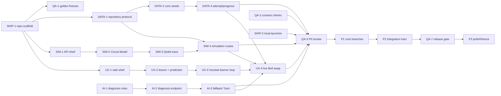

# Phase Plan — story-ship track

> Generated by /phase-plan from the approved Q-Trace FULL blueprint. Every card is cold-startable, timebox ≤4h.
> Owner: **Vinod Krishna (lead)** · card hours: **16h / 16h ceiling** · declared availability **48h**, 70% cap **33.6h** — PASS.

## File ownership

**Owns:** root workspace files, `.env.example`, `scripts/demo-local.sh`, deploy configs, `docs/DEMO-SCRIPT.md`, PPT/deck assets and submission files.
**Shared only through:** `board/contracts/*`, PRD vocabulary, env names and QA-owned fixture IDs. Never edit another track’s implementation surface.

## Global dependency map

## Mock path

Deploy shell services and rehearse with contract fixtures plus `DEMO_FALLBACK`; cloud resources never gate local-demo readiness.

## Load ledger

- Total card hours: **16h**.
- Maximum permitted by blueprint: **16h**.
- Declared usable availability: **48h**; 70% card cap: **33.6h** — PASS.
- Unallocated integration/sleep buffer: **32h** before friction.
- P3 is planned at reduced capacity and remains first to cut.

## P0 · Skeleton — due 25 Aug 2026 09:00 IST (hard)

### SHIP-1 · Scaffold the monorepo and environment contract                        [timebox: 1h]
CONTEXT: Blueprint is approved and no code exists. Load git, Next.js, FastAPI and both quantum packs. This card creates shared root structure only; implementation tracks own app internals.
DELIVERABLE: Create root workspace files, `apps/web`, `apps/api`, scripts/test directories, `.env.example`, feature-flag names, branch conventions and README start commands without adding product logic.
TEST: `bash scripts/check-layout.sh` verifies required directories/env names and that no secret value is committed.
DEPENDS: —          UNBLOCKS: UX-1,SIM-1,DATA-1,QA-1,SHIP-2
DEMO: Every teammate can clone and begin a track without inventing paths.
PERSONA: Patch           STATUS: [x] done

### SHIP-2 · Create the one-laptop demo launcher                        [timebox: 2h]
CONTEXT: Web/API shells exist. Load SIH arena and deploy-runbook. The launcher must force memory seeds and Tutor fallback, not require Atlas or internet.
DELIVERABLE: Implement `scripts/demo-local.sh`, reset command, readiness wait, clean shutdown and disclosed local-mode banner contract; document prerequisites/cache preparation.
TEST: `bash scripts/demo-local.sh --check` starts both services, reaches web/API health and proves Atlas/Tutor keys are absent.
DEPENDS: SHIP-1,UX-1,SIM-1          UNBLOCKS: QA-3
DEMO: The entire prototype can run from one laptop at the venue.
PERSONA: Patch           STATUS: [x] done

### SHIP-3 · Draft the deck spine and learner demo script                        [timebox: 2h]
CONTEXT: IDEA-BRIEF, PRD and evidence links are frozen. Load Herald, Oracle and SIH arena; do not claim production impact or sponsor authorship.
DELIVERABLE: Create `docs/DEMO-SCRIPT.md` v0 and PPT outline covering pain, existing gap, Q-Trace loop, Flight Recorder novelty, architecture, expected impact, safety and roadmap with sourced evidence.
TEST: `python3 scripts/check_story_claims.py` finds sources for every number and confirms the 90-second script includes all eight learner beats plus fallback cue.
DEPENDS: —          UNBLOCKS: SHIP-5
DEMO: The team can explain the product while builders work.
PERSONA: Herald           STATUS: [ ] todo

## P1 · Core — due 26 Aug 2026 18:00 IST

### SHIP-4 · Deploy frontend, API and Atlas shells early                        [timebox: 3h]
CONTEXT: QA-3 proves local P0 smoke. Load the deploy-runbook, `.env.example`, BUILD-PLAN targets and contract health paths; create real resources only with team-owned accounts and never invent destination URLs or credentials.
DELIVERABLE: Configure Vercel web, Railway API, Atlas M0, CORS/env templates, seed/pre-warm commands and URL placeholders updated only after successful creation.
TEST: `bash scripts/smoke-live.sh` reaches deployed web, `/health`, `/ready` and seeded Bell Module without exposing keys.
DEPENDS: QA-3          UNBLOCKS: SIM-8,AI-6,SHIP-6
DEMO: Judges can open live URLs well before the final day.
PERSONA: Patch           STATUS: [ ] todo

### SHIP-5 · Build the internal-round PPT evidence package                        [timebox: 2h]
CONTEXT: SHIP-3 and UX-4 provide the narrative and learner skeleton screenshots. Load IDEA-BRIEF, PRD, ARCHITECTURE, source ledger and any official college template; keep content modular if the template has not arrived.
DELIVERABLE: Create PPT source/assets for problem evidence, personas, learner flow, Flight Recorder, architecture, multiple backends, safety, analytics, impact, feasibility and roadmap; mark synthetic data.
TEST: `python3 scripts/check_deck.py` verifies required sections, source URLs, readable screenshots and no roadmap feature presented as live.
DEPENDS: SHIP-3,UX-4          UNBLOCKS: —
DEMO: The PPT covers the official statement and gives judges a retellable innovation.
PERSONA: Herald           STATUS: [ ] todo

## P2 · Integration — due 27 Aug 2026 18:00 IST

### SHIP-6 · Run merge trains and pre-warm both modes                        [timebox: 2h]
CONTEXT: P1 branches are review-approved. Load integration workflow; merge only in DAG order and preserve contract versions.
DELIVERABLE: Execute P1/P2 merge train, contract checks, live/local seeds, dependency caches, pre-warm scripts and STATUS updates with exact SHAs.
TEST: `bash scripts/integration-train.sh --verify` reports green main, contract versions, seed IDs, live readiness and local fallback.
DEPENDS: SHIP-4,QA-4,QA-5,DATA-6          UNBLOCKS: QA-7,SHIP-7
DEMO: The project is continuously demoable instead of assembled at the deadline.
PERSONA: Patch           STATUS: [ ] todo

### SHIP-7 · Rehearse twice and record the fallback demo                        [timebox: 2h]
CONTEXT: SHIP-6 and QA-6 provide an integrated learner journey and verified deck path. Load `docs/DEMO-SCRIPT.md`, seed reset command, SIH arena guidance and fallback controls; rehearse the same 90-second learner emphasis each time.
DELIVERABLE: Run two timed rehearsals, log questions/cuts, record a clean 60–90 second backup walkthrough and verify playback from the venue laptop.
TEST: `python3 scripts/check_rehearsal.py` records two ≤100-second runs, confirms all beats and validates local video duration/path.
DEPENDS: SHIP-6,QA-6          UNBLOCKS: QA-8,SHIP-8
DEMO: The team has stage timing and a network-independent visual backup.
PERSONA: Herald + Patch           STATUS: [ ] todo

## P3 · Polish — due 28 Aug 2026 09:00 IST (pre-cut-listed)

### SHIP-8 · Freeze the final submission and viva pack                        [timebox: 2h]
CONTEXT: SHIP-7 and QA-8 provide rehearsal evidence and final certification. Load `40-endgame.md`, `docs/DEMO-SCRIPT.md`, source ledger, viva template and submission checklist; only human-approved defects may change code and the exact presentation time may remain unknown.
DELIVERABLE: Finalize PPT, demo script, source ledger, architecture one-pager, eight-answer viva dossier, submission bundle, hashes and freeze note; recompute T-minus gates if schedule arrives.
TEST: `bash scripts/final-package.sh --verify` reproduces the submission ZIP and matches recorded hashes with all links opening offline.
DEPENDS: SHIP-7,QA-8          UNBLOCKS: —
DEMO: The team has one authoritative presentation, demo and technical-answer package.
PERSONA: Herald + Patch           STATUS: [ ] todo
