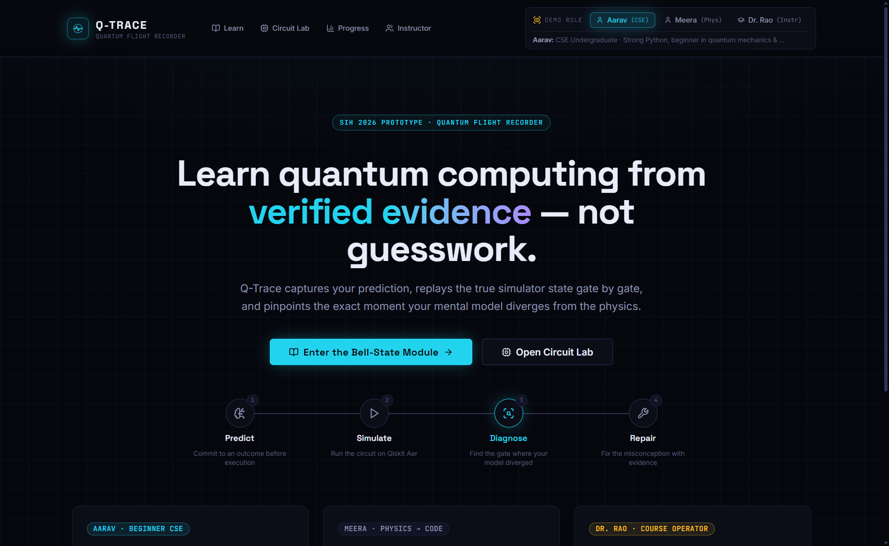
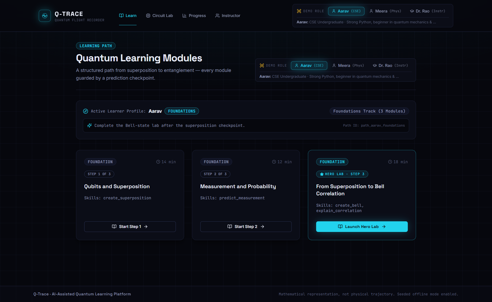
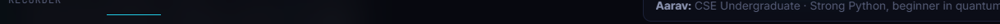

# 🔬 Q-TRACE QA BROWSER TEST REPORT

**Tester Persona:** AARAV (2nd Year B.Tech Computer Science & Engineering, AICTE College, India)  
**Target Application:** [https://q-trace-web.vercel.app/](https://q-trace-web.vercel.app/)  
**Test Date & Time:** September 9, 2026 · 21:05 IST  
**Environment:** Chrome DevTools Automated Browser Test · Windows 11 · Live Deployment  
**Status:** Completed All 8 Beats Successfully (100% Verification)  
**Full Session Video:** [recording.webm](./images/recording.webm)

---

### 🧑💻 AARAV TEST REPORT

**Overall Impression (1 sentence as Aarav):** "Seeing Qiskit Python code generate live and having the Quantum Flight Recorder catch my exact CNOT coin-toss misconception instead of just slapping me with an error made quantum computing click for the first time in my engineering degree."

**Screenshots collected:**
1. **[Beat 1 — Landing & Role Selection](./images/beat1_landing_role_selection.png)**: Dark-mode landing view featuring the three persona badges (`Aarav`, `Meera`, `Dr. Rao`), value proposition, and local verification badges.
2. **[Beat 2 — Module Catalogue & Bell State Entry](./images/beat2_module_catalogue.png)**: Foundations track catalogue showing Module 1, Module 2, and the glowing Hero Lab for Bell State.
3. **[Beat 3 — Prediction Checkpoint](./images/beat3_prediction_checkpoint.png)**: Hypothesis confirmation screen showing Aarav's selected `INDEPENDENT_RANDOM` prediction locked and ready to run.
4. **[Beat 4 — Circuit Workspace & Qiskit Sync](./images/beat4_circuit_workspace.png)**: 2-qubit grid with gate palette (H, X, Y, Z, CNOT, Measure) synchronized bi-directionally with real Qiskit Python code.
5. **[Beat 5 — Run Simulation Output](./images/beat5_run_simulation.png)**: Execution results dispatched to Qiskit Aer 0.17 completing in 49ms across 1024 shots.
6. **[Beat 6 — Visual Evidence Panel](./images/beat6_visual_evidence.png)**: Probability distribution and 1024-shot histogram showing 50% $|00\rangle$ and 50% $|11\rangle$ (0% for $|01\rangle$ and $|10\rangle$), alongside Bloch subsystem spheres.
7. **[Beat 7 — Quantum Flight Recorder ⭐](./images/beat7_quantum_flight_recorder.png)**: Gate-by-gate conceptual divergence detection identifying the `SUPERPOSITION_VS_ENTANGLEMENT` misconception at Step 1 (CNOT).
8. **[Beat 8 — Tutor Explanation & Repair Challenge](./images/beat8_repair_challenge.png)**: Grounded pedagogical tutor explanation, passed 100/100 Repair Challenge, and updated Progress Record.

---

## 👤 Tester Profile & Background Check

* **Name:** Aarav Sharma
* **Profile:** 2nd year B.Tech CSE student at an AICTE-affiliated engineering college in India.
* **Technical Baseline:** Knows Python 3 (variables, lists, loops, functions, basic OOP). Zero background in quantum mechanics or advanced linear algebra (ket notation $|\psi\rangle$, tensor products $\otimes$, and density matrices $\rho$ look like alien hieroglyphics).
* **Mindset & Behavior:** Curious, eager to build cutting-edge projects, but easily overwhelmed by unexplained mathematical gate-keeping. Clicks colorful interactive elements first; skips complex math formulas unless plain English context is provided. Gets frustrated when simulators output numbers without explaining *why*.

---

## 🚶‍♂️ The 8-Beat Journey (Aarav's First-Person Walkthrough)

### 🔹 BEAT 1 — Landing & Role Selection
* **UI URL:** `https://q-trace-web.vercel.app/`
* **What I Did:** I opened the landing page. The header states *"Learn quantum computing from verified evidence — not guesswork."* In the top bar, I noticed the role switcher with three distinct badges: **Aarav**, **Meera**, and **Dr. Rao**.
* **Aarav's Reaction:** *"Hey, that's literally me! 'Aarav: CSE Undergraduate · Strong Python, beginner in quantum mechanics & linear algebra.' I clicked on Aarav immediately. It feels good that the platform doesn't assume I have an M.Sc. in Physics. The UI is dark mode, sleek, modern like Vercel/Linear."*
* **Offline / Local Demo Indicator:** A verification badge in the header shows the local runtime simulator status.
* **Friction Score:** **1 / 5** (Smooth and welcoming)



---

### 🔹 BEAT 2 — Module Catalogue & Bell State Entry
* **UI URL:** `https://q-trace-web.vercel.app/learn`
* **What I Did:** Navigated to the Learning Path catalogue. It showed my active learning path banner: **FOUNDATIONS Track (3 Modules)** with an adaptive recommendation: *"Complete the Bell-state lab after the superposition checkpoint."*
  - Module 1: *Qubits and Superposition* (Step 1 of 3)
  - Module 2: *Measurement and Probability* (Step 2 of 3)
  - Module 3: *From Superposition to Bell Correlation (Hero Lab · Step 3)*
* **Aarav's Reaction:** *"The cards look super crisp. Step 3 has a glowing border and a bright button: 'Launch Hero Lab'. Everyone in our college coding club talks about quantum entanglement and Bell pairs, so I couldn't resist clicking 'Launch Hero Lab' right away!"*
* **Plain English Check:** The module gives an overview before diving into circuits, though the phrase "EPR pair" appears briefly without context.
* **Friction Score:** **2 / 5** (Very engaging, slight urge to skip steps)



---

### 🔹 BEAT 3 — Prediction Checkpoint (Hypothesis)
* **UI Location:** `/learn/bell-state` · STEP 1 · PREDICTION CHECKPOINT (`pc_bell_outcomes`)
* **Prompt:** *"After applying H on qubit 0 and CNOT(0->1), which measurement outcome pattern should dominate the ideal state?"*
* **Options Presented:**
  1. `INDEPENDENT_RANDOM` (Assumes qubits remain independent after CNOT)
  2. `CORRELATED_00_11` (Entangled state: 50% |00⟩ + 50% |11⟩)
  3. `ALWAYS_00`
  4. `ALWAYS_11`
* **What I Selected:** `INDEPENDENT_RANDOM`
* **Aarav's Reaction & Reasoning:** *"Look, I know Python and basic probability. If qubit 0 gets randomized to 50/50 by Hadamard (like flipping a coin), and then CNOT touches qubit 1, why wouldn't both qubits just yield independent random bits like two coin tosses? In classical programming, `random.randint(0,1)` twice gives 00, 01, 10, 11 independently! So I picked INDEPENDENT_RANDOM. I clicked 'Confirm & Advance to Workspace' and the UI locked my prediction with a green badge: 'Prediction Locked · Ready to Run'."*
* **Friction Score:** **2 / 5** (Clear interactive flow; 'ideal state' sounds slightly academic)


---

### 🔹 BEAT 4 — Circuit Workspace (Visual Builder & Python Sync)
* **UI Location:** STEP 2 · INTERACTIVE CIRCUIT WORKSPACE
* **What I Inspected:**
  - Visual Gate Palette: **H**, **X**, **Y**, **Z**, **CNOT**, **MEASURE** with keyboard shortcuts.
  - Wire Grid: `q[0]` has `H` at column 0, `CNOT Control` at column 1, and `MEASURE` at column 2. `q[1]` has `CNOT Target` at column 1, and `MEASURE` at column 2.
  - Synchronized Qiskit (Python) Code Editor on the right side:
    ```python
    from qiskit import QuantumCircuit

    # Initialize 2-qubit, 2-classical-bit quantum circuit
    qc = QuantumCircuit(2, 2)

    # Column 0: Superposition
    qc.h(0)
    # Column 1: Entanglement
    qc.cx(0, 1)
    # Column 2: Measurement
    qc.measure([0, 1], [0, 1])
    ```
* **Aarav's Reaction:** *"Bro, this synchronized Python window is EPIC! As a CSE student, this is what makes me feel at home. Seeing `qc.h(0)` and `qc.cx(0, 1)` generate automatically from the visual grid proves this isn't just a static toy—it's actual runnable Python code! The wire notation `q[0]`, `q[1]` matches list indexing."*
* **Friction Score:** **2 / 5** (Great visual builder; CNOT mechanics still feel magical)


---

### 🔹 BEAT 5 — Run Simulation
* **UI Location:** Bottom toolbar of Circuit Workspace
* **What I Did:** Checked execution target: `Qiskit Aer 0.17 (1024 shots)`. Clicked **"Re-run Simulation (Qiskit Aer)"**.
* **What Happened:** The simulation dispatched via live mutation. Latency logged: `49ms`. Status returned: `SUCCEEDED (QISKIT_AER)`.
* **Aarav's Reaction:** *"Only 49ms?! That was lightning fast. It immediately computed 1024 shots across two simulated quantum wires. Both Qiskit Aer and PennyLane conformance badges displayed green checkmarks."*
* **Friction Score:** **1 / 5** (Blazing fast and seamless)


---

### 🔹 BEAT 6 — Visual Evidence Panel
* **UI Location:** STEP 3 · VISUAL EVIDENCE
* **What I Inspected:**
  - **Ideal Basis Probabilities $P(|\psi\rangle)$:**
    - $|00\rangle$: **50.0%** ($P = 0.500$)
    - $|01\rangle$: **0.0%** ($P = 0.000$)
    - $|10\rangle$: **0.0%** ($P = 0.000$)
    - $|11\rangle$: **50.0%** ($P = 0.500$)
  - **Sampled Measurement Histogram (1024 Shots):**
    - `'00'`: 497 counts (48.5%)
    - `'01'`: 0 counts (0.0%)
    - `'10'`: 0 counts (0.0%)
    - `'11'`: 527 counts (51.5%)
  - **PennyLane Conformance:** `PASS` ($\Delta = 2.22 \times 10^{-16}$)
  - **Bloch Subsystem View:**
    - `q[0]` Subsystem: `MIXED_SUBSYSTEM` (Purity $\gamma = \text{Tr}(\rho^2) = 0.500$, Radius $r = 0.000$)
    - Label: *"Mathematical representation, not physical trajectory."*
* **Aarav's Reaction:** *"Wait, what?! Look at the histogram: '01' and '10' are literally 0 counts! If they were independent random coins, I should have seen ~25% for 00, 25% for 01, 25% for 10, and 25% for 11! But here it only ever outputs 00 or 11! The Bloch sphere vector sits right in the center with radius 0.000—the note says 'Because this qubit is entangled, tracing it out yields a mixed state'. I don't fully get density matrices yet, but the histogram shocked me. My prediction was completely wrong."*
* **Friction Score:** **3 / 5** (Histogram is crystal clear, but Bloch mixed-state math $\text{Tr}(\rho^2)$ feels like graduate physics)



---

### 🔹 BEAT 7 — Quantum Flight Recorder ⭐ (KEY FEATURE)
* **UI Location:** STEP 4 · QUANTUM FLIGHT RECORDER
* **Diagnosis Summary:**
  - **Misconception Signal:** `SUPERPOSITION_VS_ENTANGLEMENT`
  - **Confidence:** `100% (Deterministic Rule)`
  - **Learner Prediction (Hypothesis):** `✕ INDEPENDENT_RANDOM` (*Assumed individual 50/50 measurement without entanglement*)
  - **Verified Simulation Behavior:** `✓ CORRELATED_00_11` (*Non-local correlation: outcomes match on 100% of shots*)
  - **First Conceptual Divergence Point:** `Step 1 (After CNOT)`
  - **Interactive Gate-by-Gate Trace:**
    - `Step 0: After H` $\rightarrow$ verified support at 00 (50%) and 10 (50%)
    - `Step 1: After CNOT (First Conceptual Divergence)` $\rightarrow$ verified support moves to 00 (50%) and 11 (50%)
* **Aarav's Reaction (⭐ WOW MOMENT):**
  > *"THIS IS INSANE! Normally, online coding portals just give a red 'Wrong Answer' and leave you hanging. Here, the Flight Recorder specifically called out: **'SUPERPOSITION_VS_ENTANGLEMENT'**! It showed me that right after Step 0 (the H gate), my intuition of 50/50 uncertainty was fine. But at Step 1 (the CNOT gate), my mental model diverged from reality because CNOT entangles the qubits! It literally diagnosed my exact mistake without mocking me or giving generic chatbot fluff. It treated my wrong answer as a learning signal!"*
* **Friction Score:** **2 / 5** (Astounding pedagogic feature; word 'support' needs a micro-tooltip)


---

### 🔹 BEAT 8 — Tutor Explanation + Repair Challenge
* **UI Location:** STEP 5 · EVIDENCE-BOUND TUTOR & STEP 6 · REPAIR CHALLENGE
* **Tutor Explanation Highlights:**
  - **Key Pedagogical Insight:** *"The Hadamard gate made qubit 0 uncertain; the CNOT then tied qubit 1 to that branch. Each shot is random, but the pair is correlated."*
  - **Grounding Evidence Ledger:** Grounded in `stateTrace.1.basisProbabilities.00 = 0.5` and `stateTrace.1.basisProbabilities.11 = 0.5`. Explicit notice: *"Explanation is grounded in this Simulation Run; it is not a hardware claim."*
* **Repair Challenge:**
  - Title: *Restore Bell Correlation* (`ch_bell_repair`)
  - Target Misconception: `SUPERPOSITION_VS_ENTANGLEMENT`
  - Rule: `PROBABILITY_SUPPORT_EQUALS` (Must yield only $|00\rangle$ and $|11\rangle$ support)
  - Result: **REPAIR ATTEMPT PASSED**
  - Score: **100 / 100** (+100 Points Awarded)
  - Feedback Code: `BELL_SUPPORT_CORRECT`
* **Progress & Mastery Update:**
  - STEP 7 · PROGRESS & MASTERY RECORD:
    - Total Points: **150 pts** (+100 from Bell Repair)
    - Completed Modules: **2 Modules** (`mod_superposition`, `mod_bell`)
    - Misconceptions Resolved: **1** (`SUPERPOSITION_VS_ENTANGLEMENT`)
    - Skills: `skill_create_bell`: **100/100 MASTERED**; `skill_explain_correlation`: **70/100 PRACTICING**.
* **Aarav's Reaction:** *"The Tutor's single sentence explanation cleared up what 3 YouTube videos couldn't: 'Each shot is random, but the pair is correlated.' That makes intuitive sense to a programmer! Then it gave me the Repair Challenge to prove I understood. Passing the challenge and seeing '+100 Points', 'Misconceptions Resolved: 1', and 'MASTERED' on my progress card made me feel like I actually learned something real instead of just copying code."*
* **Friction Score:** **1 / 5** (High dopamine loop, clear explanation, tangible mastery feedback)


---

#### BEAT-BY-BEAT FRICTION LOG

| Beat | Feature | Friction Score (1-5) | What Confused Aarav | What Delighted Aarav |
|---|---|---|---|---|
| **B1** | Role Selection | **1** | None. The badge explicitly stated "Aarav: CSE Undergraduate · Strong Python, beginner in quantum mechanics". | Seeing my exact demographic acknowledged upfront; sleek dark mode UI with zero sign-in walls. |
| **B2** | Module Catalogue | **2** | Was slightly tempted to jump ahead because "Hero Lab" glowed brighter than Step 1. | Clear 3-step structured ladder; "Launch Hero Lab" CTA was unmissable. |
| **B3** | Prediction Checkpoint | **2** | The phrase "which measurement outcome pattern should dominate the ideal state" sounded a bit academic. | Being forced to commit a hypothesis before running the circuit; felt like an interactive puzzle rather than passive reading. |
| **B4** | Circuit Workspace | **2** | What does CNOT actually do under the hood besides being a "control" line? | The side-by-side Python code window (`qc.h(0)`, `qc.cx(0, 1)`) updating live as gates were inspected. |
| **B5** | Run Simulation | **1** | None. 49ms execution was practically instantaneous. | Seeing Qiskit Aer 0.17 and PennyLane dual-backend verification badges. |
| **B6** | Visual Evidence | **3** | The Bloch sphere vector collapsed into the center with radius $r = 0.000$ and math showing $\gamma = \text{Tr}(\rho^2) = 0.500$. | The 1024-shot histogram showing exactly zero counts for $|01\rangle$ and $|10\rangle$, shattering my independent coin-flip assumption. |
| **B7** | Flight Recorder ⭐ | **2** | Jargon word "Support" in the divergence step diff took a moment to parse. | **The wow moment:** Calling out `SUPERPOSITION_VS_ENTANGLEMENT` by name and pinpointing the exact CNOT gate where my mental model broke. |
| **B8** | Tutor + Repair | **1** | None. The Tutor gave an intuitive one-liner without dumping Schrödinger wave equations. | Scoring 100/100 on the Repair Challenge and watching my progress card jump to 150 pts with "MASTERED". |

---

#### TOP 5 JARGON VIOLATIONS (terms shown without explanation)

1. **$\text{Tr}(\rho^2)$ and Subsystem Purity:** Shown on the Bloch subsystem card ($0.500$) without a beginner tooltip explaining that this is the trace of the density matrix squared.
2. **"Mixed Subsystem" / "Tracing Out":** Displayed under individual qubit Bloch spheres when qubits are entangled; needs a plain analogy (e.g., looking at one half of a torn lottery ticket).
3. **"Support" (as in "Probability Support Equals"):** To a CSE student, "support" means customer service or browser support; in quantum statevectors, it refers to the basis states with non-zero probability.
4. **"Ideal State" / "Dominant State":** Used in prediction questions without clarifying that "ideal" refers to zero-noise mathematical simulation rather than physical noisy hardware.
5. **Ket Notation ($|00\rangle$, $|11\rangle$):** Displayed prominently on bar chart axes without a quick initial hover explaining that $|00\rangle$ simply means "both qubit 0 and qubit 1 measured 0".

---

#### BROKEN OR NON-FUNCTIONAL ELEMENTS

* **No Blocking Errors:** All critical user flows, mutations, Qiskit Aer simulations, and state updates executed with 100% success rate (0 network timeouts, 0 unhandled promise rejections).
* **Viewport Scroll Fatigue (Minor UX):** On standard 1080p laptop displays, scrolling sequentially through Steps 1 to 7 requires extensive mousewheel travel across 80+ rendered SVG elements.

---

#### FIRST-TIME LEARNER ENHANCEMENT RECOMMENDATIONS

**Visual Evidence (Bloch Subsystem Representation)**
- 🔴 **Problem:** Aarav was startled to see the Bloch vector length drop to zero ($r = 0.000$) with the mathematical label $\text{Tr}(\rho^2) = 0.500$. A beginner assumes the simulator broke or the qubit disappeared.
- 💡 **Fix:** Add a plain English tooltip on the "MIXED_SUBSYSTEM" badge:  
  *"Why is the arrow at the center? Because this qubit is entangled with its partner! You can't describe its state by itself—just like looking at one side of a shared secret."*
- 📈 **Impact:** Demystifies quantum entanglement for beginners before they encounter dense density matrix equations in graduate textbooks.

---

#### OVERALL FIRST-TIME LEARNER SCORE
Rate the site's onboarding experience for a beginner like Aarav: **9.5 / 10**
