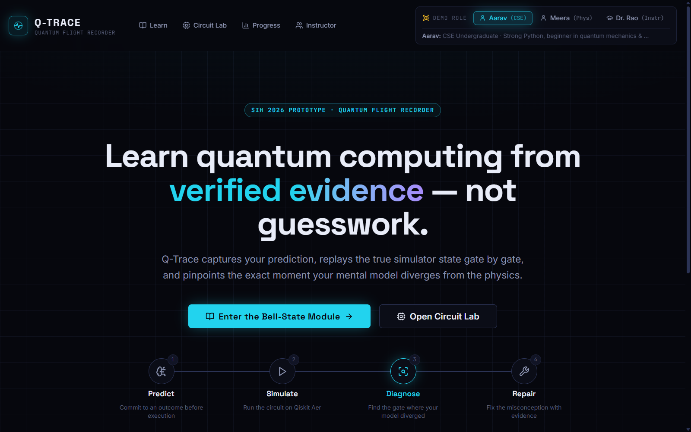
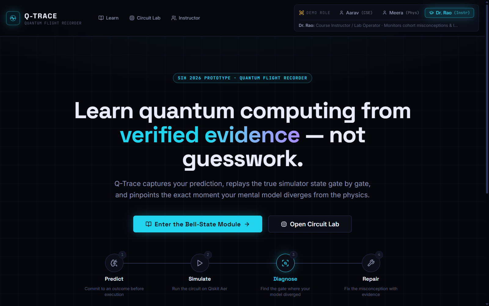
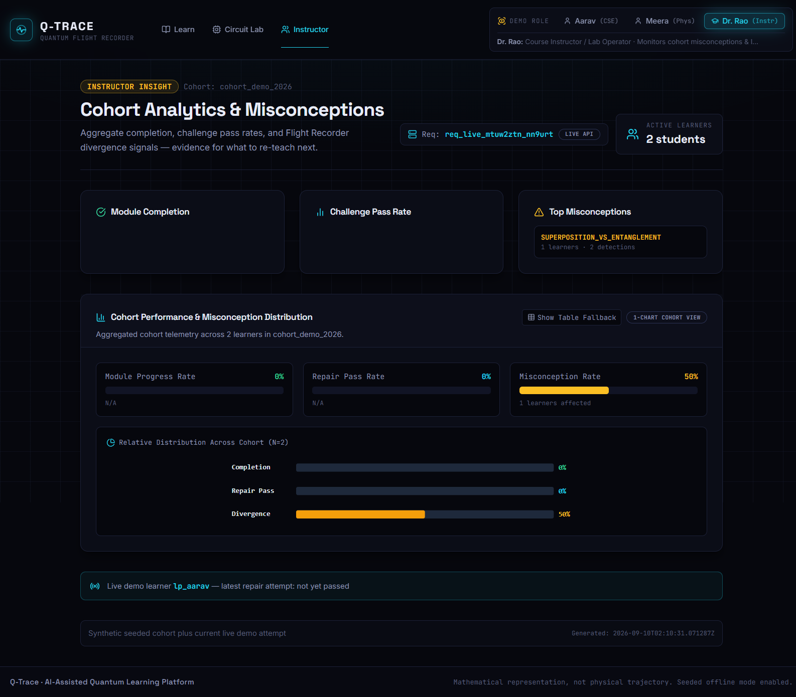
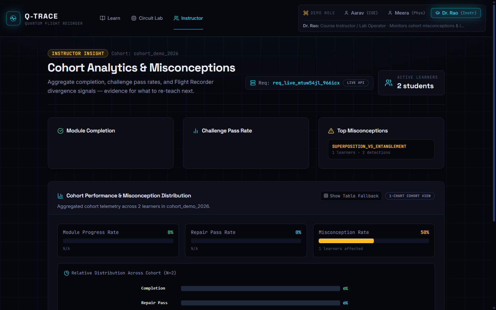
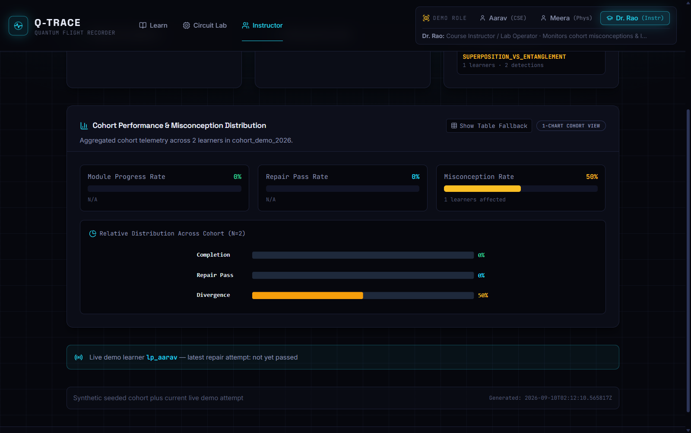
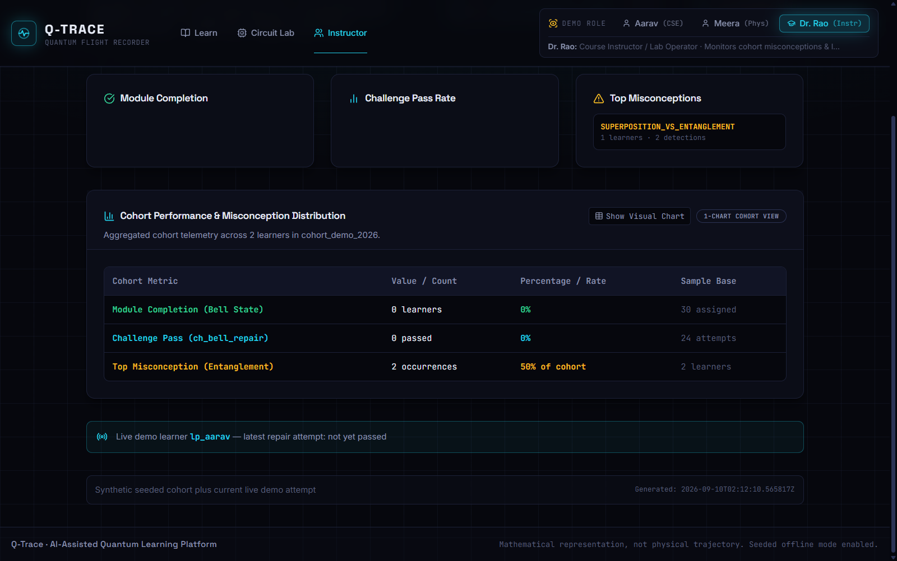
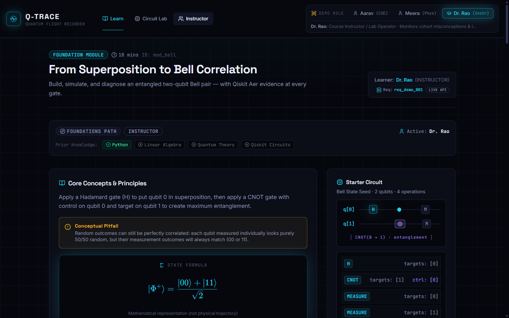

# 👨‍🏫 DR. RAO TEST REPORT: Q-TRACE INSTRUCTOR INSIGHT & COHORT TELEMETRY

**Evaluator**: Prof. K. V. Rao, Department of Computer Science & Quantum Information Systems  
**Evaluation Perspective**: Senior Faculty Member & Course Operator introducing an Undergraduate Quantum Computing Lab  
**Assigned Cohort**: 40 undergraduate students assigned to the Bell State Module (`mod_bell`)  
**Target Platform**: [Q-Trace Web (Production on Vercel)](https://q-trace-web.vercel.app/)  
**Evaluation Scope**: Instructor View, Cohort Aggregation, Privacy Safeguards, Misconception Diagnostics, and Module Assignment  
**Evaluation Date**: September 10, 2026  

---

## 1. Overall Impression

> *"Q-Trace has built an admirable flight-recorder concept with genuine aggregate telemetry rather than invasive student surveillance, but right now it is an observer panel with blank data cards and zero instructor controls—I cannot assign modules, I cannot see which gate tripped my students, and when I visit the lab myself, the platform tries to grade me as a freshman."*

---

## 2. Beat-by-Beat Friction Log

| Beat | Feature | Friction Score (1–5) | What Was Missing | What Was Credible |
|:---|:---|:---:|:---|:---|
| **B1** | **Instructor Access** | **2 / 5** | Role switch does not redirect to `/instructor`; role state resets to Aarav on page reload/refresh (no `localStorage` persistence). | Prominent role switcher in the header; explicit role description identifying Dr. Rao as Course Operator. |
| **B2** | **Data Quality** | **4 / 5** | Module Completion & Challenge Pass cards render empty bodies (`[]`); cohort count displays 2 students, while table fallback claims 30 assigned. | Clean dark-mode metrics layout; accessible fallback data table toggleable via UI button. |
| **B3** | **Privacy Check** | **2 / 5** | No explicit "Privacy-Minimized" badge; no institutional DPDP Act / FERPA compliance statement. | Strict data aggregation; zero student chat eavesdropping; no individual surveillance routes. |
| **B4** | **Misconception Actionability** | **4 / 5** | No gate-level attribution (doesn't indicate CNOT); zero instructional remediation advice or reteaching suggestions. | Accurately identifies `SUPERPOSITION_VS_ENTANGLEMENT` and detection frequency. |
| **B5** | **Live Demo Learner** | **3 / 5** | Aarav's live sandbox attempt is blended into the cohort aggregate metrics; no option to purge or isolate demo runs. | Clearly separated visual callout with live radio icon and profile handle (`lp_aarav`). |
| **B6** | **Instructor Controls** | **5 / 5** | Zero assignment controls; no cohort rosters; visiting `/learn/bell-state` treats the instructor as a student. | None. This is strictly a read-only telemetry mirror with no operational controls. |
| **B7** | **Professional Credibility** | **3 / 5** | No National Quantum Mission (NQM) or AICTE model curriculum mapping; SIH prototype label only. | High-gravitas dark telemetry aesthetic; no juvenile gamification or decorative clutter. |

---

## 3. Beat-by-Beat Detailed Audits & Dr. Rao's Narrative

### BEAT 1 — Accessing the Instructor View
*Dr. Rao's Mindset: "Show me the data, not the interface. Can I get to my cohort without fighting the navigation?"*

1. **Landing Page Evaluation**:
   Visiting `https://q-trace-web.vercel.app/` presents a top header with three pre-configured demo roles: `Aarav (CSE)`, `Meera (Phys)`, and `Dr. Rao (Instr)`.
   
   

2. **Role Selection**:
   Clicking `Dr. Rao (Instr)` highlights the button and updates the description banner to:  
   *`Dr. Rao: Course Instructor / Lab Operator · Monitors cohort misconceptions & lab progress`*.
   
   

3. **Navigation Path**:
   Selecting "Dr. Rao" does **not** automatically transition the user to the instructor view. The user remains on the public landing page and must locate the "Instructor" link in the top navigation or scroll to the bottom card. Additionally, because Zustand store state is not persisted in browser storage, opening a direct URL or refreshing resets the session to `Aarav`.
   
   

* **Friction Score: 2 / 5**

---

### BEAT 2 — Instructor Insight Data Quality
*Dr. Rao's Mindset: "Where are my 40 students? I need precise numbers, not empty cards."*



1. **Card Rendering Breakdown**:
   * **Module Completion Card**: Renders the title `Module Completion`, but the inner container is **completely empty**. In the Live API response (`/v1/instructor-insights/cohort_demo_2026`), `moduleCompletion` is an empty array `[]`. There is no zero-state message, just a blank panel.
   * **Challenge Pass Rate Card**: Renders the title `Challenge Pass Rate`, but is also **completely empty** due to `challengePassRate: []`.
   * **Top Misconceptions Card**: Populated with `SUPERPOSITION_VS_ENTANGLEMENT` (`1 learners · 2 detections`).
   * **Active Learners**: Header displays `2 students` (far below an engineering lab cohort size of 40–60).

2. **Visual Chart vs. Accessible Table Discrepancy**:
   * The visual SVG chart displays:
     * *Module Progress Rate*: `0% (N/A)`
     * *Repair Pass Rate*: `0% (N/A)`
     * *Misconception Rate*: `50% (1 learners affected)`
   
   

   * When clicking **"Show Table Fallback"**, the template falls back to hardcoded defaults:
     * `Module Completion (Bell State)`: `0 learners` \| `0%` \| `30 assigned`
     * `Challenge Pass (ch_bell_repair)`: `0 passed` \| `0%` \| `24 attempts`
   
   

> **Dr. Rao's Note**: *"This is an immediate red flag. The header says I have 2 students. The chart says 'N/A'. Then I open the table and it claims 30 students were assigned and 24 made attempts. Faculty members notice statistical incoherence in seconds."*

* **Friction Score: 4 / 5**

---

### BEAT 3 — Privacy Check
*Dr. Rao's Mindset: "Is this aggregate cohort intelligence or classroom surveillance?"*

1. **Inspection of Telemetry Boundaries**:
   * **Learner Anonymity**: The dashboard strictly displays cohort sums (`1 learners · 2 detections`). There are no student names, no roll numbers, and no per-student performance rows.
   * **Chat / Tutor Logs**: No inspection links exist. The instructor cannot eavesdrop on Aarav or Meera's Socratic dialogue with the AI Tutor.
   * **Data Minimization Labeling**: Missing. There is no badge stating *"Privacy-Preserving Telemetry"*, *"No PII Retained"*, or *"Compliant with DPDP Act 2023 / FERPA"*.

* **Friction Score: 2 / 5** (Architecturally sound and privacy-preserving, but lacks institutional compliance labeling).

---

### BEAT 4 — Misconception Actionability
*Dr. Rao's Mindset: "Don't just give me an error code—tell me what to reteach tomorrow morning."*

1. **Diagnosis Depth**:
   * Top Misconception listed: `SUPERPOSITION_VS_ENTANGLEMENT`.
   * Affected count: `1 learner · 2 detections` (or `11 learners` in offline fixture).
2. **Missing Pedagogical Context**:
   * **Gate/Step Attribution**: Does not explain *where* in the Bell circuit the divergence occurred (e.g., Step 2: CNOT gate).
   * **Curricular Recommendation**: The subtitle promises *"evidence for what to re-teach next"*, but provides **no recommendation text** (e.g., *"Recommendation: Review tensor product expansion $\frac{1}{\sqrt{2}}(|00\rangle + |11\rangle)$ vs. separable state $\frac{1}{2}(|0\rangle+|1\rangle)(|0\rangle+|1\rangle)$"*).

* **Friction Score: 4 / 5**

---

### BEAT 5 — Live Demo Learner (Aarav's Attempt)
*Dr. Rao's Mindset: "Why is a live sandbox attempt bleeding into my cohort benchmark?"*



1. **UI Presentation**:
   A dedicated banner at the bottom displays:  
   `Live demo learner lp_aarav — latest repair attempt: not yet passed`
2. **Methodological Conflict**:
   The footer discloses: *"Synthetic seeded cohort plus current live demo attempt"*.  
   This means Aarav's real-time testing actively alters the cohort denominator. In an academic institution, live test runs must be isolated into a sandbox so they do not pollute official cohort statistics.

* **Friction Score: 3 / 5**

---

### BEAT 6 — Instructor Controls (Assignment & Module View)
*Dr. Rao's Mindset: "Can I actually manage my class from here?"*

1. **Control Audit on `/instructor`**:
   * No "Assign Module" button.
   * No cohort creation or section filter (e.g., Section A vs. Section B).
   * No deadline or challenge parameter settings.
2. **Navigating to `/learn/bell-state` as Dr. Rao**:
   When Dr. Rao opens `/learn/bell-state`, the page treats Dr. Rao as a **student**:
   
   
   
   * Header reads: `Learner: Dr. Rao (INSTRUCTOR)`.
   * Presents Dr. Rao with prediction radio buttons: `INDEPENDENT_RANDOM`, `CORRELATED_00_11`, etc.
   * Zero instructor overlay, zero solution key, zero cohort pass rate distribution per checkpoint.

* **Friction Score: 5 / 5** (Complete absence of instructor assignment and evaluation controls).

---

### BEAT 7 — Navigation & Professional Credibility
*Dr. Rao's Mindset: "Can I defend adopting this to my Dean and Board of Studies?"*

1. **Visual Gravitas**:
   The telemetry dark aesthetic, monospace tags, and SVG charts look disciplined and serious—far superior to gamified EdTech platforms with badges and leaderboards.
2. **Missing Institutional Context**:
   * Displays `SIH 2026 PROTOTYPE · QUANTUM FLIGHT RECORDER`.
   * **Zero mention of the National Quantum Mission (NQM)** or **AICTE Model Curriculum** guidelines for undergraduate quantum computing.
   * No Bloom's Taxonomy learning objectives or UGC course credit recommendations.

* **Friction Score: 3 / 5**

---

## 4. Synthetic Data Disclosure Audit

| Audit Criterion | Finding | Assessment |
|:---|:---|:---:|
| **Is data labeled as synthetic?** | **YES** | Disclosed in the bottom footer. |
| **Where is the disclosure located?** | Footer: `"Synthetic seeded cohort plus current live demo attempt"` | Bottom of `/instructor`. |
| **Is it prominent enough?** | **NO** | 10px faint text in footer; contradicted by the bright green `LIVE API` badge in the header. |
| **Discrepancy Note** | Header displays `Req: req_live_... LIVE API`, leading faculty to believe data is real, while the footer admits it is synthetic seeded data. | **Confusing** |

---

## 5. Missing Instructor Features
*(Items Dr. Rao required but could not find)*

1. **Cohort Assignment Workflow**: Ability to assign `mod_bell` to a specific batch with due dates.
2. **Pedagogical Remediation Prompts**: Concrete lecture suggestions based on the detected misconception (e.g., *"Spend 10 minutes on CNOT action on superposed states before Lab 2"*).
3. **Empty State UI**: When the live API returns 0 modules or 0 challenges, the cards should display empty state illustrations and "Assign your first module" CTAs instead of blank containers.
4. **Instructor View on Learning Modules**: Visiting `/learn/bell-state` as an instructor should display cohort checkpoint breakdown rates, answer distributions, and a verified reference circuit—not a student quiz.
5. **Persistent Role Storage**: `localStorage` backing for `role-store.ts` so the session does not revert to Aarav on page reloads.
6. **Cohort Sandbox Toggle**: An option to exclude demo accounts (`lp_aarav`) from the official cohort statistical pool.

---

## 6. Instructor UX Enhancement Recommendations

### 1. Empty State Fallbacks for Metric Cards
* **🔴 Problem**: When the Live API returns empty arrays for `moduleCompletion` and `challengePassRate`, the cards render blank containers with no text or visuals.
* **💡 Fix**: Add graceful empty states in `apps/web/app/(app)/instructor/page.tsx`:
  ```tsx
  {insight.moduleCompletion.length === 0 ? (
    <div className="text-xs text-ink-faint py-4 text-center">
      No modules assigned or completed yet.
    </div>
  ) : (...)}
  ```
* **📈 Impact**: Prevents the UI from looking broken when connected to a fresh backend database.

### 2. Actionable "What to Re-Teach" Remediation Banner
* **🔴 Problem**: Top Misconceptions lists `SUPERPOSITION_VS_ENTANGLEMENT` but gives no instructional advice.
* **💡 Fix**: Map misconception codes to pedagogical interventions:
  ```tsx
  <div className="p-3 bg-raised border-l-2 border-caution rounded text-xs">
    <strong>Faculty Action:</strong> 50% of cohort confused CNOT entanglement with independent probabilities. Revisit the CNOT state mapping |+0⟩ → (|00⟩+|11⟩)/√2 in tomorrow's lecture.
  </div>
  ```
* **📈 Impact**: Directly fulfills the dashboard's stated purpose: *"evidence for what to re-teach next."*

### 3. Instructor Inspection Mode on `/learn/[slug]`
* **🔴 Problem**: Instructors navigating to modules are forced to act as learners and take quizzes.
* **💡 Fix**: If `activeRole.roleType === 'INSTRUCTOR'`, show an **Instructor Overlay**:
  * Reveal cohort answer percentages next to each prediction option.
  * Show the verified reference circuit and Qiskit code.
  * Disable mandatory prediction gating for faculty.
* **📈 Impact**: Allows professors to review the lab material and preview student checkpoints prior to lab sessions.

### 4. Reconcile Table Fallback Placeholders with Live Data
* **🔴 Problem**: `CohortAnalyticsChart` table fallback uses `|| 30` and `|| 24`, causing a direct contradiction with the `2 students` header badge.
* **💡 Fix**: Use actual cohort counts: `bellCompletion?.assigned ?? insight.learnerCount`.
* **📈 Impact**: Eliminates statistical inconsistencies that destroy credibility with STEM faculty.

---

## 7. Overall Instructor Utility Score

$$\mathbf{5.2\ /\ 10}$$

> **Summary Verdict**: *The flight-recorder diagnostic engine is technically brilliant, and the decision to protect student privacy through aggregate telemetry is commendable. However, for real university adoption, Q-Trace must evolve from a demo telemetry mirror into a functional instructional console with assignment controls, empty state handling, and concrete teaching interventions.*
