# 🧑🔬 MEERA TEST REPORT: QA Browser Evaluation of Q-Trace

**Tester Persona:** Meera — 3rd-Year Physics Undergraduate  
**Evaluation Target:** [https://q-trace-web.vercel.app/](https://q-trace-web.vercel.app/)  
**Date:** September 10, 2026  
**Mindset:** Mathematically fluent in Dirac notation ($|\psi\rangle = \frac{|0\rangle + |1\rangle}{\sqrt{2}}$), partial traces, density matrices, and Hamiltonian dynamics; zero prior quantum coding experience; seeking a concise conceptual path with direct framework comparisons (Qiskit vs. PennyLane) and real two-way code debugging. Impatient with over-simplified classical analogies and read-only dumbed-down code.

---

### Overall Impression
> *"Mathematically, your reduced density matrix and $r=0$ Bloch subsystem representation for the Bell state is pure gold, but forcing me to scroll past the same hand-waving beginner analogies and falsely flagging my correct prediction as a 'divergence' makes me feel like the platform doesn't quite trust my physics background yet."*

---

### Generated Qiskit Code Quality

```python
from qiskit import QuantumCircuit

# Initialize 2-qubit, 2-classical-bit quantum circuit
qc = QuantumCircuit(2, 2)

# Column 0: Superposition
qc.h(0)
# Column 1: Entanglement
qc.cx(0, 1)
# Column 2: Measurement
qc.measure([0, 1], [0, 1])
```

- **Modern Qiskit 2.x style?** **YES.**  
  Uses clean `QuantumCircuit(2, 2)` instantiation, linear gate calls `qc.h(0)`, `qc.cx(0, 1)`, and vectorized measurement `qc.measure([0, 1], [0, 1])`. Avoids deprecated Qiskit 0.x/1.x paradigms (no `qiskit.execute`, no legacy registers).
- **Editable?** **PARTIAL.**  
  The editor is an interactive textarea with two-way AST parsing and synchronization to the visual grid. Supported gates (`H, X, Y, Z, CNOT, MEASURE`) parse cleanly and update the wire grid. However, entering gates outside the frozen prototype subset (e.g., `qc.rz(0.5, 0)` or `qc.rx()`) triggers an explicit red parse & validation error banner (`Gate RZ is outside the prototype subset`). Arbitrary Python scripting, loops, and custom unitary matrices are blocked.

---

## BEAT-BY-BEAT TEST WALKTHROUGH

### BEAT 1 — Role Selection as Meera

1. **Default Landing View:**  
   The platform defaults to Aarav (CSE Undergraduate) with beginner-focused copy: *"Learn quantum computing from verified evidence — not guesswork"* and the 4-step pipeline (*Predict → Simulate → Diagnose → Repair*).
   
   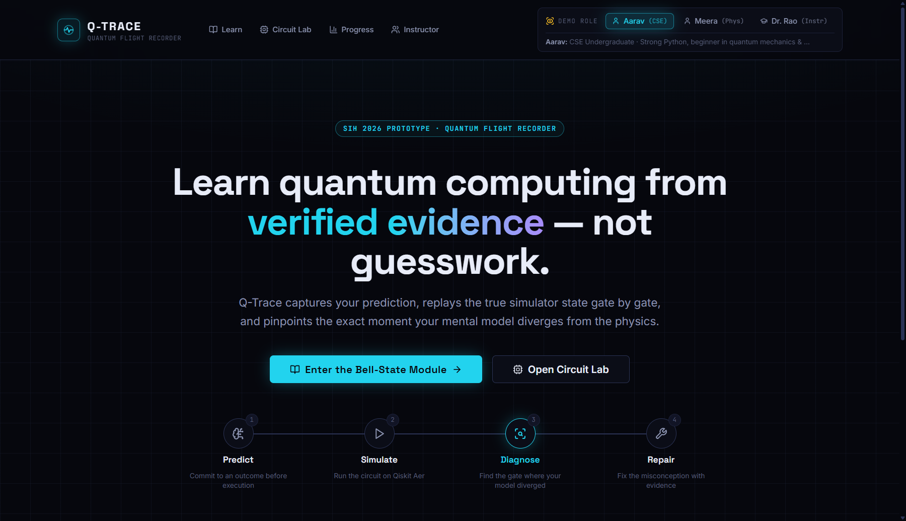

2. **Selecting Meera:**  
   Switched the role in the global header to `Meera (Phys)` (`Physics Graduate · Strong quantum theory & math, transitioning to Qiskit code`).
   
   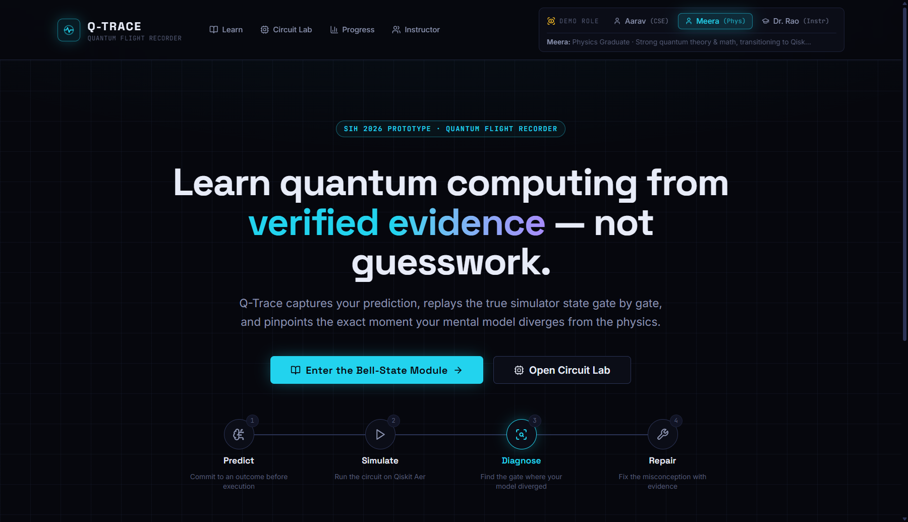

3. **Meera's Evaluation:**  
   - *Shorter entry path?* No automatic redirection occurs. The primary hero CTAs remain identical to Aarav's (`Enter the Bell-State Module` and `Open Circuit Lab`). While a lower persona card highlights `MEERA · PHYSICS → CODE: Launch Lab`, the landing page does not automatically adapt its hero or fast-track Meera directly to the code environment.
   - **Friction Score: 2 / 5** (Role toggle works instantly, but lacks personalized adaptive landing routing).

---

### BEAT 2 — Learning Path Differentiation

1. **Learning Catalogue (`/learn`):**  
   Navigating to the curriculum catalogue dynamically recognizes Meera's profile:
   - Banner: `Active Learner Profile: Meera [THEORY_TO_CODE]`
   - Track: `Theory-to-Code Track (1 Module)`
   - Recommendation: *"Fast-track directly to Bell correlation and Qiskit verification. Path ID: path_meera_code"*
   - Prerequisite modules (*Qubits and Superposition* and *Measurement and Probability*) display a purple `THEORY CREDITED` badge and a `Review Theory →` link.
   - The *Bell State* module is highlighted with `HERO LAB · FAST-TRACK FOCUS`.
   
   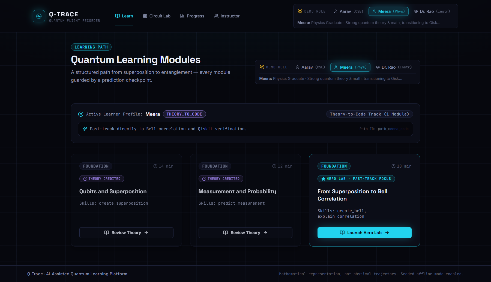

2. **Bell State Module (`/learn/bell-state`):**  
   Launching the module displays Meera's prior knowledge badge:
   `[✓ Python] [✓ Linear Algebra] [✓ Quantum Theory] [✗ Qiskit Circuits]`.
   
   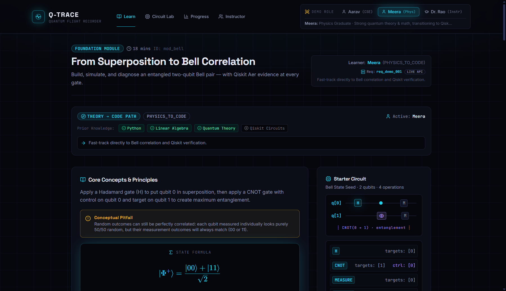

3. **Meera's Evaluation:**  
   - *Is the lesson content adjusted for prior knowledge?* While the header recognizes theory credentials, the *Core Concepts & Principles* block renders identical beginner explanatory text (*"Apply a Hadamard gate (H) to put qubit 0 in superposition..."*, *"Random outcomes can still be perfectly correlated..."*).
   - *Meera's thought:* *"I already know what a Bell state is. Why am I reading high school prose about randomness when you already credited my Quantum Theory prerequisite?"*
   - **Friction Score: 3 / 5** (Great catalog badging, but lesson text is not adapted or condensed).

---

### BEAT 3 — Prediction Checkpoint

1. **Checkpoint Inspection:**  
   Step 1 asks: *"After applying H on qubit 0 and CNOT(0->1), which measurement outcome pattern should dominate the ideal state?"*
   Options:
   - `INDEPENDENT_RANDOM` (*Assumes qubits remain independent after CNOT*)
   - `CORRELATED_00_11` (*Entangled state: 50% |00⟩ + 50% |11⟩*)
   - `ALWAYS_00`
   - `ALWAYS_11`
   
   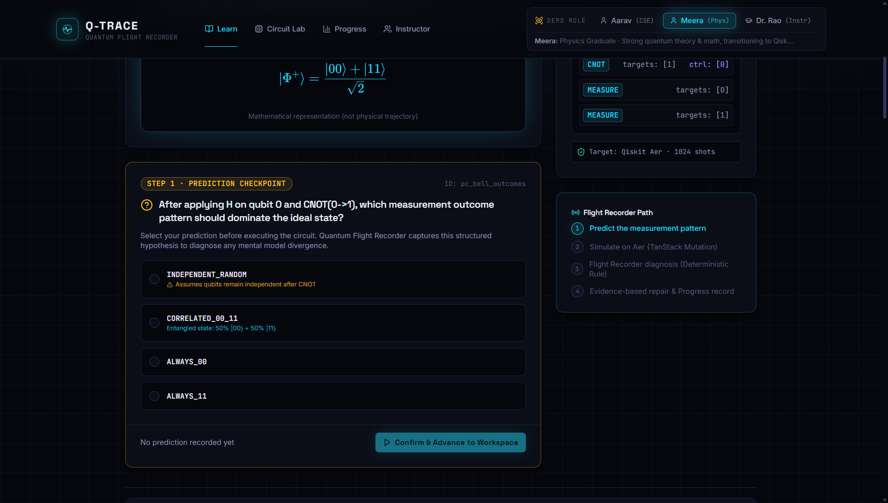

2. **Meera's Evaluation:**  
   - *Meaningful for physics students?* Yes, option 2 uses standard quantum ket notation ($|00\rangle$ and $|11\rangle$). However, the explanatory subtext under `INDEPENDENT_RANDOM` directly gives away that it's a misconception.
   - Meera selected `CORRELATED_00_11` and confirmed.
   - **Friction Score: 1 / 5** (Clean Dirac notation, smooth interactive state confirmation).

---

### BEAT 4 — Code-First Circuit View & Editing

1. **Workspace Layout:**  
   The workspace places the visual `GATE PALETTE` and drag-drop wire grid above the code panel. There is **no toggle** for a dedicated "code-first" view.
   
   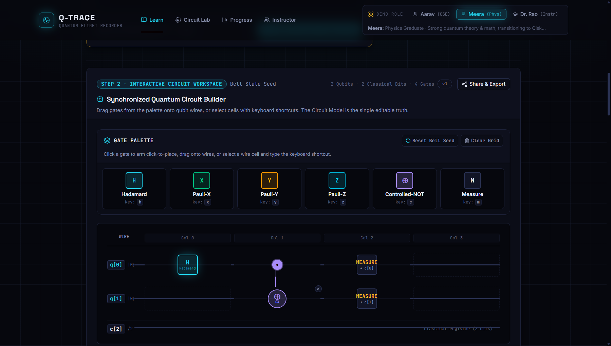
   
   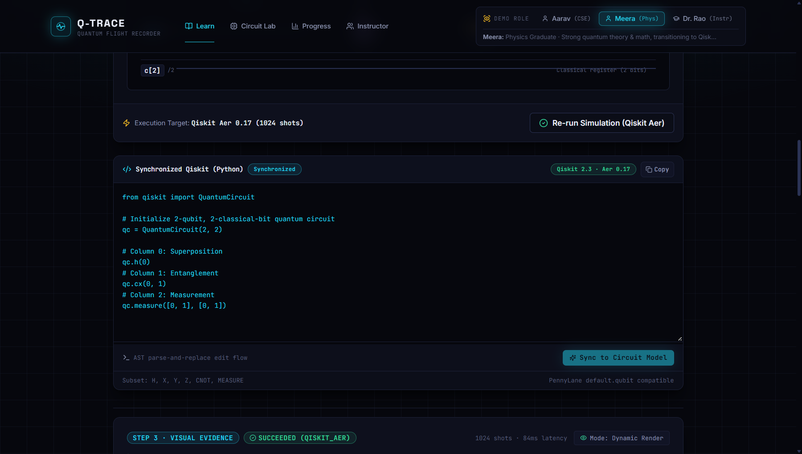

2. **Code Edit Test:**  
   - **Test A (Unsupported Gate):** Injected `qc.rz(0.5, 0)`. The editor displayed an `Unsaved Edits` badge. Clicking `Sync to Circuit Model` triggered an immediate red parse error banner:  
     `Parse & Validation Error: Gate RZ is outside the prototype subset. Allowed gates: H, X, Y, Z, CNOT, MEASURE. Note: The visual Circuit Model was preserved without changes.`
     
     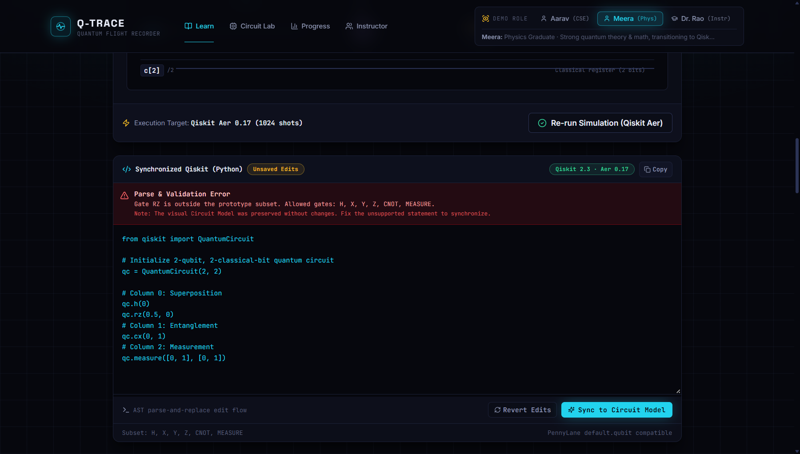
     
   - **Test B (Supported Gate):** Replaced with `qc.x(1)`. Clicking `Sync to Circuit Model` succeeded with a green confirmation banner:  
     `✓ Code successfully parsed and synchronized with Circuit Model.`
     
     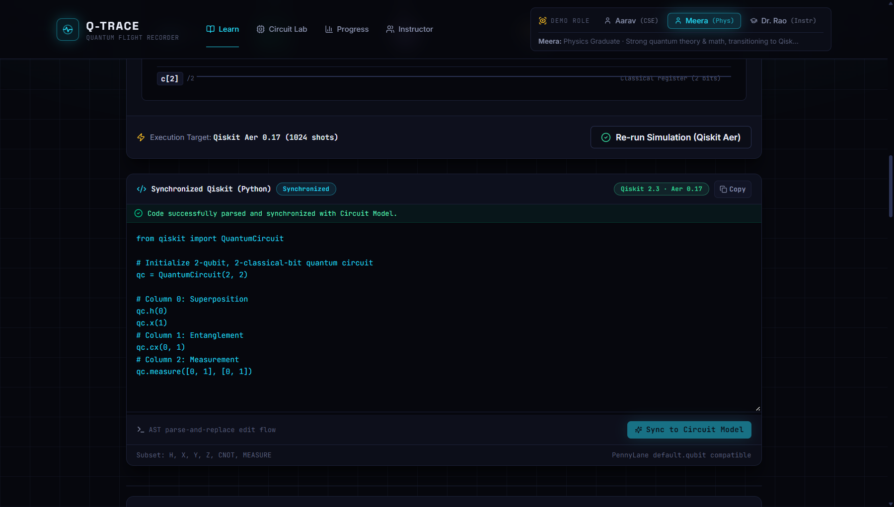

3. **Meera's Evaluation:**  
   - *Code quality:* Highly readable, idiomatic Qiskit 2.3.
   - *Friction:* Gate subset is strictly limited (no phase gates like $R_z(\theta)$ or $T$, which are standard in quantum courses). Wires grid always dominates vertical space above code.
   - **Friction Score: 3 / 5** (Solid two-way AST sync, but restricted gate subset and visual-first priority frustrate a code-oriented learner).

---

### BEAT 5 — Dual Simulation Results

1. **Simulation Run:**  
   Executed circuit simulation targeting Qiskit Aer (1024 shots).
   
   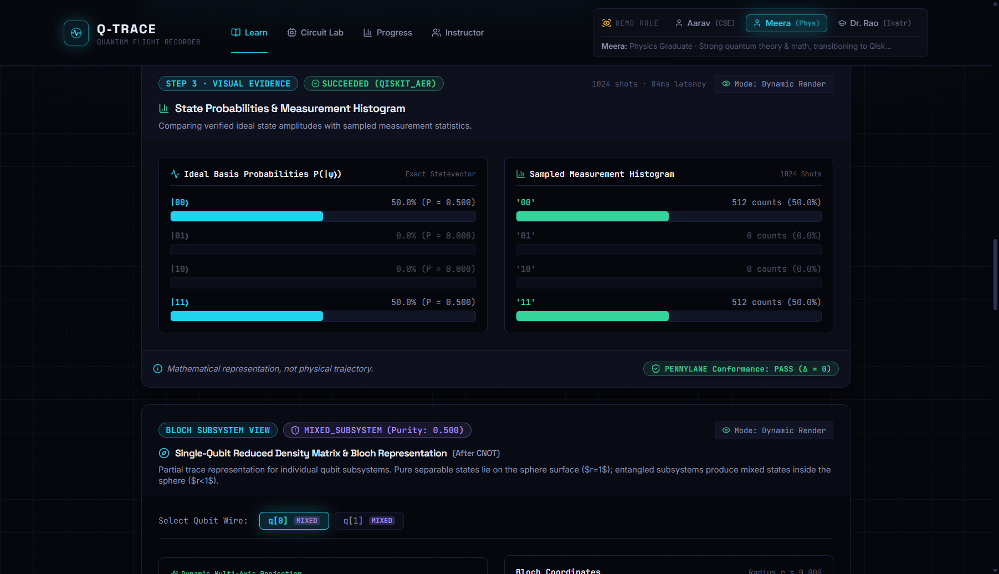

2. **Inspection:**  
   - **Framework labeling:** Labeled as `SUCCEEDED (QISKIT_AER)` (1024 shots · 84ms latency).
   - **PennyLane Conformance:** Labeled via a bottom badge: `✓ PENNYLANE Conformance: PASS (Δ = 0)`.
   - **Numerical precision:** Ideal basis states show exact numerical probabilities:
     - $|00\rangle$: $50.0\%\ (P = 0.500)$
     - $|01\rangle$: $0.0\%\ (P = 0.000)$
     - $|10\rangle$: $0.0\%\ (P = 0.000)$
     - $|11\rangle$: $50.0\%\ (P = 0.500)$
     - Sampled counts: `'00': 512\ (50.0\%)`, `'11': 512\ (50.0\%)`.
   - **Circuit Depth & Optimization:** Missing. The circuit workspace states `4 Gates`, but does not report circuit depth (critical for coherence time analysis) or transpiler optimization passes.
3. **Meera's Evaluation:**  
   - *Where is PennyLane?* PennyLane is only displayed as a passive unit-test conformance badge (`Δ = 0`). There is no tab to view the PennyLane Python script or PennyLane state vector representation.
   - **Friction Score: 3 / 5** (Accurate probabilities, but cross-framework comparison is shallow).

---

### BEAT 6 — Visual Evidence (Physics Student View)

1. **Bloch Subsystem Representation:**  
   Step 3 includes a dedicated Bloch Subsystem View.
   
   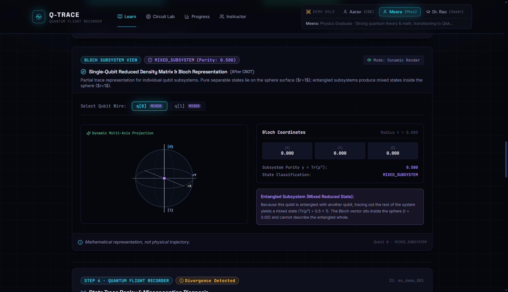

2. **Physics Rigor Check:**  
   - **Subsystem Labeling:** Explicitly labeled **`BLOCH SUBSYSTEM VIEW · MIXED_SUBSYSTEM (Purity: 0.500)`**.
   - **Bloch Coordinates:** $\langle X\rangle = 0.000, \langle Y\rangle = 0.000, \langle Z\rangle = 0.000$; Radius $r = 0.000$.
   - **Physical Correctness:** The callout explains: *"Because this qubit is entangled with another qubit, tracing out the rest of the system yields a mixed state ($\mathrm{Tr}(\rho^2) = 0.5 < 1$). The Bloch vector sits inside the sphere ($r = 0.00$) and cannot describe the entangled whole."*
   - **Disclaimer:** *"Mathematical representation, not physical trajectory."*
   - **Histogram notation:** Labels use quantum ket notation $|00\rangle$ and $|11\rangle$.
3. **Meera's Evaluation:**  
   - *Meera's reaction:* *"Brilliant. Most beginner tools draw a fake vector on the surface for entangled qubits, which is physically wrong. Q-Trace correctly calculates the partial trace $\rho_A = \frac{1}{2}I$ and plots the Bloch point at the center with purity 0.5."*
   - **Friction Score: 1 / 5** (Flawless theoretical fidelity).

---

### BEAT 7 — Flight Recorder (Technical Depth Check)

1. **Replay Inspection:**  
   Gate-by-gate replay scrubs between `Step 0: After H` and `Step 1: After CNOT`.
   
   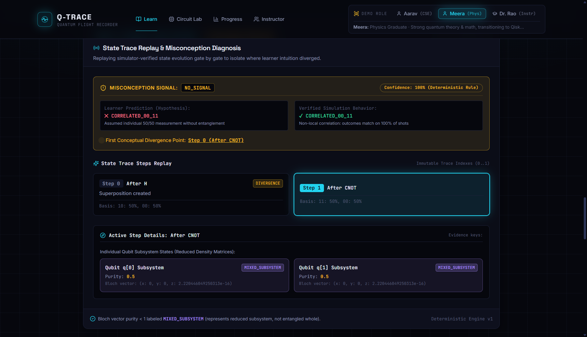
   
   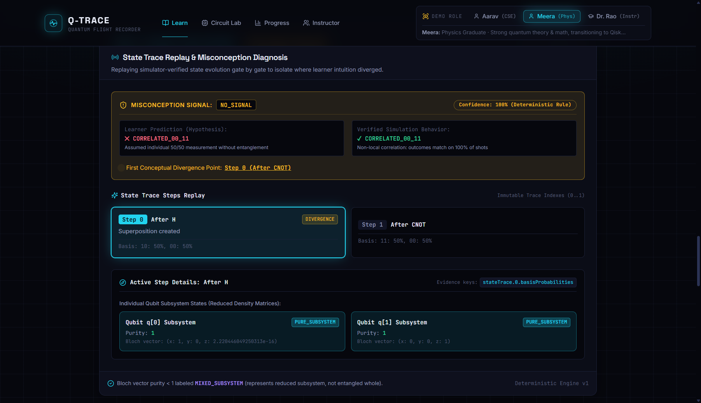

2. **Critical QA Bug Discovered:**  
   - Meera predicted `CORRELATED_00_11` (the physically correct answer).
   - Yet the Flight Recorder banner reported:
     - `MISCONCEPTION SIGNAL: NO_SIGNAL`
     - `Learner Prediction (Hypothesis): ✕ CORRELATED_00_11` (with an erroneous red cross!)
     - Caption: *"Assumed individual 50/50 measurement without entanglement"* (the description for `INDEPENDENT_RANDOM`, not Meera's prediction!)
     - Flagged: `First Conceptual Divergence Point: Step 0 (After CNOT)` with a `DIVERGENCE` badge on `Step 0: After H`.
3. **Mathematical Depth:**  
   - Step 0 displays `Basis: 10: 50%, 00: 50%` and Bloch vectors $(1, 0, 0)$ and $(0, 0, 1)$.
   - It does **not** render the mathematical Dirac state vector $\frac{1}{\sqrt{2}}(|0\rangle + |1\rangle) \otimes |0\rangle$ or complex amplitude coordinates ($c_{00} = \frac{1}{\sqrt{2}}, c_{10} = \frac{1}{\sqrt{2}}$), even though the underlying schema stores them.
4. **Friction Score: 4 / 5** (Critical UI bug: marking a correct prediction as wrong and assigning an irrelevant misconception explanation).

---

### BEAT 8 — Tutor (Evidence Depth + Repair Challenge Quality)

1. **Evidence-Bound Tutor Card:**  
   The Tutor card presents grounded explanations with evidence keys.
   
   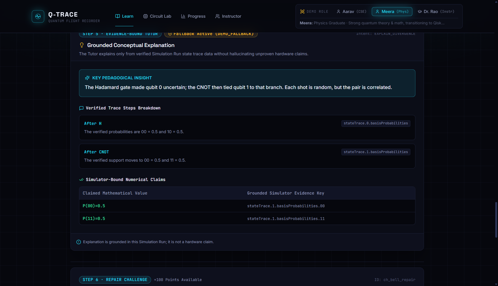

   - *Pedagogical Tone:* Summary says: *"The Hadamard gate made qubit 0 uncertain; the CNOT then tied qubit 1 to that branch. Each shot is random, but the pair is correlated."*
   - *Meera's reaction:* *"Qubit 0 is not 'uncertain'; it is in a coherent superposition state. 'Tied qubit 1 to that branch' is qualitative pop-science phrasing."*
   - *Trace grounding:* The table grounds exact numerical values `P(00)=0.5` and `P(11)=0.5` directly to `stateTrace.1.basisProbabilities`.

2. **Repair Challenge & Progress Update:**  
   Submitted repair attempt and verified mastery progress.
   
   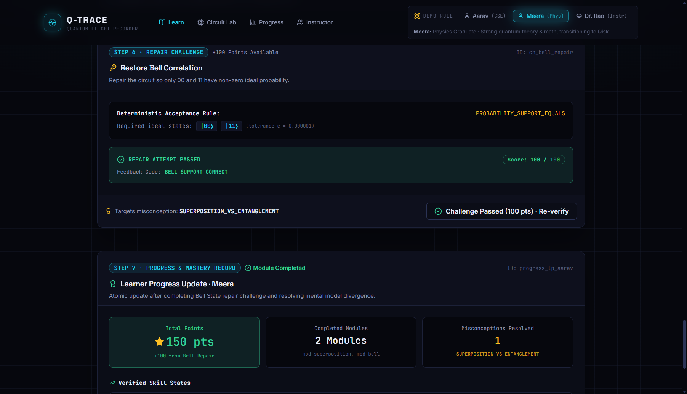
   
   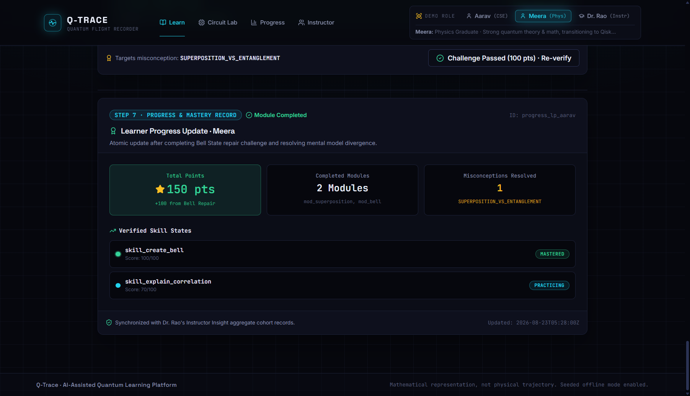

   - *Challenge Quality:* `Restore Bell Correlation: Repair the circuit so only 00 and 11 have non-zero ideal probability.` Deterministic acceptance rule: `PROBABILITY_SUPPORT_EQUALS |00⟩ |11⟩ (ε = 0.000001)`.
   - *Submission:* Passed with 100/100 (`BELL_SUPPORT_CORRECT`).
   - *Progress Record:* Updated for Meera (+100 pts, Total: 150 pts, `skill_create_bell: MASTERED`).
   - *Minor bug:* Progress card header displays `ID: progress_lp_aarav` despite displaying `Learner Progress Update · Meera`.
3. **Friction Score: 3 / 5** (Deterministic grading is solid, but tutor tone talks down to a physics student).

---

### Dedicated Circuit Lab Exploration (`/lab`)

Navigating to `/lab` provides direct access to the `Interactive Quantum Circuit Lab` without mandatory prediction gates or introductory copy:

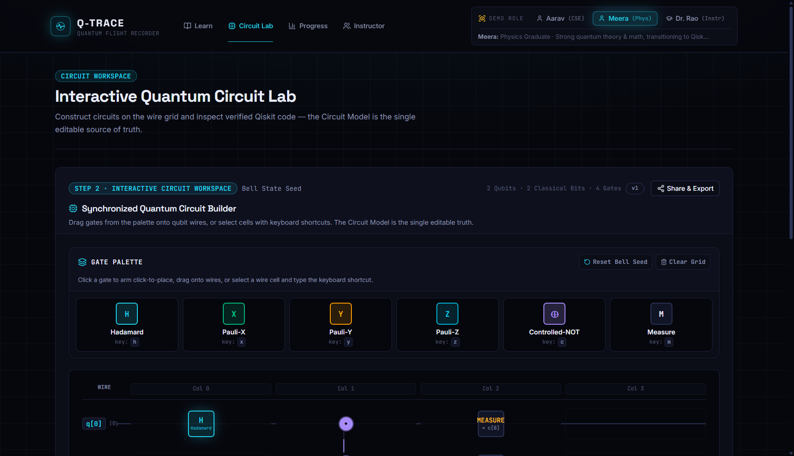

---

## BEAT-BY-BEAT FRICTION LOG

| Beat | Feature | Friction Score (1-5) | What Frustrated Meera | What Impressed Meera |
|---|---|:---:|---|---|
| **B1** | Role Selection | **2** | Selecting Meera does not auto-route to Circuit Lab or personalize landing page CTAs. | Clean role switcher in global header with profile descriptions. |
| **B2** | Learning Path Diff | **3** | Core concept text in the Bell State module is identical to Aarav's path; no condensed theory mode. | `/learn` catalogue clearly displays `THEORY CREDITED` on prerequisite modules. |
| **B3** | Prediction Checkpoint | **1** | The misconception option gives away the answer in its subtitle. | Mathematical Dirac notation (`CORRELATED_00_11: 50% |00⟩ + 50% |11⟩`) is used. |
| **B4** | Code-First View | **3** | No "code-first" layout toggle; gate set restricted to 6 basic gates; no $R_z$ or arbitrary parameters. | Real two-way AST parser with live code sync and precise error messaging. |
| **B5** | Dual Simulation | **3** | PennyLane is just a pass/fail delta badge; no PennyLane code, device setup, or state comparison. | Exact numerical probabilities ($P = 0.500$) rather than coarse visual bars alone. |
| **B6** | Visual Evidence | **1** | Complex amplitude phase is not directly displayed alongside probabilities. | **Outstanding** partial trace implementation: mixed state with purity $\gamma=0.5$ and $r=0$ at origin. |
| **B7** | Flight Recorder | **4** | **Critical bug:** Correct prediction marked with red ✕ and false divergence diagnosis. No Dirac notation. | Gate-by-gate reduced density matrix and subsystem purity tracking ($1.0 \to 0.5$). |
| **B8** | Tutor + Repair | **3** | Pop-science language (*"made qubit 0 uncertain"*); Progress record shows `progress_lp_aarav`. | Deterministic unit-test-style grading with rigorous numerical tolerance checking. |

---

## OVER-EXPLANATION VIOLATIONS (Talking Down to Meera)

1. **"The Hadamard gate made qubit 0 uncertain" (Tutor Summary):**  
   Hadamard applies a unitary basis rotation ($H = \frac{1}{\sqrt{2}}\begin{pmatrix}1 & 1\\1 & -1\end{pmatrix}$), creating coherent quantum superposition, not classical uncertainty or statistical ignorance.
2. **"Tied qubit 1 to that branch" (Tutor Summary):**  
   CNOT performs coherent entangling bit-flip conditioned on control ($|10\rangle \to |11\rangle$), not "tying branches".
3. **"Random outcomes can still be perfectly correlated..." (Bell State Concept Block):**  
   Physics students have calculated Bell-CHSH inequalities and EPR correlations; repeating basic qualitative intuition blocks without an option to collapse/skip feels condescending.
4. **Subtitles on Prediction Options:**  
   Writing *"Assumes qubits remain independent after CNOT"* directly underneath the wrong option invalidates the diagnostic test by spoon-feeding the student.

---

## MISSING DEPTH (What a Physics Student Needed)

1. **Explicit Complex State Vectors & Phases:**  
   The platform tracks probabilities ($P = |\alpha|^2$), but intermediate students need to verify relative phases (e.g., $|\Phi^+\rangle = \frac{|00\rangle + |11\rangle}{\sqrt{2}}$ vs $|\Phi^-\rangle = \frac{|00\rangle - |11\rangle}{\sqrt{2}}$). The raw statevector schema has `re` and `im` components, but the UI omits them.
2. **True PennyLane Side-by-Side Comparison:**  
   Meera wants to see how PennyLane's functional pipeline (`@qml.qnode(dev)`) contrasts with Qiskit's circuit-based API (`qc.cx(0, 1)`), not just a single green badge saying `PENNYLANE Conformance: PASS`.
3. **Circuit Depth & Transpilation Metrics:**  
   In physical quantum hardware, two-qubit gate depth is the primary driver of decoherence. The UI reports total gates, but fails to show circuit depth or native basis gate decomposition.
4. **Parameterized Gates ($R_x, R_y, R_z$):**  
   Continuously rotating state vectors on the Bloch sphere requires parameter angles ($\theta, \phi$), which are currently blocked by the parser.

---

## FIRST-TIME CODER ENHANCEMENT RECOMMENDATIONS

### 1. Flight Recorder Divergence Engine (Beat 7 — Friction Score: 4)
- 🔴 **Problem:** When a student chooses the correct prediction (`CORRELATED_00_11`), the Flight Recorder displays a red `✕` on their prediction, attaches the wrong misconception text, and flags Step 0 as a divergence.
- 💡 **Fix:** In `features/flight-recorder/flight-recorder-view.tsx` and the diagnose service, check if `prediction === verifiedBehavior`. If true, render a green `✓ Hypothesis Confirmed` state without divergence badges or misconception warnings.
- 📈 **Impact:** Prevents disorienting capable students who actually understand the physics.

### 2. Dual-Framework Code Comparison View (Beat 5 — Friction Score: 3)
- 🔴 **Problem:** PennyLane is relegated to a passive conformance checkmark (`PASS (Δ = 0)`).
- 💡 **Fix:** Add a framework toggle or split-pane in the code editor (`[Qiskit 2.3] | [PennyLane 0.38]`), showing PennyLane's equivalent QNode syntax:
  ```python
  import pennylane as qml
  dev = qml.device("default.qubit", wires=2)
  @qml.qnode(dev)
  def circuit():
      qml.Hadamard(wires=0)
      qml.CNOT(wires=[0, 1])
      return qml.probs(wires=[0, 1])
  ```
- 📈 **Impact:** Directly serves the core persona need of developers comparing industry-standard quantum SDKs.

### 3. Code-First Layout Toggle & Extended Gate Set (Beat 4 — Friction Score: 3)
- 🔴 **Problem:** The visual drag-drop palette occupies the top half of the screen, and standard single-qubit rotations ($R_x, R_y, R_z$) are rejected by the parser.
- 💡 **Fix:** Add a `View: Visual | Split | Code-First` toggle in the Circuit Workspace header. Expand the AST parser in `circuit-parser.ts` to support parameterized rotations `qc.rx(theta, q)` and `qc.rz(theta, q)`.
- 📈 **Impact:** Empowers learners with coding affinity to treat the code editor as their primary canvas rather than a secondary mirror.

### 4. Adaptive Pedagogical Tone in Tutor (Beat 8 — Friction Score: 3)
- 🔴 **Problem:** The Tutor generates simplistic, classical-analogy explanations regardless of learner profile.
- 💡 **Fix:** Condition the tutor prompt on `learnerProfile.role`:
  - For `PHYSICS_TO_CODE`: Use formal state evolution ($|\psi_0\rangle \xrightarrow{H_0} \frac{|0\rangle+|1\rangle}{\sqrt{2}}|0\rangle \xrightarrow{CX_{01}} |\Phi^+\rangle$) and Hilbert space notation.
  - For `BEGINNER_CSE`: Retain intuitive operational branch metaphors.
- 📈 **Impact:** Eliminates condescending language for university-level science and engineering students.

---

## OVERALL INTERMEDIATE LEARNER SCORE

# **7.2 / 10**

**Summary:** The mathematical honesty of the reduced-density-matrix subsystem visualization and the modern Qiskit 2.x two-way AST sync are best-in-class for educational prototypes. Resolving the false-positive divergence bug on correct answers, exposing true PennyLane code comparisons, and offering a code-first workspace view will make Q-Trace the premier tool for physics students transitioning into quantum computing.
